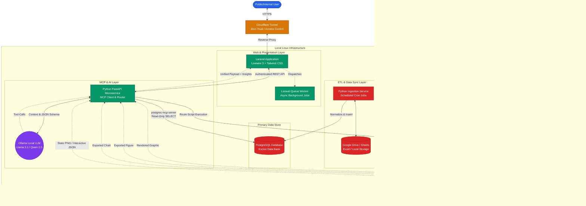
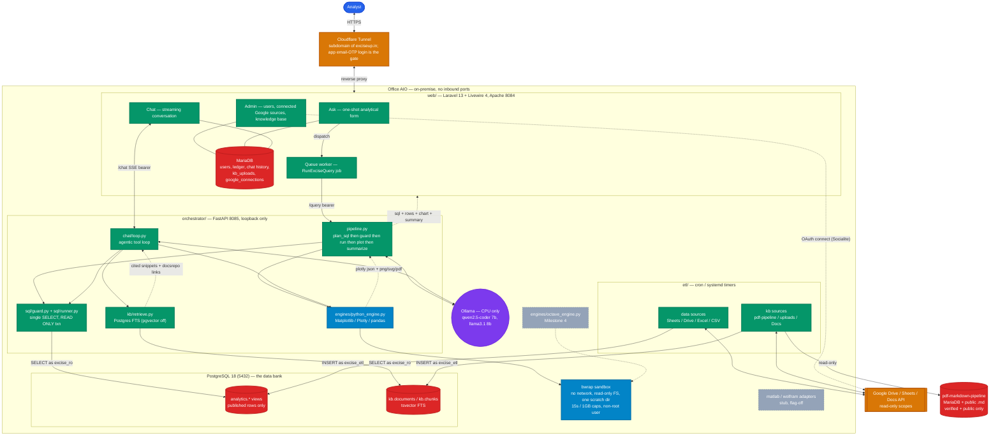
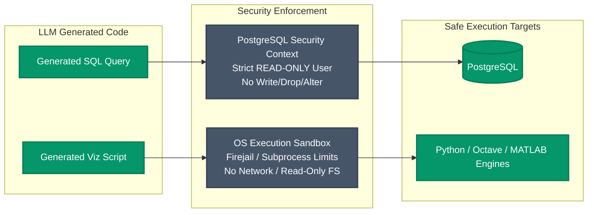
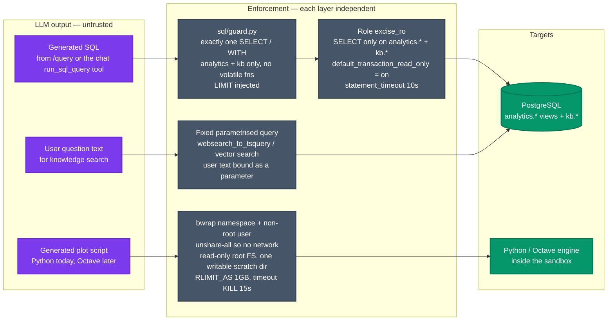
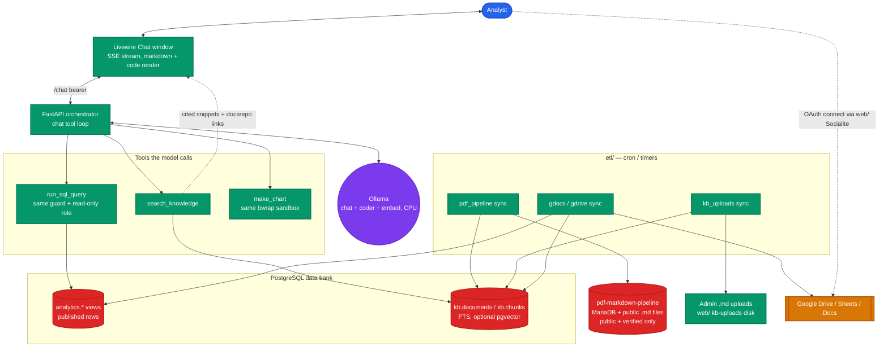

# ARCHITECTURE.md — excise-mcp-dashboard

## Systems overview

Three deployable units on one Linux host (the office AIO), fronted by a single
Cloudflare Tunnel, sharing one PostgreSQL data bank.

| Unit | Runtime | Port | Exposure | Job |
|---|---|---|---|---|
| `web/` | Laravel 13 + Livewire 4, PHP 8.5, Apache vhost | 8084 | via Cloudflare Tunnel; app email-OTP login is the gate | Analytical form + OpenWebUI-style chat window + admin (users, connected Google sources, knowledge base); auth; query ledger; exports; background jobs |
| `orchestrator/` | Python 3.12 + FastAPI, uvicorn | 8085 | `127.0.0.1` only | MCP client to Ollama; one-shot SQL pipeline; streaming chat with a tool loop (`run_sql_query`, `search_knowledge`, `make_chart`); knowledge retrieval; engine router; sandbox launcher |
| `etl/` | Python 3.12 CLI, run by cron / systemd timers | — | Google API (ingestion only) | Sheets / Drive / Docs / Excel / CSV -> Postgres data tables; pdf-markdown-pipeline verified docs + admin `.md` uploads + Google Docs -> `kb.*` |
| PostgreSQL 18 | system service | 5432 | `127.0.0.1` (+ Tailscale later if needed) | The excise data bank (`analytics.*`) and the knowledge base (`kb.*`) — read-only for the AI path |
| Ollama | system service | 11434 | `127.0.0.1` | Local LLM inference + embeddings, CPU-only |
| MariaDB | system service | 3306 | `127.0.0.1` | `web/` operational store — sessions, users, ledger, chat history, output artifacts (`saved_analyses`, `analysis_runs`, `reports`), `kb_uploads`, `google_connections`, queue |

### Request path for one question

1. Analyst signs in through the app's email-OTP login and types a question in
   the left pane.
2. Livewire dispatches a `RunExciseQuery` job (Laravel queue, `database`
   driver) and opens an SSE stream for stage updates. The web worker is not
   blocked.
3. The job calls `POST http://127.0.0.1:8085/query` on the orchestrator with a
   bearer token (shared secret) and the question plus recent conversation
   turns.
4. The orchestrator:
   a. sends the question, the excise schema, and few-shot examples to Ollama
      (`qwen2.5-coder:7b`), requesting a structured `SqlPlan` (one `SELECT`);
   b. validates the SQL is a single read-only statement, runs it on the
      read-only `asyncpg` pool inside a `READ ONLY` transaction with a
      statement timeout;
   c. sends the result shape back to Ollama for a `PlotPlan` (engine +
      script), validates it, writes the script to a scratch dir;
   d. runs the script in the `bwrap` sandbox (no network, one writable dir,
      wall-clock + memory caps), collecting a Plotly JSON blob and/or a
      PNG/SVG/PDF;
   e. asks Ollama for a short plain-language summary of the numbers;
   f. returns `{sql, rows_preview, chart, summary, stages[], request_id}`.
5. The job stores a `queries` row (prompt, SQL, timing, engine, model, status), a
   `chart_artifacts` row (files on the `local` disk), and streams `Complete`.
6. The right pane renders the interactive chart, the data table, and the
   generated SQL. The ledger view lists every past query with its feedback
   control.

### Streaming stages

`Querying database -> Running analysis -> Rendering chart -> Complete`, plus a
terminal `Failed: <stage>`. The orchestrator emits each transition on its
response as it goes (chunked) or the job polls a `/query/{id}/status`
endpoint; Laravel relays them to the browser over SSE, with `wire:poll` as the
fallback if SSE behaves badly through the tunnel.

### Request path for a chat message

1. Analyst opens the chat window, picks or starts a conversation, sends a
   message. Livewire posts it and opens an SSE reader.
2. `web/` calls `POST http://127.0.0.1:8085/chat` (bearer token) with the
   message and the trimmed conversation history.
3. The orchestrator runs the tool loop (`MCP_ENGINES.md` §Chat and retrieval):
   the model streams text; when it needs data it calls `run_sql_query` (same
   guard + read-only run as the one-shot path), for the law it calls
   `search_knowledge` (FTS over `kb.chunks`, optionally vector), for a picture
   it calls `make_chart` (same `bwrap` sandbox). Each tool call and result is
   an SSE event.
4. `web/` relays the SSE stream to the browser and persists `messages` +
   `message_tool_calls`; a chart is stored as a `chart_artifacts` row.
5. Cited knowledge chunks render with a link to `docsrepo.exciseup.in`; SQL
   the model ran renders as an inline, copyable card.

### Output artifact lifecycle

The data bank (PostgreSQL) holds raw data only. Everything the model produces —
charts, table previews, summaries, the generated SQL — is an app artifact in
`web/`'s MariaDB plus files on the `local` disk, never written back to
Postgres.

1. A `/query` or chat `make_chart` run writes a `queries` / `message` row and
   `chart.{plotly.json,png,svg,pdf}` under
   `web/storage/app/artifacts/<query-ulid>/`.
2. An unsaved run's files are swept after `ARTIFACT_TTL_DAYS`.
3. A user pins a run into `saved_analyses` (with a `recipe` to re-run it).
   "Refresh" — manual, scheduled, or fired by a matching `etl.ingestion_runs`
   completion — writes an `analysis_runs` row; the history is the trend.
4. `reports` order `saved_analyses` and Markdown blocks into a presentation
   that tracks live data or is frozen to a point in time.
5. Export: a chart as PNG/SVG/PDF/`plotly.json`; a result as CSV/XLSX; a report
   as a dompdf PDF, an XLSX workbook, or a ZIP bundle, each stamped with the
   ETL data vintage. `DATA_PIPELINE.md` §Output store.

### Knowledge ingestion path

- `etl sync --source pdf_pipeline_docs` (daily): reads
  `pdf_markdown_pipeline_local.documents` (a dedicated read-only MariaDB user)
  filtered to public + verified, reads each Markdown file from that project's
  `public` disk, chunks, writes `kb.documents` + `kb.chunks` in Postgres.
- `etl sync --source kb_uploads` (every 15 min): ingests admin-uploaded `.md`
  files staged by `web/`.
- `etl sync --source gdocs_* / gdrive_kb_*`: Google Docs and Drive `.md`/Docs
  via a user's OAuth connection.
- A document that stops being public/verified upstream is marked
  `withdrawn_at`; retrieval skips it, the text stays for audit.

### Google OAuth path

`web/` runs `laravel/socialite` (Google, read-only Drive/Sheets/Docs scopes,
offline access). A per-user `google_connections` row holds an encrypted
refresh token. The ETL reads the refresh token over loopback and lets
`google-auth` mint access tokens; a revoked grant surfaces as "reconnect
needed" on the admin screen. `SECURITY.md` §Google OAuth.

### Trust boundaries

- **Internet -> Cloudflare edge**: TLS termination and the named tunnel on a
  subdomain of `exciseup.in`. No Cloudflare Access — every route is behind the
  app's email-OTP login, so an unauthenticated request only ever reaches
  `/login`.
- **Tunnel -> Apache (8084)**: the only inbound path; no firewall port opened
  (`cloudflared` dials out over `lo`).
- **Laravel -> orchestrator (8085)**: loopback only, bearer token, request-id
  correlation. The orchestrator refuses any request without the token.
- **Orchestrator -> PostgreSQL**: dedicated `LOGIN` role, `SELECT` only,
  `default_transaction_read_only = on`, statement timeout. DDL/DML refused by
  the engine.
- **Orchestrator -> sandbox**: generated scripts run as a non-root user inside
  a `bwrap` namespace — no network, root filesystem read-only, one writable
  scratch dir, `RLIMIT` memory cap, `timeout(1)` wall clock. See `SECURITY.md`.
- **ETL -> PostgreSQL**: separate role with `INSERT`/`UPDATE`/`DELETE` on the
  data tables and `kb.*` only, no DDL after the initial migration. Runs from
  cron, not reachable from the web path.
- **Orchestrator -> knowledge base**: the same read-only role reads `kb.*`
  (`SELECT` only). Retrieval is FTS (built-in) or, when enabled, `pgvector`
  cosine search with embeddings from the local Ollama — no outbound network.
- **ETL -> Google API**: the only outbound call other than the tunnel.
  Read-only scopes; a service account for server-owned content, a user's
  OAuth refresh token for their own Drive/Sheets/Docs. Tokens are encrypted
  at rest and never logged.
- **`web/` -> pdf-markdown-pipeline data**: read-only. A scoped MariaDB user
  (`SELECT` on `pdf_markdown_pipeline_local` only) and group-read on that
  project's `storage/app/public` Markdown tree. No write path.

### Failure behavior

Every stage failure is typed and surfaced: `Ollama unreachable`, `SQL rejected`
(not a single SELECT), `SQL error` (DB raised), `query timeout`, `engine
unavailable`, `sandbox timeout`, `sandbox violation`, `render produced no
output`. The web app shows the failed stage and still writes a ledger row so
failures are reviewable. One automatic retry only for a malformed structured
output from the LLM.

### Not in the first build

Octave / MATLAB / Mathematica engines, an MCP server in front of Postgres, a
complexity-based routing heuristic, `pgvector` semantic retrieval, and an
embedded OpenWebUI. The interfaces accommodate all of them; `EVALUATION.md`
§Right-sizing explains why they wait. `ROADMAP.md` Milestone 3 builds the
knowledge base on Postgres FTS; Milestone 4 adds Octave behind the same
`IVisualizationEngine`; `pgvector` is a config flag plus a backfill if the
Milestone 6 quality check calls for it.

## Component diagrams

Diagrams 1 and 2 are the two from the brief. Diagrams 1U and 2U match what
this repo specifies: bubblewrap as the sandbox, a direct read-only `asyncpg`
pool in place of a standalone Postgres MCP server, one Python engine, Livewire
4, and the knowledge base, chat window, and Google OAuth. Diagram 3 covers the
chat and ingestion paths.

### Diagram 1 (as supplied in the brief): comprehensive system flow

> Implementation note: the first build wires `Web -> FastAPI -> Ollama`,
> `FastAPI -> PG` (direct `asyncpg`, read-only role, no separate
> `postgres-mcp-server` process), and `Adapter -> PyEngine` only. The Octave,
> MATLAB, and Wolfram paths and the standalone Postgres MCP server are drawn
> here as the target shape; see `EVALUATION.md` §Right-sizing and `ROADMAP.md`.

### Diagram 1U (updated): system flow as this repo specifies it

> Grey dashed nodes (Octave, MATLAB, Wolfram) are not in the first build.
> Everything else is Milestones 1-6 in `ROADMAP.md`.

### Diagram 2 (as supplied in the brief): execution security & read-only sandbox

> Implementation note: the OS sandbox on this box is **bubblewrap (`bwrap`
> 0.11.1)**, already installed, plus a non-root execution user, `RLIMIT`
> memory caps, and `timeout(1)`. `firejail` is not installed and is not
> required. `SECURITY.md` §Code-execution sandbox has the exact invocation.

### Diagram 2U (updated): three enforcement layers as built

> The read-only role is the primary control for data access; the guard and the
> `READ ONLY` transaction are redundant layers on top. `search_knowledge` runs
> no model-authored SQL at all. `SECURITY.md` §1 and §2 have the exact grants
> and the `bwrap` command line.

### Diagram 3: chat, knowledge, and ingestion

Covers the chat window, the knowledge base, and the Google OAuth ingestion
paths.

## Cross-references

- Hardware limits, model choice, retrieval and chat-integration decisions,
  reuse inventory: `EVALUATION.md`
- ETL design, PostgreSQL schema, the `kb` schema, Google sources: `DATA_PIPELINE.md`
- Orchestrator internals, `IVisualizationEngine`, per-engine guides, the chat
  tool loop and retrieval: `MCP_ENGINES.md`
- Read-only role SQL, sandbox invocation, knowledge-base read paths, Google
  OAuth, tunnel + Access config: `SECURITY.md`
- Build order and checklists: `ROADMAP.md`
- Every sudo / install / external-console step: `OPERATOR_SETUP.md`
- Session rules and conventions: `CLAUDE.md`
