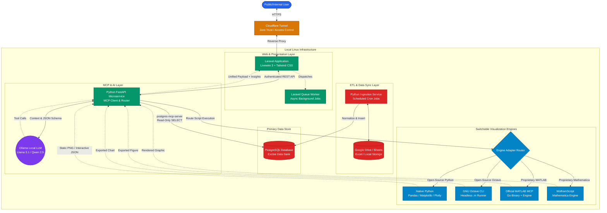
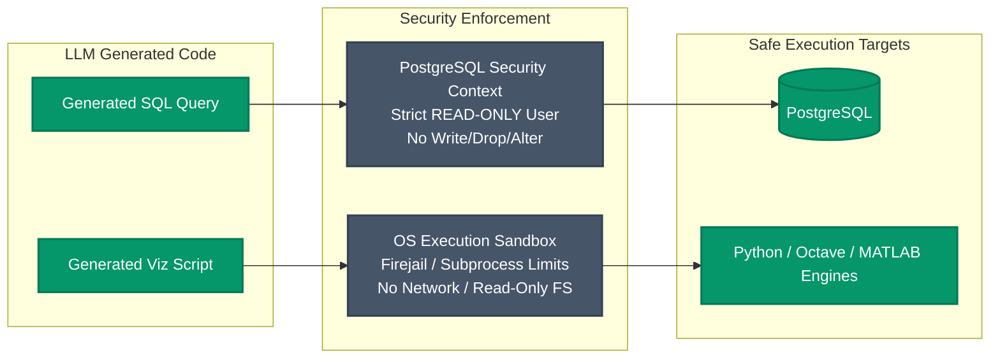

# ARCHITECTURE.md — excise-mcp-dashboard

## Systems overview

Three deployable units on one Linux host (the office AIO), fronted by a single
Cloudflare Tunnel, sharing one PostgreSQL data bank.

| Unit | Runtime | Port | Exposure | Job |
|---|---|---|---|---|
| `web/` | Laravel 13 + Livewire 4, PHP 8.5, Apache vhost | 8084 | via Cloudflare Tunnel + Access | Split-view chat/chart UI, auth, query ledger, exports, background jobs |
| `orchestrator/` | Python 3.12 + FastAPI, uvicorn | 8085 | `127.0.0.1` only | MCP client to Ollama, SQL generation, engine router, sandbox launcher |
| `etl/` | Python 3.12 CLI, run by cron / systemd timers | — | none | Normalize Sheets / Drive / Excel / CSV into PostgreSQL |
| PostgreSQL 18 | system service | 5432 | `127.0.0.1` (+ Tailscale later if needed) | The excise data bank — read-only for the AI path |
| Ollama | system service | 11434 | `127.0.0.1` | Local LLM inference, CPU-only |
| MariaDB | system service | 3306 | `127.0.0.1` | `web/` operational store — sessions, users, ledger, queue |

### Request path for one question

1. Analyst signs in through Cloudflare Access, then the app's OTP login, and
   types a question in the left pane.
2. Livewire dispatches a `RunExciseQuery` job (Laravel queue, `database`
   driver) and opens an SSE stream for stage updates. The web worker is not
   blocked.
3. The job calls `POST http://127.0.0.1:8085/query` on the orchestrator with a
   bearer token (shared secret) and the question plus recent conversation
   turns.
4. The orchestrator:
   a. sends the question, the excise schema, and few-shot examples to Ollama
      (`qwen2.5-coder:7b`), requesting a structured `SqlPlan` (one `SELECT`);
   b. validates the SQL is a single read-only statement, runs it on the
      read-only `asyncpg` pool inside a `READ ONLY` transaction with a
      statement timeout;
   c. sends the result shape back to Ollama for a `PlotPlan` (engine +
      script), validates it, writes the script to a scratch dir;
   d. runs the script in the `bwrap` sandbox (no network, one writable dir,
      wall-clock + memory caps), collecting a Plotly JSON blob and/or a
      PNG/SVG/PDF;
   e. asks Ollama for a short plain-language summary of the numbers;
   f. returns `{sql, rows_preview, chart, summary, stages[], request_id}`.
5. The job stores a `queries` row (prompt, SQL, timing, engine, status), a
   `chart_artifacts` row (files on the `local` disk), and streams `Complete`.
6. The right pane renders the interactive chart, the data table, and the
   generated SQL. The ledger view lists every past query with its feedback
   control.

### Streaming stages

`Querying database -> Running analysis -> Rendering chart -> Complete`, plus a
terminal `Failed: <stage>`. The orchestrator emits each transition on its
response as it goes (chunked) or the job polls a `/query/{id}/status`
endpoint; Laravel relays them to the browser over SSE, with `wire:poll` as the
fallback if SSE behaves badly through the tunnel.

### Trust boundaries

- **Internet -> Cloudflare edge**: TLS, Access policy (email domain / group).
- **Tunnel -> Apache (8084)**: the only inbound path; no firewall port opened
  (`cloudflared` dials out over `lo`).
- **Laravel -> orchestrator (8085)**: loopback only, bearer token, request-id
  correlation. The orchestrator refuses any request without the token.
- **Orchestrator -> PostgreSQL**: dedicated `LOGIN` role, `SELECT` only,
  `default_transaction_read_only = on`, statement timeout. DDL/DML refused by
  the engine.
- **Orchestrator -> sandbox**: generated scripts run as a non-root user inside
  a `bwrap` namespace — no network, root filesystem read-only, one writable
  scratch dir, `RLIMIT` memory cap, `timeout(1)` wall clock. See `SECURITY.md`.
- **ETL -> PostgreSQL**: separate role with `INSERT`/`UPDATE`/`DELETE` on the
  data tables only, no DDL after the initial migration. Runs from cron, not
  reachable from the web path.

### Failure behavior

Every stage failure is typed and surfaced: `Ollama unreachable`, `SQL rejected`
(not a single SELECT), `SQL error` (DB raised), `query timeout`, `engine
unavailable`, `sandbox timeout`, `sandbox violation`, `render produced no
output`. The web app shows the failed stage and still writes a ledger row so
failures are reviewable. One automatic retry only for a malformed structured
output from the LLM.

### What is deliberately not in the first build

Octave / MATLAB / Mathematica engines, an MCP server in front of Postgres, and
a complexity-based routing heuristic. The interfaces below accommodate them;
`EVALUATION.md` §Right-sizing explains why they wait. `ROADMAP.md` Milestone 3
adds Octave behind the same `IVisualizationEngine`.

## Component diagrams

### Diagram 1: comprehensive system flow

> Implementation note: the first build wires `Web -> FastAPI -> Ollama`,
> `FastAPI -> PG` (direct `asyncpg`, read-only role, no separate
> `postgres-mcp-server` process), and `Adapter -> PyEngine` only. The Octave,
> MATLAB, and Wolfram paths and the standalone Postgres MCP server are drawn
> here as the target shape; see `EVALUATION.md` §Right-sizing and `ROADMAP.md`.

### Diagram 2: execution security & read-only sandbox

> Implementation note: the OS sandbox on this box is **bubblewrap (`bwrap`
> 0.11.1)**, already installed, plus a non-root execution user, `RLIMIT`
> memory caps, and `timeout(1)`. `firejail` is not installed and is not
> required. `SECURITY.md` §Code-execution sandbox has the exact invocation.

## Cross-references

- Hardware limits and model choice: `EVALUATION.md`
- ETL design and the PostgreSQL schema: `DATA_PIPELINE.md`
- Orchestrator internals, `IVisualizationEngine`, per-engine guides:
  `MCP_ENGINES.md`
- Read-only role SQL, sandbox invocation, tunnel + Access config: `SECURITY.md`
- Build order and checklists: `ROADMAP.md`
- Session rules and conventions: `CLAUDE.md`
