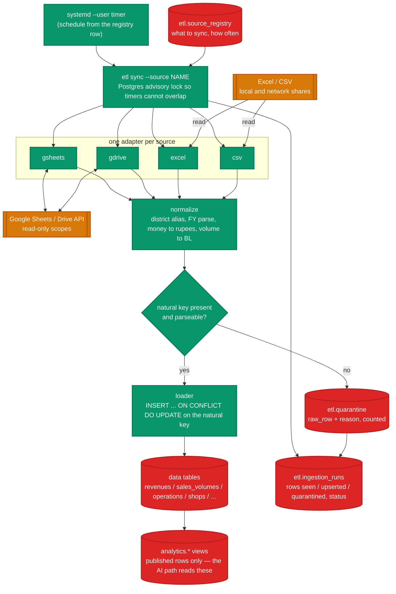
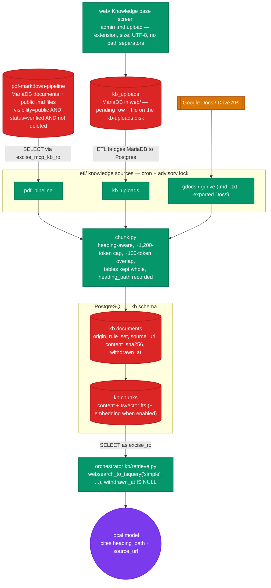

# DATA_PIPELINE.md — ETL ingestion and the PostgreSQL data bank

## Position

The excise data bank is a **PostgreSQL translation of the already-built,
already-verified schema in `~/Sites/upexcise-stats-dashboard`**
(`docs/data-model.md` there). That schema holds FY2014-15 onward: 75 districts,
900 rows per series on Revenue / Sales Volume / Operations, ~79,685 shops /
242,520 shop-years, 3,524 brands, 5,537 brand prices, 72 duty rates, 60 policy
rows, all reconciled against the source NITI workbooks with four import bugs
found and fixed. Do not design a new schema. Translate that one and add the
columns this project needs on top.

`web/`'s own small store (users, sessions, the query ledger, the job queue) is
a separate MariaDB database, `excise_mcp_dashboard_local`, provisioned by
`php artisan db:provision`. It is not the data bank and never holds excise
figures.

## PostgreSQL schema blueprint

MariaDB -> PostgreSQL translation rules:

- `utf8mb4` / `utf8mb4_unicode_ci` -> database `ENCODING 'UTF8'`,
  `LC_COLLATE`/`LC_CTYPE` from the cluster; add `CITEXT` for
  case-insensitive natural keys (the shop-identity collation bug in the sibling
  was a collation-prediction mistake — use `CITEXT` or explicit
  `LOWER()` functional unique indexes, and resolve identity with a real query,
  not an in-code guess).
- `AUTO_INCREMENT` -> `GENERATED ALWAYS AS IDENTITY`.
- `bigInteger unsigned` FKs -> `BIGINT` + `REFERENCES`.
- `decimal(15,2)` money -> `NUMERIC(15,2)`.
- Laravel `timestamps` -> `created_at TIMESTAMPTZ NOT NULL DEFAULT now()`,
  `updated_at TIMESTAMPTZ NOT NULL DEFAULT now()` (a trigger keeps
  `updated_at` current).
- Soft delete -> `deleted_at TIMESTAMPTZ NULL`, partial indexes
  `WHERE deleted_at IS NULL`.
- `published_at` stays — the AI only ever reads published rows (see §Row
  visibility).

### Dimensions

```sql
CREATE TABLE zones (
    id           BIGINT GENERATED ALWAYS AS IDENTITY PRIMARY KEY,
    name         CITEXT NOT NULL UNIQUE,
    slug         CITEXT NOT NULL UNIQUE,
    created_at   TIMESTAMPTZ NOT NULL DEFAULT now(),
    updated_at   TIMESTAMPTZ NOT NULL DEFAULT now()
);

CREATE TABLE divisions (
    id           BIGINT GENERATED ALWAYS AS IDENTITY PRIMARY KEY,
    zone_id      BIGINT NOT NULL REFERENCES zones(id),
    name         CITEXT NOT NULL,
    slug         CITEXT NOT NULL UNIQUE,
    created_at   TIMESTAMPTZ NOT NULL DEFAULT now(),
    updated_at   TIMESTAMPTZ NOT NULL DEFAULT now(),
    UNIQUE (zone_id, name)
);

CREATE TABLE districts (
    id            BIGINT GENERATED ALWAYS AS IDENTITY PRIMARY KEY,
    division_id   BIGINT NOT NULL REFERENCES divisions(id),
    name          CITEXT NOT NULL UNIQUE,
    slug          CITEXT NOT NULL UNIQUE,
    lgd_code      INTEGER UNIQUE,          -- Local Government Directory code, for joins to other gov datasets
    latitude      NUMERIC(9,6),
    longitude     NUMERIC(9,6),
    published_at  TIMESTAMPTZ NULL,
    created_at    TIMESTAMPTZ NOT NULL DEFAULT now(),
    updated_at    TIMESTAMPTZ NOT NULL DEFAULT now(),
    deleted_at    TIMESTAMPTZ NULL
);

CREATE TABLE financial_years (
    id           BIGINT GENERATED ALWAYS AS IDENTITY PRIMARY KEY,
    label        TEXT NOT NULL UNIQUE,     -- 'FY2014-15'
    start_year   SMALLINT NOT NULL UNIQUE, -- 2014
    created_at   TIMESTAMPTZ NOT NULL DEFAULT now(),
    updated_at   TIMESTAMPTZ NOT NULL DEFAULT now()
);

CREATE TABLE license_categories (
    id           BIGINT GENERATED ALWAYS AS IDENTITY PRIMARY KEY,
    code         CITEXT NOT NULL UNIQUE,   -- e.g. 'CL', 'FL', 'BEER', 'BWFL'
    name         TEXT NOT NULL,
    kind         TEXT NOT NULL,            -- 'country_liquor' | 'foreign_liquor' | 'beer' | 'model_shop' | ...
    created_at   TIMESTAMPTZ NOT NULL DEFAULT now(),
    updated_at   TIMESTAMPTZ NOT NULL DEFAULT now()
);
```

### Fact tables (one per NITI series)

```sql
CREATE TABLE revenues (                    -- duty / fee collections
    id                 BIGINT GENERATED ALWAYS AS IDENTITY PRIMARY KEY,
    district_id        BIGINT NOT NULL REFERENCES districts(id),
    financial_year_id  BIGINT NOT NULL REFERENCES financial_years(id),
    license_category_id BIGINT REFERENCES license_categories(id),  -- NULL = all-category total row
    metric             TEXT NOT NULL,       -- 'excise_duty' | 'license_fee' | 'import_fee' | 'total'
    amount_inr         NUMERIC(18,2) NOT NULL,   -- store in rupees, format in the UI
    published_at       TIMESTAMPTZ NULL,
    source_ref         TEXT,                -- workbook / sheet / row provenance
    created_at         TIMESTAMPTZ NOT NULL DEFAULT now(),
    updated_at         TIMESTAMPTZ NOT NULL DEFAULT now(),
    deleted_at         TIMESTAMPTZ NULL,
    UNIQUE (district_id, financial_year_id, license_category_id, metric)
);

CREATE TABLE sales_volumes (               -- dispatches / supply-chain volume
    id                 BIGINT GENERATED ALWAYS AS IDENTITY PRIMARY KEY,
    district_id        BIGINT NOT NULL REFERENCES districts(id),
    financial_year_id  BIGINT NOT NULL REFERENCES financial_years(id),
    license_category_id BIGINT REFERENCES license_categories(id),
    metric             TEXT NOT NULL,       -- 'dispatch_bl' | 'consumption_bl' | 'cases'
    quantity           NUMERIC(18,3) NOT NULL,
    unit               TEXT NOT NULL,       -- 'BL' (bulk litres) | 'cases'
    published_at       TIMESTAMPTZ NULL,
    source_ref         TEXT,
    created_at         TIMESTAMPTZ NOT NULL DEFAULT now(),
    updated_at         TIMESTAMPTZ NOT NULL DEFAULT now(),
    deleted_at         TIMESTAMPTZ NULL,
    UNIQUE (district_id, financial_year_id, license_category_id, metric)
);

CREATE TABLE operations (                  -- enforcement statistics
    id                 BIGINT GENERATED ALWAYS AS IDENTITY PRIMARY KEY,
    district_id        BIGINT NOT NULL REFERENCES districts(id),
    financial_year_id  BIGINT NOT NULL REFERENCES financial_years(id),
    metric             TEXT NOT NULL,       -- 'raids' | 'cases_registered' | 'arrests' | 'liquor_seized_bl' | 'vehicles_seized'
    value              NUMERIC(18,3) NOT NULL,
    published_at       TIMESTAMPTZ NULL,
    source_ref         TEXT,
    created_at         TIMESTAMPTZ NOT NULL DEFAULT now(),
    updated_at         TIMESTAMPTZ NOT NULL DEFAULT now(),
    deleted_at         TIMESTAMPTZ NULL,
    UNIQUE (district_id, financial_year_id, metric)
);
```

### Shops (dimension + fact split, as in the sibling)

```sql
CREATE TABLE shops (
    id             BIGINT GENERATED ALWAYS AS IDENTITY PRIMARY KEY,
    district_id    BIGINT NOT NULL REFERENCES districts(id),
    shop_number    CITEXT NOT NULL,
    seq            SMALLINT NOT NULL DEFAULT 1,   -- disambiguator for same district+number (see sibling data-model.md)
    display_name   TEXT NOT NULL,
    license_category_id BIGINT REFERENCES license_categories(id),
    circle_code    CITEXT,
    sector_code    CITEXT,
    latitude       NUMERIC(9,6),
    longitude      NUMERIC(9,6),
    published_at   TIMESTAMPTZ NULL,
    created_at     TIMESTAMPTZ NOT NULL DEFAULT now(),
    updated_at     TIMESTAMPTZ NOT NULL DEFAULT now(),
    deleted_at     TIMESTAMPTZ NULL,
    UNIQUE (district_id, shop_number, seq)
);

CREATE TABLE shop_years (                  -- quota / settlement per shop per FY
    id                 BIGINT GENERATED ALWAYS AS IDENTITY PRIMARY KEY,
    shop_id            BIGINT NOT NULL REFERENCES shops(id),
    financial_year_id  BIGINT NOT NULL REFERENCES financial_years(id),
    shop_type          TEXT NOT NULL,       -- country liquor / foreign liquor / beer / model shop / composite
    mgq_bl             NUMERIC(18,3),       -- minimum guaranteed quota
    license_fee_inr    NUMERIC(18,2),
    settlement_mode    TEXT,                -- 'lottery' | 'e-lottery' | 'renewal' | 'auction'
    is_operational     BOOLEAN,
    source_ref         TEXT,
    created_at         TIMESTAMPTZ NOT NULL DEFAULT now(),
    updated_at         TIMESTAMPTZ NOT NULL DEFAULT now(),
    UNIQUE (shop_id, financial_year_id)
    -- visibility inherited from shops.published_at; shop_years has no published_at
);
```

### Reference tables

```sql
CREATE TABLE brands (
    id             BIGINT GENERATED ALWAYS AS IDENTITY PRIMARY KEY,
    name           CITEXT NOT NULL,
    license_category_id BIGINT REFERENCES license_categories(id),
    segment        TEXT,                   -- 'regular' | 'premium' | 'economy'
    manufacturer   TEXT,
    published_at   TIMESTAMPTZ NULL,
    created_at     TIMESTAMPTZ NOT NULL DEFAULT now(),
    updated_at     TIMESTAMPTZ NOT NULL DEFAULT now(),
    deleted_at     TIMESTAMPTZ NULL,
    UNIQUE (name, license_category_id)
);

CREATE TABLE brand_prices (
    id                 BIGINT GENERATED ALWAYS AS IDENTITY PRIMARY KEY,
    brand_id           BIGINT NOT NULL REFERENCES brands(id),
    financial_year_id  BIGINT NOT NULL REFERENCES financial_years(id),
    pack_ml            INTEGER NOT NULL,
    mrp_inr            NUMERIC(12,2) NOT NULL,
    ex_distillery_inr  NUMERIC(12,2),
    published_at       TIMESTAMPTZ NULL,
    created_at         TIMESTAMPTZ NOT NULL DEFAULT now(),
    updated_at         TIMESTAMPTZ NOT NULL DEFAULT now(),
    UNIQUE (brand_id, financial_year_id, pack_ml)
);

CREATE TABLE duty_rates (
    id                 BIGINT GENERATED ALWAYS AS IDENTITY PRIMARY KEY,
    financial_year_id  BIGINT NOT NULL REFERENCES financial_years(id),
    license_category_id BIGINT NOT NULL REFERENCES license_categories(id),
    basis              TEXT NOT NULL,       -- 'per_bl' | 'per_lpl' | 'ad_valorem' | 'per_case'
    rate               NUMERIC(14,4) NOT NULL,
    unit               TEXT NOT NULL,
    notes              TEXT,
    published_at       TIMESTAMPTZ NULL,
    created_at         TIMESTAMPTZ NOT NULL DEFAULT now(),
    updated_at         TIMESTAMPTZ NOT NULL DEFAULT now(),
    UNIQUE (financial_year_id, license_category_id, basis)
);

CREATE TABLE policy_entries (
    id             BIGINT GENERATED ALWAYS AS IDENTITY PRIMARY KEY,
    financial_year_id BIGINT REFERENCES financial_years(id),
    effective_from DATE,
    effective_to   DATE,
    title          TEXT NOT NULL,
    category       TEXT,                   -- 'pricing' | 'licensing' | 'enforcement' | 'quota' | 'structural'
    summary        TEXT NOT NULL,
    source_ref     TEXT,
    published_at   TIMESTAMPTZ NULL,
    created_at     TIMESTAMPTZ NOT NULL DEFAULT now(),
    updated_at     TIMESTAMPTZ NOT NULL DEFAULT now(),
    deleted_at     TIMESTAMPTZ NULL
);
```

### ETL bookkeeping (separate schema)

```sql
CREATE SCHEMA etl;

CREATE TABLE etl.ingestion_runs (
    id            BIGINT GENERATED ALWAYS AS IDENTITY PRIMARY KEY,
    source        TEXT NOT NULL,           -- 'google_sheet' | 'google_drive' | 'excel' | 'csv'
    source_ref    TEXT NOT NULL,           -- sheet id / drive file id / path
    started_at    TIMESTAMPTZ NOT NULL DEFAULT now(),
    finished_at   TIMESTAMPTZ,
    status        TEXT NOT NULL DEFAULT 'running',  -- running | ok | failed | partial
    rows_seen     INTEGER DEFAULT 0,
    rows_upserted INTEGER DEFAULT 0,
    rows_quarantined INTEGER DEFAULT 0,
    error         TEXT
);

CREATE TABLE etl.quarantine (
    id            BIGINT GENERATED ALWAYS AS IDENTITY PRIMARY KEY,
    run_id        BIGINT NOT NULL REFERENCES etl.ingestion_runs(id),
    raw_row       JSONB NOT NULL,
    reason        TEXT NOT NULL,
    created_at    TIMESTAMPTZ NOT NULL DEFAULT now()
);

CREATE TABLE etl.source_registry (        -- what to sync and how often
    id            BIGINT GENERATED ALWAYS AS IDENTITY PRIMARY KEY,
    name          TEXT NOT NULL UNIQUE,
    source        TEXT NOT NULL,
    source_ref    TEXT NOT NULL,
    target_table  TEXT NOT NULL,
    schedule      TEXT NOT NULL,           -- cron expression
    enabled       BOOLEAN NOT NULL DEFAULT true,
    last_run_id   BIGINT REFERENCES etl.ingestion_runs(id)
);
```

### Indexes

Every fact table: `(financial_year_id)`, `(district_id, financial_year_id)`,
`(metric)` where present, and a partial `(published_at) WHERE published_at IS
NOT NULL`. `shop_years (financial_year_id, shop_type)`. `brand_prices
(financial_year_id)`. Add from the actual query plans the LLM produces — the
ledger records every SQL statement, so index tuning is driven by real usage
after Milestone 2.

### Row visibility for the AI path

The read-only role sees a set of views, not the base tables:

```sql
CREATE SCHEMA analytics;
CREATE VIEW analytics.revenues AS
    SELECT r.*, d.name AS district, d.slug AS district_slug,
           fy.label AS financial_year, fy.start_year,
           lc.code AS license_category
    FROM revenues r
    JOIN districts d  ON d.id = r.district_id AND d.deleted_at IS NULL AND d.published_at IS NOT NULL
    JOIN financial_years fy ON fy.id = r.financial_year_id
    LEFT JOIN license_categories lc ON lc.id = r.license_category_id
    WHERE r.deleted_at IS NULL AND r.published_at IS NOT NULL;
-- one such view per fact + reference table; shop_years joins shops for published_at
```

The LLM is told about `analytics.*` only. It never learns the base table names,
the `id` columns are still present for joins but the natural-language layer
works in district names and FY labels. `SECURITY.md` §Read-only role grants
`SELECT` on `analytics.*` and nothing else.

## ETL pipeline design

`etl/` is a small Python 3.12 package run from cron / systemd timers. One
command, `etl sync [--source NAME] [--all]`, reads `etl.source_registry`,
runs each due source through: **fetch -> normalize -> validate -> upsert ->
record run**.



### Shared shape

Every source adapter yields rows in one normalized dict shape per target
table (the loader knows the natural key per table and does `INSERT ... ON
CONFLICT ... DO UPDATE`). A row that fails validation (missing natural-key
field, unparseable number, unknown district) goes to `etl.quarantine` with a
reason and is counted, never inserted. A run writes one
`etl.ingestion_runs` row with counts; a non-zero quarantine count sets status
`partial` and the run summary is logged and (optionally) mailed.

Idempotent by construction: re-running the same source over the same
unchanged input upserts identical values and changes no counts. This is the
property the sibling `excise:import` already has and the tests enforce.

### Google auth modes

Every Google adapter (`gsheets`, `gdrive`, `gdocs`) takes an `auth` field on
its `source_registry` row:

- **`service_account`** — a Google Cloud service account, key file path in
  `GOOGLE_APPLICATION_CREDENTIALS` (env, `600`, never committed), the target
  shared with the service-account email as Viewer. For server-owned content
  that does not belong to a person.
- **`oauth`** — a user-delegated connection. The Laravel app runs the OAuth
  flow (`laravel/socialite`, Google provider, `access_type=offline`,
  `prompt=consent`) and stores one `google_connections` row per user with a
  `Crypt`-encrypted refresh token and the granted scopes. The ETL reads
  `client_id` / `client_secret` (from `etl/.env`) plus the connection's
  refresh token (from the operational DB over a loopback read) and lets
  `google-auth` mint and refresh access tokens. A `source_registry` row in
  `oauth` mode carries `connection_id`. A refresh failure (revoked, expired
  consent) sets the run `failed` with `reason = 'google reconnect needed:
  <connection>'` and the "Connected sources" screen flags it — never a silent
  skip.

Scopes requested (read-only, minimum needed):
`.../auth/drive.readonly`, `.../auth/spreadsheets.readonly`,
`.../auth/documents.readonly`. `SECURITY.md` §Google OAuth covers the consent
screen (Internal vs External), the restricted-scope verification caveat, and
token handling.

### Source adapters

**Google Sheets** (`etl/sources/gsheets.py`)
- Library: `google-api-python-client` + `google-auth`, scope
  `spreadsheets.readonly`. Auth mode per §Google auth modes.
- Reads a named range or a whole tab; the `source_registry` row carries the
  sheet id, the tab/range, and the target table. A per-sheet column map
  (`etl/maps/<sheet>.yml`) translates sheet headers to normalized fields.
- Change detection: the Sheets/Drive API `modifiedTime`; skip a source not
  newer than the last successful run unless `--force`.

**Google Drive** (`etl/sources/gdrive.py`)
- Scope `drive.readonly`. Auth mode per §Google auth modes.
- Lists a folder, downloads new/changed files to a temp dir, then dispatches
  by MIME type: `.xlsx` / `.csv` -> the Excel or CSV adapter (data tables);
  `.md` / `.txt` and exported Google Docs -> the knowledge adapter (`kb.*`,
  see §Knowledge base). Native Google Sheets export as `.xlsx`; native Google
  Docs export as `text/markdown`.
- Dedup on Drive `fileId` + `md5Checksum`.

**Google Docs** (`etl/sources/gdocs.py`)
- Scope `documents.readonly`. Auth mode per §Google auth modes.
- For a registered Doc id, pulls the document and renders it to Markdown
  (headings, lists, tables, links). Target is always `kb.*` — a Doc is
  reference text, not tabular data. The `source_registry` row carries the
  Doc id and a `title` / `category` override.

**Excel** (`etl/sources/excel.py`)
- Library: `openpyxl` for `.xlsx`; `.xls` is rare — convert with LibreOffice
  headless (`soffice --headless --convert-to xlsx`) only if a real `.xls`
  appears, otherwise do not add the dependency.
- Mirrors the sibling `ImportExciseData` logic: the note-row filter that once
  truncated sheets is replaced by an explicit "this row is data if the
  natural-key columns are all present and numeric" test, not a heuristic on
  column A length.
- One workbook can feed several tables (the NITI submission workbooks do);
  the column map names the target per sheet.

**CSV / local & network shares** (`etl/sources/csv.py`)
- `csv` stdlib + explicit `dialect`; declared encoding in the registry row
  (default `utf-8-sig`).
- A registry row can point at a directory glob on a mounted share; each file
  is one logical source keyed by path + mtime + size.

### Normalization rules

- Districts resolve by `CITEXT` name against `districts`; an unrecognized name
  is quarantined with `reason = 'unknown district: <value>'` (a small alias
  table `etl.district_aliases(alias CITEXT, district_id)` handles known
  spelling variants — seed it from the sibling's cleanup notes).
- Financial years parse from any of `2014-15`, `FY2014-15`, `2014_15`,
  `2014` -> `financial_years.start_year`.
- Money: strip `₹`, commas, spaces; reject anything left non-numeric; store
  rupees (not lakh/crore) — the registry row says the input unit and the
  adapter multiplies.
- Volumes: normalize to bulk litres (`BL`); cases stay as `cases` in their own
  metric.
- Every inserted row carries `source_ref = '<run source>:<source_ref>:<row
  number>'` so a figure in the UI can be traced to a cell.

### Schedules

Driven by `etl.source_registry.schedule` (cron expressions), executed by
systemd `--user` timers generated in `deploy/`:

| Source class | Default cadence | Rationale |
|---|---|---|
| Google Sheets (live working sheets) | every 6 h, `0 */6 * * *` | analysts edit these during the day; 6 h keeps the bank fresh without hammering the API |
| Google Drive folder (dropped workbooks) | hourly, `15 * * * *` | pick up a new submission workbook soon after it lands |
| Local / network-share CSV | daily 02:30, `30 2 * * *` | batch exports, updated overnight |
| Full NITI workbook re-import | manual (`etl sync --source niti_full`) | the annual reconciled set; run on demand, verify counts like the sibling did |

All timers are `--user` units with `Persistent=true` so a missed run (box
off) fires on next boot. A run acquires a Postgres advisory lock
(`pg_try_advisory_lock`) so overlapping timers cannot double-load.

### Failure and alerting

- A source that fails leaves its last-good data in place (upsert-only, no
  truncate-then-load).
- `etl.ingestion_runs.status = 'failed'` with the exception in `error`.
- The run command exits non-zero; the systemd unit's `OnFailure=` points at a
  small notifier unit that mails the run summary through the same Resend setup
  the Laravel apps use (`MAIL_MAILER=resend`, `noreply@mail.exciseup.in`).
- `partial` (quarantined rows) mails a lower-priority digest, not a failure.

### What the ETL never does

- No writes from the web path — `etl/` is cron-only, not importable by `web/`
  or `orchestrator/`.
- No schema changes after the initial migration — the ETL role has
  `INSERT`/`UPDATE`/`DELETE` on data tables, `kb.*`, and `etl.*`, no
  `CREATE`/`ALTER`.
- No deletes of published history except through an explicit
  `etl sync --source X --reconcile` run that logs every delete to
  `etl.quarantine` first.

---

## Knowledge base

The model can answer questions about UP Excise acts, rules, regulations, and
policies — not only the numbers. The corpus is verified Markdown, stored in a
`kb` schema in the same Postgres data bank, retrieved by the orchestrator
(`MCP_ENGINES.md` §Chat and retrieval). Two feeds:

1. **pdf-markdown-pipeline** — the department's verified document repository
   (`~/Sites/pdf-markdown-pipeline`, live at `docsrepo.exciseup.in`). Only
   `visibility = 'public'` **and** `status = 'verified'` **and**
   `deleted_at IS NULL` documents are ingested.
2. **Admin `.md` uploads** — the "Knowledge base" screen in `web/`. An
   uploaded file lands on a dedicated disk with a `kb_uploads` row; the ETL
   picks it up on the next run.



### `kb` schema

```sql
CREATE SCHEMA kb;

CREATE TABLE kb.documents (
    id             BIGINT GENERATED ALWAYS AS IDENTITY PRIMARY KEY,
    origin         TEXT NOT NULL,           -- 'pdf_pipeline' | 'upload' | 'gdoc' | 'gdrive'
    origin_ref     TEXT NOT NULL,           -- pipeline document id | upload ulid | gdoc id | drive fileId
    title          TEXT NOT NULL,
    doc_type       TEXT,                    -- 'act' | 'rule' | 'rule_amendment' | 'policy' | 'government_order' | 'notice' | 'court_order' | 'service_code' | 'other'
    language       TEXT,                    -- 'english' | 'hindi' | 'both'
    department     TEXT,                    -- 'excise' | 'sugarcane' | ...
    rule_set       TEXT,                    -- named Act / Rules / policy series, when known
    effective_from DATE,
    effective_to   DATE,                    -- set when a later doc supersedes this one
    source_url     TEXT,                    -- deep link on docsrepo.exciseup.in, or the Drive/Docs URL
    content_sha256 TEXT NOT NULL,           -- of the full Markdown, for change detection
    ingested_at    TIMESTAMPTZ NOT NULL DEFAULT now(),
    withdrawn_at   TIMESTAMPTZ NULL,        -- upstream doc went non-public / unverified / deleted, or upload withdrawn
    UNIQUE (origin, origin_ref)
);

CREATE TABLE kb.chunks (
    id             BIGINT GENERATED ALWAYS AS IDENTITY PRIMARY KEY,
    document_id    BIGINT NOT NULL REFERENCES kb.documents(id) ON DELETE CASCADE,
    ord            INTEGER NOT NULL,        -- chunk order within the document
    heading_path   TEXT,                    -- 'Chapter III > Section 12 > (2)' for citation
    content        TEXT NOT NULL,           -- the chunk text, Markdown
    token_estimate INTEGER NOT NULL,
    fts            tsvector GENERATED ALWAYS AS (
                       to_tsvector('simple', coalesce(heading_path,'') || ' ' || content)
                   ) STORED,
    embedding      real[] NULL,             -- populated only when KB_EMBEDDINGS_ENABLED; becomes vector(N) with pgvector
    UNIQUE (document_id, ord)
);

CREATE INDEX kb_chunks_fts       ON kb.chunks USING GIN (fts);
CREATE INDEX kb_chunks_doc       ON kb.chunks (document_id);
-- with pgvector:
-- ALTER TABLE kb.chunks ALTER COLUMN embedding TYPE vector(768) USING embedding::vector(768);
-- CREATE INDEX kb_chunks_hnsw ON kb.chunks USING hnsw (embedding vector_cosine_ops);
```

The Postgres FTS config is `'simple'` (no stemming) because the corpus is
bilingual English/Hindi and the Hindi text must not be run through an English
stemmer. `pg_trgm` on `content` is an option for fuzzy matching if `'simple'`
recall is weak; `EVALUATION.md` §Retrieval.

### `analytics`-side exposure

The read-only role sees `kb.documents` and `kb.chunks` directly (`SECURITY.md`
§Read-only role) — no view needed, `withdrawn_at IS NULL` is a filter the
retrieval query always applies. The base fact-table `analytics.*` views and
the `kb.*` tables are the model's entire world.

### pdf-markdown-pipeline sync (`etl/sources/pdf_pipeline.py`)

Reads from two places on the same box, both read-only:

- **MariaDB `pdf_markdown_pipeline_local`** (the app's DB): the `documents`
  table, filtered `visibility = 'public' AND status = 'verified' AND
  deleted_at IS NULL`, joined to `sections` / `rule_sets` / `departments` for
  `rule_set`, `doc_type` (`documents.document_type`), `language`, and the slug
  segments that build the `docsrepo.exciseup.in` URL. A dedicated read-only
  MariaDB user (`excise_mcp_kb_ro`, `SELECT` on that DB only) — the operator
  creates it, `OPERATOR_SETUP.md` §KB.
- **Filesystem**: the Markdown for each row is at
  `~/Sites/pdf-markdown-pipeline/storage/app/public/<markdown_path>`
  (`markdown_path` is relative to the `public` disk). Read-only file access;
  the ETL user needs group read on that tree.

Per document: hash the Markdown, compare to `kb.documents.content_sha256`;
if new or changed, re-chunk and replace the document's `kb.chunks`. A
`documents` row that no longer matches the filter (unpublished, un-verified,
deleted) sets `withdrawn_at` — the content stays for audit but retrieval
skips it. Idempotent: an unchanged corpus changes no rows.

### Admin upload flow

1. `web/` "Knowledge base" screen: an admin (`kb.manage` privilege) uploads a
   `.md` file. Validation: extension `.md`, `<= 2 MB`, UTF-8 decodable,
   filename sanitised to `[a-z0-9-_]`, no path separators. Optional title,
   `doc_type`, `rule_set`, `effective_from`.
2. The file is written to the `kb-uploads` disk
   (`web/storage/app/kb-uploads/<ulid>.md`, on the Apache `ReadWritePaths`
   list) and a `kb_uploads` row is created (`ulid`, `original_name`, `title`,
   metadata, `status = 'pending'`, `uploaded_by`).
3. The next `etl sync --source kb_uploads` run reads pending rows, ingests
   each into `kb.documents` (`origin = 'upload'`, `origin_ref = <ulid>`,
   `source_url` = a `web/` route that serves the stored file), chunks into
   `kb.chunks`, sets the `kb_uploads` row `status = 'ingested'`.
4. "Withdraw" on the screen sets `kb_uploads.status = 'withdrawn'`; the next
   run sets `kb.documents.withdrawn_at`.

`kb_uploads` lives in `web/`'s MariaDB (it is operational state); `kb.*` lives
in Postgres (it is model-facing data). The ETL bridges them.

### Chunking

- Split on Markdown headings first; a section longer than ~1,200 tokens splits
  again on paragraph boundaries with a ~100-token overlap.
- `heading_path` records the heading breadcrumb so a retrieved chunk can be
  cited as "Section 12(2) of the UP Excise Manual" with a link.
- Tables are kept whole in one chunk where possible.
- No chunk crosses a document boundary.

### Embeddings (only when `KB_EMBEDDINGS_ENABLED`)

Off by default. When enabled: at ingestion, `etl/` batches chunk text through
the local Ollama embed model (`nomic-embed-text`, 768-dim, or `bge-m3`) and
writes `kb.chunks.embedding`. The orchestrator embeds the query the same way
at retrieval and does cosine search (`pgvector` HNSW) merged with the FTS
result. Nothing is sent off the box. `EVALUATION.md` §Retrieval has the
decision and the RAM cost.

### Knowledge sources in `etl.source_registry`

| name | source | ref | target | schedule |
|---|---|---|---|---|
| `pdf_pipeline_docs` | `pdf_pipeline` | — | `kb` | `0 3 * * *` (daily 03:00) |
| `kb_uploads` | `upload` | — | `kb` | `*/15 * * * *` (picks up new uploads) |
| `gdocs_<name>` | `gdoc` | Doc id | `kb` | per registration |
| `gdrive_kb_<name>` | `gdrive` | folder id | `kb` (`.md`/`.txt`/Docs only) | hourly |

Same `etl.ingestion_runs` / `etl.quarantine` bookkeeping and advisory lock as
the data-table sources.

---

## Output store

Two data planes, kept apart:

- **Raw data — PostgreSQL** (`analytics.*` + `kb.*`), fed by ETL from Google
  Sheets / Drive / Docs, Excel, and CSV. Read-only to the AI path. This is the
  data bank; nothing the model or the app produces is written back to it.
- **Outputs — `web/`'s MariaDB + the `local` disk.** Every chart, table
  preview, summary, and the SQL that produced it is an app artifact owned by a
  user, with its own ACL, history, and exports. The orchestrator generates
  them and hands them to `web/`; `web/` owns their lifecycle.

The one path from an output back toward the public data plane is the reviewed
hand-off to `upexcise-stats-dashboard` (`ROADMAP.md` backlog), never a direct
write.

### What a run produces

One `/query` or chat `make_chart` call yields:

| Piece | Stored as |
|---|---|
| the question + generated SQL + engine + model + timings + status | a `queries` row (chat: the `message` + `message_tool_calls` rows) in MariaDB |
| interactive chart spec | `chart_artifacts.spec` — a `JSON` / `LONGTEXT` column in MariaDB (the Plotly figure, needed on every render, small because charts plot aggregates) |
| rendered chart files | `chart.{png,svg,pdf}` on the `local` disk, path on the `chart_artifacts` row |
| table | `rows_preview` (first N rows) inline as JSON on the row; full rows re-run from the stored SQL on export, not persisted |
| written summary | text column on the `queries` / `messages` row |

**Small and structured -> MariaDB; large blobs -> the disk.** The chart spec,
`rows_preview`, the SQL, the summary, and every `saved_analyses` / `reports`
row live in MariaDB — queryable, versioned with the row, and self-contained
for the offline Dexie cache. The rendered PNG / SVG / PDF and the report
exports go to the `local` disk with a pointer row. MariaDB *can* hold the
rasters in a `LONGBLOB`, but that bloats every `mysqldump`, pushes big blobs
through the InnoDB buffer pool against the hot session / job rows, and makes
serving a file a `SELECT` + PHP stream instead of `Storage::download`. The
four sibling apps keep artifacts on disk the same way.

Files land under `web/storage/app/artifacts/<query-ulid>/` (on the Apache
`ReadWritePaths` list). A run that nobody saves is swept after
`ARTIFACT_TTL_DAYS` (default 30) by a systemd `--user` timer, the same pattern
as the sandbox scratch sweeper (`SECURITY.md` §2). A run referenced by a
`saved_analyses` row is never swept.

### Saved analyses — freeze and re-run

A user pins a run into a `saved_analyses` row (ULID): `user_id`, `query_id`
(the run it froze), `title`, `notes`, `recipe` JSON (the question, resolved
filters, `engine`, `model`, and the `analytics.*` views the SQL touched),
`visibility` (`private` / `team`), `pinned_at`.

The `recipe` makes it reproducible. "Refresh" re-runs it against current data
and writes an `analysis_runs` row: `saved_analysis_id`, `query_id` (the new
run), `ran_at`, `trigger` (`manual` / `schedule` / `etl`), `headline` (the
single figure the chart is about, for the trend sparkline). Triggers:

- **manual** — a Refresh button on the saved analysis.
- **schedule** — a cron expression on the row; a systemd timer calls the same
  job (`ROADMAP.md` backlog "scheduled questions").
- **etl** — the SQL guard records referenced views on `queries.tables_used`;
  when an `etl.ingestion_runs` row completes for one of them, matching saved
  analyses with `auto_refresh = true` are queued.

`analysis_runs` is the trend history: same question, successive data vintages.
A saved analysis shows a `Sparkline` (reuse `~/Sites/upexcise-stats-dashboard`
`app/Support/Sparkline.php`) of `headline` across its runs, and points at
either the latest run or a pinned one.

### Reports — assemble a presentation

A `reports` row (ULID): `user_id`, `title`, `description`, `visibility`,
`published_at`. Ordered `report_blocks`: `report_id`, `position`, `type`
(`analysis` / `heading` / `text` / `image`), `saved_analysis_id` +
`run_ref` (`latest` or a pinned `analysis_runs.id`) for analysis blocks,
`body` Markdown for text blocks. A report is the "presentation" — a document
of charts, tables, and narration that either tracks live data (`run_ref =
latest`) or is frozen to a point in time.

### Export

| Scope | Formats | Built from |
|---|---|---|
| one chart | PNG / SVG / PDF (disk files), `plotly.json` (re-embeddable) | the disk files + the `spec` column |
| one result | CSV / XLSX of the full rows | re-run the stored SQL, stream through the sibling `ExportService` (`openspout`) |
| saved analysis | the chart + a `recipe.json` (reproducible) | the row + files |
| report | one **PDF** (a print-view Blade → `barryvdh/laravel-dompdf`, DejaVu Sans for `₹` + Devanagari, the sibling `AnnualReport` shape); **XLSX** workbook, one sheet of rows per analysis block; **ZIP** bundle of the PDF + per-block CSVs + `plotly.json` + recipes | the blocks, resolved at export time; `etl_epoch` stamped on the output so the data vintage is on the page |

PPTX is deferred — it needs a new library; the PDF and the print view cover
"make a presentation" until a real need for editable slides appears.

`report_exports` caches the last export per `(report_id, format)`:
`file_path` under `web/storage/app/report-exports/<report-ulid>/`,
`generated_at`, `etl_epoch`. Regenerated on demand or when a block's
underlying run changes.
