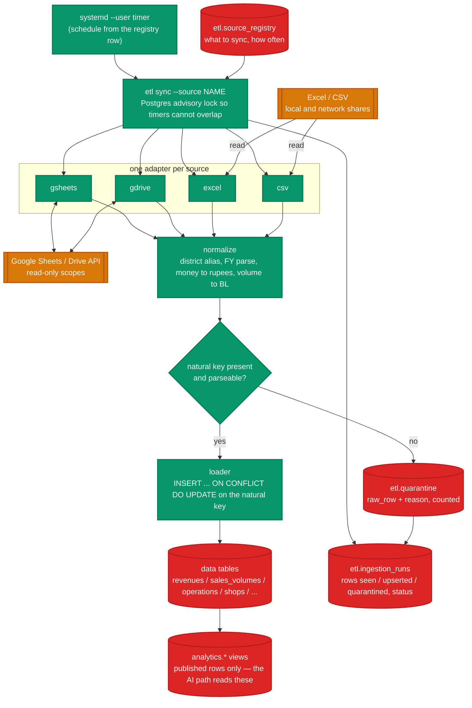
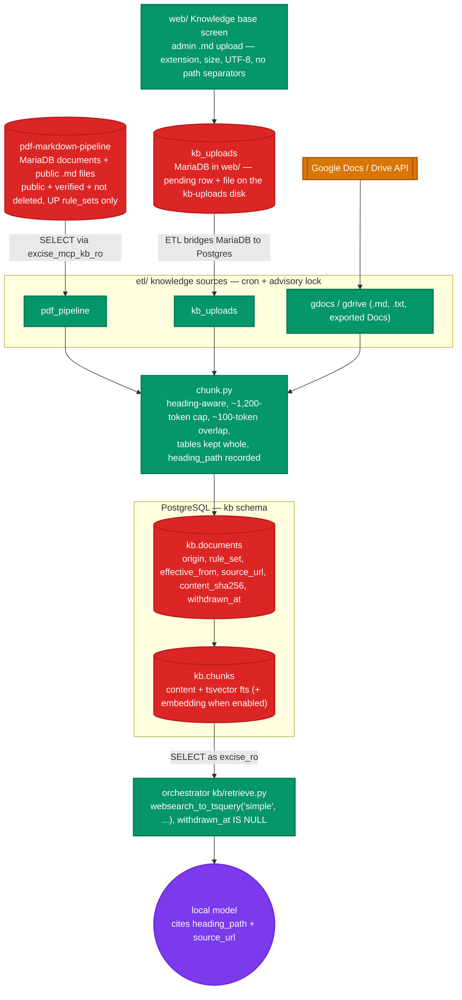

# DATA_PIPELINE.md — ETL ingestion and the PostgreSQL data bank

## Position

The excise data bank is a **PostgreSQL translation of the already-built,
already-verified schema in `~/Sites/upexcise-stats-dashboard`**
(`docs/data-model.md` there). That schema holds FY2014-15 onward: 75 districts,
900 rows per series on Revenue / Sales Volume / Operations, ~79,685 shops /
242,520 shop-years, 3,524 brands, 5,537 brand prices, 72 duty rates, 60 policy
rows, all reconciled against the source NITI workbooks with four import bugs
found and fixed. Do not design a new schema. Translate that one and add the
columns this project needs on top.

`web/`'s own small store (users, sessions, the query ledger, the job queue) is
a separate MariaDB database, `excise_mcp_dashboard_local`, provisioned by
`php artisan db:provision`. It is not the data bank and never holds excise
figures.

## PostgreSQL schema blueprint

Implemented in `db/schema.sql`, `db/analytics_views.sql`, `db/roles.sql`, and
`db/seed_reference.sql` (Milestone 1). This section is the design those scripts
follow; `db/README.md` covers apply order and the roles.

MariaDB -> PostgreSQL translation rules:

- `utf8mb4` / `utf8mb4_unicode_ci` -> database `ENCODING 'UTF8'`,
  `LC_COLLATE`/`LC_CTYPE` from the cluster; add `CITEXT` for
  case-insensitive natural keys (the shop-identity collation bug in the sibling
  was a collation-prediction mistake — use `CITEXT` or explicit
  `LOWER()` functional unique indexes, and resolve identity with a real query,
  not an in-code guess).
- `AUTO_INCREMENT` -> `GENERATED ALWAYS AS IDENTITY`.
- `bigInteger unsigned` FKs -> `BIGINT` + `REFERENCES`.
- `decimal(15,2)` money -> `NUMERIC(15,2)`.
- Laravel `timestamps` -> `created_at TIMESTAMPTZ NOT NULL DEFAULT now()`,
  `updated_at TIMESTAMPTZ NOT NULL DEFAULT now()` (a trigger keeps
  `updated_at` current).
- Soft delete -> `deleted_at TIMESTAMPTZ NULL`, partial indexes
  `WHERE deleted_at IS NULL`.
- `published_at` stays — the AI only ever reads published rows (see §Row
  visibility).

### Dimensions

```sql
CREATE TABLE zones (
    id           BIGINT GENERATED ALWAYS AS IDENTITY PRIMARY KEY,
    name         CITEXT NOT NULL UNIQUE,
    slug         CITEXT NOT NULL UNIQUE,
    created_at   TIMESTAMPTZ NOT NULL DEFAULT now(),
    updated_at   TIMESTAMPTZ NOT NULL DEFAULT now()
);

CREATE TABLE divisions (
    id           BIGINT GENERATED ALWAYS AS IDENTITY PRIMARY KEY,
    zone_id      BIGINT NOT NULL REFERENCES zones(id),
    name         CITEXT NOT NULL,
    slug         CITEXT NOT NULL UNIQUE,
    created_at   TIMESTAMPTZ NOT NULL DEFAULT now(),
    updated_at   TIMESTAMPTZ NOT NULL DEFAULT now(),
    UNIQUE (zone_id, name)
);

CREATE TABLE districts (
    id            BIGINT GENERATED ALWAYS AS IDENTITY PRIMARY KEY,
    division_id   BIGINT NOT NULL REFERENCES divisions(id),
    name          CITEXT NOT NULL UNIQUE,
    slug          CITEXT NOT NULL UNIQUE,
    lgd_code      INTEGER UNIQUE,          -- Local Government Directory code, for joins to other gov datasets
    latitude      NUMERIC(9,6),
    longitude     NUMERIC(9,6),
    published_at  TIMESTAMPTZ NULL,
    created_at    TIMESTAMPTZ NOT NULL DEFAULT now(),
    updated_at    TIMESTAMPTZ NOT NULL DEFAULT now(),
    deleted_at    TIMESTAMPTZ NULL
);

CREATE TABLE financial_years (
    id           BIGINT GENERATED ALWAYS AS IDENTITY PRIMARY KEY,
    label        TEXT NOT NULL UNIQUE,     -- 'FY2014-15'
    start_year   SMALLINT NOT NULL UNIQUE, -- 2014
    created_at   TIMESTAMPTZ NOT NULL DEFAULT now(),
    updated_at   TIMESTAMPTZ NOT NULL DEFAULT now()
);

CREATE TABLE license_categories (
    id           BIGINT GENERATED ALWAYS AS IDENTITY PRIMARY KEY,
    code         CITEXT NOT NULL UNIQUE,   -- e.g. 'CL', 'FL', 'BEER', 'BWFL'
    name         TEXT NOT NULL,
    kind         TEXT NOT NULL,            -- 'country_liquor' | 'foreign_liquor' | 'beer' | 'model_shop' | ...
    created_at   TIMESTAMPTZ NOT NULL DEFAULT now(),
    updated_at   TIMESTAMPTZ NOT NULL DEFAULT now()
);
```

### Fact tables (one per NITI series)

```sql
CREATE TABLE revenues (                    -- duty / fee collections
    id                 BIGINT GENERATED ALWAYS AS IDENTITY PRIMARY KEY,
    district_id        BIGINT NOT NULL REFERENCES districts(id),
    financial_year_id  BIGINT NOT NULL REFERENCES financial_years(id),
    license_category_id BIGINT REFERENCES license_categories(id),  -- NULL = all-category total row
    metric             TEXT NOT NULL,       -- 'excise_duty' | 'license_fee' | 'import_fee' | 'total'
    amount_inr         NUMERIC(18,2) NOT NULL,   -- store in rupees, format in the UI
    published_at       TIMESTAMPTZ NULL,
    source_ref         TEXT,                -- workbook / sheet / row provenance
    created_at         TIMESTAMPTZ NOT NULL DEFAULT now(),
    updated_at         TIMESTAMPTZ NOT NULL DEFAULT now(),
    deleted_at         TIMESTAMPTZ NULL,
    UNIQUE (district_id, financial_year_id, license_category_id, metric)
);

CREATE TABLE sales_volumes (               -- dispatches / supply-chain volume
    id                 BIGINT GENERATED ALWAYS AS IDENTITY PRIMARY KEY,
    district_id        BIGINT NOT NULL REFERENCES districts(id),
    financial_year_id  BIGINT NOT NULL REFERENCES financial_years(id),
    license_category_id BIGINT REFERENCES license_categories(id),
    metric             TEXT NOT NULL,       -- 'dispatch_bl' | 'consumption_bl' | 'cases'
    quantity           NUMERIC(18,3) NOT NULL,
    unit               TEXT NOT NULL,       -- 'BL' (bulk litres) | 'cases'
    published_at       TIMESTAMPTZ NULL,
    source_ref         TEXT,
    created_at         TIMESTAMPTZ NOT NULL DEFAULT now(),
    updated_at         TIMESTAMPTZ NOT NULL DEFAULT now(),
    deleted_at         TIMESTAMPTZ NULL,
    UNIQUE (district_id, financial_year_id, license_category_id, metric)
);

CREATE TABLE operations (                  -- enforcement statistics
    id                 BIGINT GENERATED ALWAYS AS IDENTITY PRIMARY KEY,
    district_id        BIGINT NOT NULL REFERENCES districts(id),
    financial_year_id  BIGINT NOT NULL REFERENCES financial_years(id),
    metric             TEXT NOT NULL,       -- 'raids' | 'cases_registered' | 'arrests' | 'liquor_seized_bl' | 'vehicles_seized'
    value              NUMERIC(18,3) NOT NULL,
    published_at       TIMESTAMPTZ NULL,
    source_ref         TEXT,
    created_at         TIMESTAMPTZ NOT NULL DEFAULT now(),
    updated_at         TIMESTAMPTZ NOT NULL DEFAULT now(),
    deleted_at         TIMESTAMPTZ NULL,
    UNIQUE (district_id, financial_year_id, metric)
);
```

### Shops (dimension + fact split, as in the sibling)

```sql
CREATE TABLE shops (
    id             BIGINT GENERATED ALWAYS AS IDENTITY PRIMARY KEY,
    district_id    BIGINT NOT NULL REFERENCES districts(id),
    shop_number    CITEXT NOT NULL,
    seq            SMALLINT NOT NULL DEFAULT 1,   -- disambiguator for same district+number (see sibling data-model.md)
    display_name   TEXT NOT NULL,
    license_category_id BIGINT REFERENCES license_categories(id),
    circle_code    CITEXT,
    sector_code    CITEXT,
    latitude       NUMERIC(9,6),
    longitude      NUMERIC(9,6),
    published_at   TIMESTAMPTZ NULL,
    created_at     TIMESTAMPTZ NOT NULL DEFAULT now(),
    updated_at     TIMESTAMPTZ NOT NULL DEFAULT now(),
    deleted_at     TIMESTAMPTZ NULL,
    UNIQUE (district_id, shop_number, seq)
);

CREATE TABLE shop_years (                  -- quota / settlement per shop per FY
    id                 BIGINT GENERATED ALWAYS AS IDENTITY PRIMARY KEY,
    shop_id            BIGINT NOT NULL REFERENCES shops(id),
    financial_year_id  BIGINT NOT NULL REFERENCES financial_years(id),
    shop_type          TEXT NOT NULL,       -- country liquor / foreign liquor / beer / model shop / composite
    mgq_bl             NUMERIC(18,3),       -- minimum guaranteed quota
    license_fee_inr    NUMERIC(18,2),
    settlement_mode    TEXT,                -- 'lottery' | 'e-lottery' | 'renewal' | 'auction'
    is_operational     BOOLEAN,
    source_ref         TEXT,
    created_at         TIMESTAMPTZ NOT NULL DEFAULT now(),
    updated_at         TIMESTAMPTZ NOT NULL DEFAULT now(),
    UNIQUE (shop_id, financial_year_id)
    -- visibility inherited from shops.published_at; shop_years has no published_at
);
```

### Dispatches (IESCMS wholesale-to-retail transport-pass log)

`sales_volumes` above holds one row per district+year+category — the annual
reconciled NITI figure. This is a different, finer-grained source: IESCMS
(the department's live supply-chain system) exports a shop-wise dispatch
report per month, one row per individual transport pass/indent, not an
aggregate. A country-liquor indent's quantities come broken down by liquor
strength (25% V/V, 36% V/V, ...); a foreign-liquor indent's don't, so that
breakdown lives in a child table instead of six columns a foreign-liquor row
never fills in.

```sql
CREATE TABLE dispatches (
    id                       BIGINT GENERATED ALWAYS AS IDENTITY PRIMARY KEY,
    district_id              BIGINT NOT NULL REFERENCES districts(id),
    financial_year_id        BIGINT NOT NULL REFERENCES financial_years(id),
    shop_id                  BIGINT NOT NULL REFERENCES shops(id),          -- retail side
    wholesale_license_type   CITEXT NOT NULL,     -- 'FL2' | 'CL2', as printed on the wholesale license
    wholesale_license_number TEXT NOT NULL,
    wholesale_entity_name    TEXT NOT NULL,
    circle_sector            CITEXT,
    indent_number            TEXT NOT NULL UNIQUE,
    indent_received_at       TIMESTAMPTZ,
    indent_accepted_at       TIMESTAMPTZ,
    transport_pass_issued_at TIMESTAMPTZ,
    tp_reference_no          TEXT,
    requested_cases          NUMERIC(18,3),       -- NULL for a country-liquor indent: see dispatch_strength_lines
    requested_bottles        NUMERIC(18,3),       -- foreign-liquor indents only
    requested_bulk_litres    NUMERIC(18,3),       -- NULL for a country-liquor indent: see dispatch_strength_lines
    dispatched_cases         NUMERIC(18,3),
    dispatched_bottles       NUMERIC(18,3),
    dispatched_bulk_litres   NUMERIC(18,3) NOT NULL,
    duty_fee_inr             NUMERIC(18,2) NOT NULL,
    published_at             TIMESTAMPTZ NULL,
    source_ref               TEXT,
    created_at               TIMESTAMPTZ NOT NULL DEFAULT now(),
    updated_at               TIMESTAMPTZ NOT NULL DEFAULT now(),
    deleted_at               TIMESTAMPTZ NULL
);

CREATE TABLE dispatch_strength_lines (     -- country-liquor per-strength breakdown
    id                     BIGINT GENERATED ALWAYS AS IDENTITY PRIMARY KEY,
    dispatch_id            BIGINT NOT NULL REFERENCES dispatches(id) ON DELETE CASCADE,
    strength_label         TEXT NOT NULL,        -- '25% V/V' | '36% V/V' | '42.8% V/V 100 ML' | ...
    requested_cases        NUMERIC(18,3),
    requested_bulk_litres  NUMERIC(18,3),
    dispatched_cases       NUMERIC(18,3),
    dispatched_bulk_litres NUMERIC(18,3),
    UNIQUE (dispatch_id, strength_label)
    -- visibility inherited from dispatches.published_at, same as shop_years from shops
);
```

`etl/sources/iescms_dispatch.py` reads both report layouts (`read_fl_rows`,
`read_cl_rows`) and upserts a `shops` row for the retail side alongside each
`dispatches` row — the shop dimension isn't seeded separately for this
source, it's built from the same report. `indent_number` is the natural key
for `dispatches`; the IESCMS report already guarantees it's unique, so a
re-run of the same file changes no counts. Both tables set `published_at`
at import time — an IESCMS export is the department's own live system
record, not a draft submission that needs a separate review step before an
analyst can query it. Registered as two `etl.source_registry` rows (source
`iescms_dispatch`, one per report layout), same as any other source;
`OPERATOR_SETUP.md` §Data bank has the exact commands.

### SRO shop revenue snapshot

A third, independent shop-level source: `up-excise-spatial-revenue-optimizer`
(sro.exciseup.in, its own short name "SRO" — Spatial Revenue Optimizer), a
separate departmental app whose own DEOs enter a per-shop revenue figure
directly, statewide, every year. Found useful here while tracing why
`revenues`'s district attribution goes wrong after 2018 (below): SRO's
current-year table gave a real, correctly-attributed cross-check —
`phase1_raw_collection`, 28,405 shops across all 75 districts for FY2025-26,
each with a `total_revenue` figure, lat/long, and thana-level location
(`district_name` > `circle_sector_name` > `thana_name`, one sector holding
several thanas) — a level of location detail neither `shops` nor
`dispatches` carries. Kept as its own table rather than merged into `shops`:
SRO's `shop_type` (`COMPOSITE_SHOP`, `BHANG_SHOP`, ...) and `has_cl5cc` flag
are that app's own vocabulary, not this schema's `license_categories` codes,
and the two aren't a reliable one-to-one match to force through that FK.

```sql
CREATE TABLE sro_shops (
    id                     BIGINT GENERATED ALWAYS AS IDENTITY PRIMARY KEY,
    district_id            BIGINT NOT NULL REFERENCES districts(id),
    financial_year_id      BIGINT NOT NULL REFERENCES financial_years(id),
    source_shop_id         TEXT NOT NULL,       -- SRO's own shop_id, unique within a district only
    shop_name              TEXT NOT NULL,
    shop_type              TEXT NOT NULL,       -- SRO's own vocabulary, see note above
    has_cl5cc              BOOLEAN NOT NULL DEFAULT false,
    circle_sector_name     TEXT NOT NULL,
    thana_name             TEXT NOT NULL,
    latitude               NUMERIC(9,6),
    longitude              NUMERIC(9,6),
    license_fee_lf         NUMERIC(18,2) NOT NULL DEFAULT 0,
    basic_license_fee_blf  NUMERIC(18,2) NOT NULL DEFAULT 0,
    mgr_amount             NUMERIC(18,2) NOT NULL DEFAULT 0,
    composite_lf_fl        NUMERIC(18,2) NOT NULL DEFAULT 0,
    composite_lf_beer      NUMERIC(18,2) NOT NULL DEFAULT 0,
    composite_mgr_fl       NUMERIC(18,2) NOT NULL DEFAULT 0,
    composite_mgr_beer     NUMERIC(18,2) NOT NULL DEFAULT 0,
    mgq_quantity           NUMERIC(18,3) NOT NULL DEFAULT 0,
    consideration_fee      NUMERIC(18,2) NOT NULL DEFAULT 0,
    special_beer_lf        NUMERIC(18,2) NOT NULL DEFAULT 0,
    special_beer_mgr       NUMERIC(18,2) NOT NULL DEFAULT 0,
    total_revenue          NUMERIC(18,2) NOT NULL DEFAULT 0,
    uploaded_by_deo        TEXT,
    published_at           TIMESTAMPTZ NULL,
    source_ref             TEXT,
    created_at             TIMESTAMPTZ NOT NULL DEFAULT now(),
    updated_at             TIMESTAMPTZ NOT NULL DEFAULT now(),
    deleted_at             TIMESTAMPTZ NULL,
    UNIQUE (district_id, source_shop_id, financial_year_id)
);
```

SRO ships its own data as a periodic Cloudflare D1 backup — a plain SQL text
dump against a SQLite schema
(`~/Projects/up-excise-spatial-revenue-optimizer/backups/d1-prod-backup-
YYYY-MM-DD.sql`), not a live connection this app can query. `etl/sources/
sro_shops.py`'s `read_rows()` loads that dump into a throwaway in-memory
SQLite database (stdlib `sqlite3`, no new dependency) and reads
`phase1_raw_collection` back out with a normal `SELECT` — the same shape
every other row source here is read in, just from a one-off text file
instead of a live MariaDB/Postgres connection or an Excel workbook. The
natural key is `(district_id, source_shop_id, financial_year_id)`, not just
`(district_id, source_shop_id)` — SRO overwrites its own current-year table
each year (`phase1_prior_year_snapshot` is where it archives the year
before), but a re-sync here should add a new year's rows as history, not
erase last year's, since the analyst asking "what did this shop earn last
year" needs both years still queryable. `source_ref` in `etl.source_registry`
carries `"<dump path>#FYyyyy-yy"`, the same `<path>#kind` shape
`niti_facts`/`niti_brands`/`niti_policy` already use for a file-based source
needing one more piece of context beyond its path. Registered as
one `etl.source_registry` row per snapshot year, same as any other source;
`OPERATOR_SETUP.md` §Data bank has the exact commands. Not yet imported —
schema created, source written and tested, `etl sync --source sro_shops`
not yet run against the real backup.

### Reference tables

```sql
CREATE TABLE brands (
    id             BIGINT GENERATED ALWAYS AS IDENTITY PRIMARY KEY,
    name           CITEXT NOT NULL,
    license_category_id BIGINT REFERENCES license_categories(id),
    segment        TEXT,                   -- 'regular' | 'premium' | 'economy'
    manufacturer   TEXT,
    published_at   TIMESTAMPTZ NULL,
    created_at     TIMESTAMPTZ NOT NULL DEFAULT now(),
    updated_at     TIMESTAMPTZ NOT NULL DEFAULT now(),
    deleted_at     TIMESTAMPTZ NULL,
    UNIQUE (name, license_category_id)
);

CREATE TABLE brand_prices (
    id                 BIGINT GENERATED ALWAYS AS IDENTITY PRIMARY KEY,
    brand_id           BIGINT NOT NULL REFERENCES brands(id),
    financial_year_id  BIGINT NOT NULL REFERENCES financial_years(id),
    pack_ml            INTEGER NOT NULL,
    mrp_inr            NUMERIC(12,2) NOT NULL,
    ex_distillery_inr  NUMERIC(12,2),
    published_at       TIMESTAMPTZ NULL,
    created_at         TIMESTAMPTZ NOT NULL DEFAULT now(),
    updated_at         TIMESTAMPTZ NOT NULL DEFAULT now(),
    UNIQUE (brand_id, financial_year_id, pack_ml)
);

CREATE TABLE duty_rates (
    id                 BIGINT GENERATED ALWAYS AS IDENTITY PRIMARY KEY,
    financial_year_id  BIGINT NOT NULL REFERENCES financial_years(id),
    license_category_id BIGINT NOT NULL REFERENCES license_categories(id),
    basis              TEXT NOT NULL,       -- 'per_bl' | 'per_lpl' | 'ad_valorem' | 'per_case'
    rate               NUMERIC(14,4) NOT NULL,
    unit               TEXT NOT NULL,
    notes              TEXT,
    published_at       TIMESTAMPTZ NULL,
    created_at         TIMESTAMPTZ NOT NULL DEFAULT now(),
    updated_at         TIMESTAMPTZ NOT NULL DEFAULT now(),
    UNIQUE (financial_year_id, license_category_id, basis)
);

CREATE TABLE policy_entries (
    id             BIGINT GENERATED ALWAYS AS IDENTITY PRIMARY KEY,
    financial_year_id BIGINT REFERENCES financial_years(id),
    effective_from DATE,
    effective_to   DATE,
    title          TEXT NOT NULL,
    category       TEXT,                   -- 'pricing' | 'licensing' | 'enforcement' | 'quota' | 'structural'
    summary        TEXT NOT NULL,
    source_ref     TEXT,
    published_at   TIMESTAMPTZ NULL,
    created_at     TIMESTAMPTZ NOT NULL DEFAULT now(),
    updated_at     TIMESTAMPTZ NOT NULL DEFAULT now(),
    deleted_at     TIMESTAMPTZ NULL
);
```

### ETL bookkeeping (separate schema)

```sql
CREATE SCHEMA etl;

CREATE TABLE etl.ingestion_runs (
    id            BIGINT GENERATED ALWAYS AS IDENTITY PRIMARY KEY,
    source        TEXT NOT NULL,           -- 'google_sheet' | 'google_drive' | 'excel' | 'csv'
    source_ref    TEXT NOT NULL,           -- sheet id / drive file id / path
    report_period DATE,                    -- first-of-month; see §Periodic sources below
    started_at    TIMESTAMPTZ NOT NULL DEFAULT now(),
    finished_at   TIMESTAMPTZ,
    status        TEXT NOT NULL DEFAULT 'running',  -- running | ok | failed | partial
    rows_seen     INTEGER DEFAULT 0,
    rows_upserted INTEGER DEFAULT 0,
    rows_quarantined INTEGER DEFAULT 0,
    error         TEXT
);

CREATE TABLE etl.quarantine (
    id            BIGINT GENERATED ALWAYS AS IDENTITY PRIMARY KEY,
    run_id        BIGINT NOT NULL REFERENCES etl.ingestion_runs(id),
    raw_row       JSONB NOT NULL,
    reason        TEXT NOT NULL,
    created_at    TIMESTAMPTZ NOT NULL DEFAULT now()
);

CREATE TABLE etl.source_registry (        -- what to sync and how often
    id               BIGINT GENERATED ALWAYS AS IDENTITY PRIMARY KEY,
    name             TEXT NOT NULL UNIQUE,
    source           TEXT NOT NULL,
    source_ref       TEXT NOT NULL,
    target_table     TEXT NOT NULL,
    schedule         TEXT NOT NULL,           -- cron expression
    enabled          BOOLEAN NOT NULL DEFAULT true,
    requires_period  BOOLEAN NOT NULL DEFAULT false,  -- see §Periodic sources below
    last_run_id      BIGINT REFERENCES etl.ingestion_runs(id)
);
```

### Periodic sources without a per-row date

A source like `iescms_dispatch` stamps a real business date on every row it
produces (`transport_pass_issued_at` and the rest), so `dispatches` never
needs to be told what period it belongs to — each row already says. Some
future sources won't: a monthly shops roster, or a monthly revenue / quota /
enforcement figure, arrives as one file that represents a whole reporting
month with no such column on any individual row. Nothing marks that period
once the file has been read, other than `created_at`, which is when the ETL
happened to run — already documented as unusable for a business-date
question (`guard_sql`, `MCP_ENGINES.md` §Pipeline stages).

A source registered with `etl.source_registry.requires_period = true` makes
the operator state that period explicitly, as `etl sync --source NAME
--period 2026-08`. `etl/etl/run.py` records the parsed period (first of the
named month) on that run's `etl.ingestion_runs.report_period`, and refuses to
run the source at all without one, recording a typed `failed` run row
instead of guessing at "now." A source not registered this way ignores
`--period` entirely and behaves exactly as it did before this existed.

This only carries the period onto the run's own bookkeeping row. A table
that mutates in place from such a source — the way `shops` already does from
`iescms_dispatch` — still only reflects its latest import once one lands.
Answering "what did this look like as of period X" once a later import has
overwritten it needs its own period-stamped table, the way `shop_years`
already answers the equivalent question at financial-year grain — built
alongside whichever source turns out to need it first.

### Indexes

Every fact table: `(financial_year_id)`, `(district_id, financial_year_id)`,
`(metric)` where present, and a partial `(published_at) WHERE published_at IS
NOT NULL`. `shop_years (financial_year_id, shop_type)`. `brand_prices
(financial_year_id)`. Add from the actual query plans the LLM produces — the
ledger records every SQL statement, so index tuning is driven by real usage
after Milestone 2.

### Row visibility for the AI path

The read-only role sees a set of views, not the base tables:

```sql
CREATE SCHEMA analytics;
CREATE VIEW analytics.revenues AS
    SELECT r.*, d.name AS district, d.slug AS district_slug,
           fy.label AS financial_year, fy.start_year,
           lc.code AS license_category
    FROM revenues r
    JOIN districts d  ON d.id = r.district_id AND d.deleted_at IS NULL AND d.published_at IS NOT NULL
    JOIN financial_years fy ON fy.id = r.financial_year_id
    LEFT JOIN license_categories lc ON lc.id = r.license_category_id
    WHERE r.deleted_at IS NULL AND r.published_at IS NOT NULL;
-- one such view per fact + reference table; shop_years joins shops for published_at
```

The LLM is told about `analytics.*` only. It never learns the base table names,
the `id` columns are still present for joins but the natural-language layer
works in district names and FY labels. `SECURITY.md` §Read-only role grants
`SELECT` on `analytics.*` and nothing else.

What the model is told about each view has two sources: `schema_card.py`'s own
`VIEW_NOTES`, a fixed dict in the orchestrator's source, and an admin-editable
overlay — the data dictionary (Admin -> Data dictionary, privilege
`schema.manage`), one note per table and, unlike `VIEW_NOTES`, one per column
too. A note there is saved to web/'s own `schema_notes` table and read back by
the orchestrator over `GET /api/schema-notes` (`MCP_ENGINES.md` §HTTP surface,
`SECURITY.md` §3), taking effect on the orchestrator's next restart. The same
screen lists every table's columns and a five-row sample of each, from the
orchestrator's own `GET /schema/tables` and `GET /schema/tables/{name}/sample`
— the same route `web/` uses everywhere else it needs something out of
Postgres, since `web/` holds no database connection of its own.

A live question asking for a specific month's sales in amount and volume by
shop category repeatedly failed on a hallucinated `shop_id`/`dispatch_id`
column against `analytics.sales_volumes` — that view is aggregated by
district + financial year + license category, with no shop-level or
monthly breakdown at all, so no column by either name has ever existed on
it. `analytics.revenues` has the same shape. `VIEW_NOTES` now says so for
both, and points at `analytics.dispatches` instead for a question scoped to
a month or to individual shops — it already carries `duty_fee_inr` (amount)
and `dispatched_bulk_litres`/`dispatched_cases`/`dispatched_bottles`
(volume) at exactly that granularity.

Tracing that same failure back to the source uncovered a second gap: the
IESCMS dispatch report each row comes from carries two separate license-type
columns — a wholesale one (`FL2`/`CL2`, the distributor) and a retail one
(the actual shop, e.g. `FL5DB`/`CL5C`) — and `analytics.dispatches` already
keeps them apart as `wholesale_license_type` and `retail_license_category`.
What was missing was anywhere to look up what any code actually means:
`license_categories` (code, name, kind) has held the full list since the
dispatch-report milestone but was never exposed as its own view.
`analytics.license_categories` now is one, `CREATE OR REPLACE VIEW` in
`db/analytics_views.sql` like every other view here, picked up automatically
by `excise_ro`'s `ALTER DEFAULT PRIVILEGES` grant (`db/roles.sql`) with no
separate grant needed. `VIEW_NOTES` for `dispatches` and `shops` now name it
directly, and say plainly that a shop's own category is never `FL2`/`CL2` —
those two are `kind = 'wholesale'` and only ever belong to
`dispatches.wholesale_license_type`.

A live Chat answer read out shop categories by bare code only (`CL5C`,
`FL5DB`, `FL4A`, ...) with no plain-language name alongside any of them — a
reader who doesn't already know the code list gets nothing from it. The chat
model only ever sees `run_sql_query`'s own row preview, never the schema
card, so asking it to name a code from memory would just be a guessed name —
the fix belongs in the query, not the prompt. `llm/prompts.py`'s
`FEW_SHOT_SQL_EXAMPLES` now has a worked example joining
`analytics.license_categories` in by code to select its `name` alongside a
`retail_license_category` grouping, and the `dispatches` `VIEW_NOTES` entry
says to do this whenever the answer will show shop categories to a reader.
`CHAT_SYSTEM_PROMPT` tells the model to use the name column the result
already carries, never to invent one for a code the result didn't name.

A live Ask question ("how many country liquor and composite shops in
Lucknow in August 2026") undercounted real shops by 417 — all of them
`FL5DB`. `kind = 'composite'` in `analytics.license_categories` covers both
`CL5CC` and `FL5DB`, but the worked `FEW_SHOT_SQL_EXAMPLES` entry for this
exact question filtered `retail_license_category IN ('CL5C', 'CL5CC')`, a
hand-picked list that only had one of the two composite codes — the model
copies a worked example's pattern rather than deriving which codes a kind
actually has. The example now JOINs `license_categories` and filters on
`kind IN ('country_liquor', 'composite')` instead, and the `license_categories`
`VIEW_NOTES` entry states the general rule: a question naming a category
rather than a specific code (composite, country liquor, foreign liquor,
beer, model shop) means every code of that kind, found by filtering on
`kind`, never by a memorized code list that can silently leave one out.

The data dictionary screen showed each table under its raw name
(`analytics.dispatch_strength_lines`) with `VIEW_NOTES`' own prose as its
only description — planning guidance written for the SQL model, full of
column names and JOIN instructions, not a sentence an admin reads to find
out what a table holds. `schema_card.py`'s `TABLE_DISPLAY` now carries a
plain-language name and one-sentence summary per view — `SchemaTable` from
`GET /schema/tables` gains `display_name` and `summary` fields alongside the
existing `note` — and `schema-notes-index.blade.php` leads with those, the
raw `analytics.*` name kept underneath in monospace for reference, the full
technical note tucked behind a "Technical note (what the AI is told)"
disclosure. A table missing from `TABLE_DISPLAY` falls back to its own name
with underscores turned to spaces, never a blank heading. `VIEW_NOTES` itself
gained a missing entry along the way: `analytics.sro_shops` (the SRO shop
census, imported earlier this section) had no note at all despite being live
data and the correct source for a district-level revenue question past
`analytics.revenues`' own post-2018 consolidation problem — the `revenues`
note now says so directly.

That fix's own premise about `CL5CC` was wrong: checked against
`~/Projects/up-excise-spatial-revenue-optimizer`'s roadmap, the canonical
shop-type reference for this department, `CL5CC` is not `kind = 'composite'`
at all — it is a Country Liquor shop with a beer endorsement, never combined
with foreign liquor, and "composite" means only a Foreign Liquor + Beer
license (`FL5DB` is the sole `kind = 'composite'` code).
`public.license_categories` is corrected — `CL5CC.kind` is now
`'country_liquor'`, `FL5DB.name` now reads "Composite (Foreign Liquor +
Beer)" — live and in `db/seed_reference.sql`. The question above still gets
the same right answer either way, since it asked for country liquor and
composite *together*: `CL5C` and `CL5CC` are both `kind = 'country_liquor'`
regardless of this fix, and `FL5DB` alone was always the missing
`kind = 'composite'` code. A new knowledge-base document, "UP Excise shop
types and license codes," carries the corrected classification for every
shop type — Country Liquor, Composite, Model Shop, PRV, Bhang Shop, HBR —
in plain language, sourced from the same roadmap (`ROADMAP.md`'s backlog
has the `kb_uploads` ETL-sync gap this surfaced: the admin upload screen has
no sync consumer yet, so this one document was ingested by calling
`etl/etl/chunk.py` directly).

### BI access (future — Power BI and similar, not built)

`analytics.*` and `kb.*` are the entire surface any read-only consumer ever
needs, human or model. A BI tool (Power BI Desktop today; DBeaver was the
original Backlog framing) connects the same way `excise_ro` does, just under
its own role:

```sql
CREATE ROLE excise_bi_ro LOGIN PASSWORD :'bi_ro_pw';
GRANT CONNECT ON DATABASE excise_bank TO excise_bi_ro;
GRANT USAGE ON SCHEMA analytics, kb TO excise_bi_ro;
GRANT SELECT ON ALL TABLES IN SCHEMA analytics, kb TO excise_bi_ro;
ALTER ROLE excise_bi_ro SET default_transaction_read_only = on;
```

A direct copy of `db/roles.sql`'s `excise_ro` grants under a new name — kept
separate from `excise_ro` itself so a human's ad-hoc query is never on the
same role as the AI path's own audit trail, and so revoking BI access never
touches the orchestrator. One shared `excise_bi_ro`, or one role per officer
if per-person audit ever matters more than setup simplicity — either way it
follows `db/roles.sql`'s existing pattern. `ARCHITECTURE.md` Diagram 5,
`EVALUATION.md` §Right-sizing item 15, `ROADMAP.md` Backlog. Power BI *Service*
(cloud publish/refresh) stays out of scope — it would send data off the box.

## ETL pipeline design

`etl/` is a small Python 3.12 package run from cron / systemd timers. One
command, `etl sync [--source NAME] [--all]`, reads `etl.source_registry`,
runs each due source through: **fetch -> normalize -> validate -> upsert ->
record run**.



### Shared shape

Every source adapter yields rows in one normalized dict shape per target
table (the loader knows the natural key per table and does `INSERT ... ON
CONFLICT ... DO UPDATE`). A row that fails validation (missing natural-key
field, unparseable number, unknown district) goes to `etl.quarantine` with a
reason and is counted, never inserted. A run writes one
`etl.ingestion_runs` row with counts; a non-zero quarantine count sets status
`partial` and the run summary is logged and (optionally) mailed.

Idempotent by construction: re-running the same source over the same
unchanged input upserts identical values and changes no counts. This is the
property the sibling `excise:import` already has and the tests enforce.

### Google auth modes

Every Google adapter (`gsheets`, `gdrive`, `gdocs`) takes an `auth` field on
its `source_registry` row:

- **`service_account`** — a Google Cloud service account, key file path in
  `GOOGLE_APPLICATION_CREDENTIALS` (env, `600`, never committed), the target
  shared with the service-account email as Viewer. For server-owned content
  that does not belong to a person.
- **`oauth`** — a user-delegated connection. The Laravel app runs the OAuth
  flow (`laravel/socialite`, Google provider, `access_type=offline`,
  `prompt=consent`) and stores one `google_connections` row per user with a
  `Crypt`-encrypted refresh token and the granted scopes. The ETL reads
  `client_id` / `client_secret` (from `etl/.env`) plus the connection's
  refresh token (from the operational DB over a loopback read) and lets
  `google-auth` mint and refresh access tokens. A `source_registry` row in
  `oauth` mode carries `connection_id`. A refresh failure (revoked, expired
  consent) sets the run `failed` with `reason = 'google reconnect needed:
  <connection>'` and the "Connected sources" screen flags it — never a silent
  skip.

Scopes requested (read-only, minimum needed):
`.../auth/drive.readonly`, `.../auth/spreadsheets.readonly`,
`.../auth/documents.readonly`. `SECURITY.md` §Google OAuth covers the consent
screen (Internal vs External), the restricted-scope verification caveat, and
token handling.

### Source adapters

**Google Sheets** (`etl/sources/gsheets.py`)
- Library: `google-api-python-client` + `google-auth`, scope
  `spreadsheets.readonly`. Auth mode per §Google auth modes.
- Reads a named range or a whole tab; the `source_registry` row carries the
  sheet id, the tab/range, and the target table. A per-sheet column map
  (`etl/maps/<sheet>.yml`) translates sheet headers to normalized fields.
- Change detection: the Sheets/Drive API `modifiedTime`; skip a source not
  newer than the last successful run unless `--force`.

**Google Drive** (`etl/sources/gdrive.py`)
- Scope `drive.readonly`. Auth mode per §Google auth modes.
- Lists a folder, downloads new/changed files to a temp dir, then dispatches
  by MIME type: `.xlsx` / `.csv` -> the Excel or CSV adapter (data tables);
  `.md` / `.txt` and exported Google Docs -> the knowledge adapter (`kb.*`,
  see §Knowledge base). Native Google Sheets export as `.xlsx`; native Google
  Docs export as `text/markdown`.
- Dedup on Drive `fileId` + `md5Checksum`.

**Google Docs** (`etl/sources/gdocs.py`)
- Scope `documents.readonly`. Auth mode per §Google auth modes.
- For a registered Doc id, pulls the document and renders it to Markdown
  (headings, lists, tables, links). Target is always `kb.*` — a Doc is
  reference text, not tabular data. The `source_registry` row carries the
  Doc id and a `title` / `category` override.

**Excel** (`etl/sources/excel.py`)
- Library: `openpyxl` for `.xlsx`; `.xls` is rare — convert with LibreOffice
  headless (`soffice --headless --convert-to xlsx`) only if a real `.xls`
  appears, otherwise do not add the dependency.
- Mirrors the sibling `ImportExciseData` logic: the note-row filter that once
  truncated sheets is replaced by an explicit "this row is data if the
  natural-key columns are all present and numeric" test, not a heuristic on
  column A length.
- One workbook can feed several tables (the NITI submission workbooks do);
  the column map names the target per sheet.

**CSV / local & network shares** (`etl/sources/csv.py`)
- `csv` stdlib + explicit `dialect`; declared encoding in the registry row
  (default `utf-8-sig`).
- A registry row can point at a directory glob on a mounted share; each file
  is one logical source keyed by path + mtime + size.

### Normalization rules

- Districts resolve by `CITEXT` name against `districts`; an unrecognized name
  is quarantined with `reason = 'unknown district: <value>'` (a small alias
  table `etl.district_aliases(alias CITEXT, district_id)` handles known
  spelling variants — seed it from the sibling's cleanup notes).
- Financial years parse from any of `2014-15`, `FY2014-15`, `2014_15`,
  `2014` -> `financial_years.start_year`.
- Money: strip `₹`, commas, spaces; reject anything left non-numeric; store
  rupees (not lakh/crore) — the registry row says the input unit and the
  adapter multiplies.
- Volumes: normalize to bulk litres (`BL`); cases stay as `cases` in their own
  metric.
- Every inserted row carries `source_ref = '<run source>:<source_ref>:<row
  number>'` so a figure in the UI can be traced to a cell.

### Schedules

Driven by `etl.source_registry.schedule` (cron expressions), executed by
systemd `--user` timers generated in `deploy/`:

| Source class | Default cadence | Rationale |
|---|---|---|
| Google Sheets (live working sheets) | every 6 h, `0 */6 * * *` | analysts edit these during the day; 6 h keeps the bank fresh without hammering the API |
| Google Drive folder (dropped workbooks) | hourly, `15 * * * *` | pick up a new submission workbook soon after it lands |
| Local / network-share CSV | daily 02:30, `30 2 * * *` | batch exports, updated overnight |
| Full NITI workbook re-import | manual (`etl sync --source niti_full`) | the annual reconciled set; run on demand, verify counts like the sibling did |

All timers are `--user` units with `Persistent=true` so a missed run (box
off) fires on next boot. A run acquires a Postgres advisory lock
(`pg_try_advisory_lock`) so overlapping timers cannot double-load.

### Failure and alerting

- A source that fails leaves its last-good data in place (upsert-only, no
  truncate-then-load).
- `etl.ingestion_runs.status = 'failed'` with the exception in `error`.
- The run command exits non-zero; the systemd unit's `OnFailure=` points at a
  small notifier unit that mails the run summary through the same Resend setup
  the Laravel apps use (`MAIL_MAILER=resend`, `noreply@mail.exciseup.in`).
- `partial` (quarantined rows) mails a lower-priority digest, not a failure.

### What the ETL never does

- No writes from the web path — `etl/` is cron-only, not importable by `web/`
  or `orchestrator/`.
- No schema changes after the initial migration — the ETL role has
  `INSERT`/`UPDATE`/`DELETE` on data tables, `kb.*`, and `etl.*`, no
  `CREATE`/`ALTER`.
- No deletes of published history except through an explicit
  `etl sync --source X --reconcile` run that logs every delete to
  `etl.quarantine` first.

---

## Knowledge base

The model can answer questions about UP Excise acts, rules, regulations, and
policies — not only the numbers. The corpus is verified Markdown, stored in a
`kb` schema in the same Postgres data bank, retrieved by the orchestrator
(`MCP_ENGINES.md` §Chat and retrieval). Two feeds:

1. **pdf-markdown-pipeline** — the department's verified document repository
   (`~/Sites/pdf-markdown-pipeline`, live at `docsrepo.exciseup.in`). Only
   `visibility = 'public'` **and** `status = 'verified'` **and**
   `deleted_at IS NULL` **and** (no state-specific `rule_set`, or one tagged
   `Uttar Pradesh`) documents are ingested — that repository also holds ten
   other states' excise policies as comparative reference material, out of
   scope for this UP-only tool.
2. **Admin `.md` uploads** — the "Knowledge base" screen in `web/`. An
   uploaded file lands on a dedicated disk with a `kb_uploads` row; the ETL
   picks it up on the next run.



### `kb` schema

```sql
CREATE SCHEMA kb;

CREATE TABLE kb.documents (
    id             BIGINT GENERATED ALWAYS AS IDENTITY PRIMARY KEY,
    origin         TEXT NOT NULL,           -- 'pdf_pipeline' | 'upload' | 'gdoc' | 'gdrive'
    origin_ref     TEXT NOT NULL,           -- pipeline document id | upload ulid | gdoc id | drive fileId
    title          TEXT NOT NULL,
    doc_type       TEXT,                    -- 'act' | 'rule' | 'rule_amendment' | 'policy' | 'government_order' | 'notice' | 'court_order' | 'service_code' | 'other'
    language       TEXT,                    -- 'english' | 'hindi' | 'both'
    department     TEXT,                    -- 'excise' | 'sugarcane' | ...
    rule_set       TEXT,                    -- named Act / Rules / policy series, when known
    effective_from DATE,
    effective_to   DATE,                    -- set when a later doc supersedes this one
    source_url     TEXT,                    -- deep link on docsrepo.exciseup.in, or the Drive/Docs URL
    content_sha256 TEXT NOT NULL,           -- of the full Markdown, for change detection
    ingested_at    TIMESTAMPTZ NOT NULL DEFAULT now(),
    withdrawn_at   TIMESTAMPTZ NULL,        -- upstream doc went non-public / unverified / deleted, or upload withdrawn
    UNIQUE (origin, origin_ref)
);

CREATE TABLE kb.chunks (
    id             BIGINT GENERATED ALWAYS AS IDENTITY PRIMARY KEY,
    document_id    BIGINT NOT NULL REFERENCES kb.documents(id) ON DELETE CASCADE,
    ord            INTEGER NOT NULL,        -- chunk order within the document
    heading_path   TEXT,                    -- 'Chapter III > Section 12 > (2)' for citation
    content        TEXT NOT NULL,           -- the chunk text, Markdown
    token_estimate INTEGER NOT NULL,
    fts            tsvector GENERATED ALWAYS AS (
                       to_tsvector('simple', coalesce(heading_path,'') || ' ' || content)
                   ) STORED,
    embedding      real[] NULL,             -- populated only when KB_EMBEDDINGS_ENABLED; becomes vector(N) with pgvector
    UNIQUE (document_id, ord)
);

CREATE INDEX kb_chunks_fts       ON kb.chunks USING GIN (fts);
CREATE INDEX kb_chunks_doc       ON kb.chunks (document_id);
-- with pgvector:
-- ALTER TABLE kb.chunks ALTER COLUMN embedding TYPE vector(768) USING embedding::vector(768);
-- CREATE INDEX kb_chunks_hnsw ON kb.chunks USING hnsw (embedding vector_cosine_ops);
```

The Postgres FTS config is `'simple'` (no stemming) because the corpus is
bilingual English/Hindi and the Hindi text must not be run through an English
stemmer. `pg_trgm` on `content` is an option for fuzzy matching if `'simple'`
recall is weak; `EVALUATION.md` §Retrieval.

### `analytics`-side exposure

The read-only role sees `kb.documents` and `kb.chunks` directly (`SECURITY.md`
§Read-only role) — no view needed, `withdrawn_at IS NULL` is a filter the
retrieval query always applies. The base fact-table `analytics.*` views and
the `kb.*` tables are the model's entire world.

### pdf-markdown-pipeline sync (`etl/sources/pdf_pipeline.py`)

Reads from two places on the same box, both read-only:

- **MariaDB `pdf_markdown_pipeline_local`** (the app's DB): the `documents`
  table, filtered `visibility = 'public' AND status = 'verified' AND
  deleted_at IS NULL AND (rule_sets.state IS NULL OR rule_sets.state =
  'Uttar Pradesh')`, joined to `sections` / `rule_sets` / `departments` for
  `rule_set`, `doc_type` (`documents.document_type`), `language`, and the slug
  segments that build the `docsrepo.exciseup.in` URL. `rule_sets.state` also
  names the other ten states whose policies live in that repository as
  comparative reference material; a `NULL` state (a generic Act or government
  order with no state-specific rule set) stays in scope, a different state's
  does not. A dedicated read-only MariaDB user (`excise_mcp_kb_ro`, `SELECT`
  on that DB only) — the operator creates it, `OPERATOR_SETUP.md` §KB.
- **Filesystem**: the Markdown for each row is at
  `~/Sites/pdf-markdown-pipeline/storage/app/public/<markdown_path>`
  (`markdown_path` is relative to the `public` disk). Read-only file access;
  the ETL user needs group read on that tree.

Per document: hash the Markdown, compare to `kb.documents.content_sha256`;
if new or changed, re-chunk and replace the document's `kb.chunks`.
`documents.metadata` (JSON) carries `effective_year` for a rule amendment —
when present, it becomes `kb.documents.effective_from` as `<year>-01-01`, so
retrieval can cite a real date rather than whatever a title happens to spell
out; a document with no `effective_year` of its own stays undated, since the
source repository has none to give it either. A `documents` row that no
longer matches the filter (unpublished, un-verified, deleted, or now outside
the state scope) sets `withdrawn_at` — the content stays for audit but
retrieval skips it. Idempotent on an unchanged corpus; a document whose
`effective_from` changes without its Markdown changing (the state filter
above, or backfilling a column added after the document first synced) is not
treated as unchanged, so it still gets re-applied.

### Admin upload flow

1. `web/` "Knowledge base" screen: an admin (`kb.manage` privilege) uploads a
   `.md` file. Validation: extension `.md`, `<= 2 MB`, UTF-8 decodable,
   filename sanitised to `[a-z0-9-_]`, no path separators. Optional title,
   `doc_type`, `rule_set`, `effective_from`.
2. The file is written to the `kb-uploads` disk
   (`web/storage/app/kb-uploads/<ulid>.md`, on the Apache `ReadWritePaths`
   list) and a `kb_uploads` row is created (`ulid`, `original_name`, `title`,
   metadata, `status = 'pending'`, `uploaded_by`).
3. The next `etl sync --source kb_uploads` run reads pending rows, ingests
   each into `kb.documents` (`origin = 'upload'`, `origin_ref = <ulid>`,
   `source_url` = a `web/` route that serves the stored file), chunks into
   `kb.chunks`, sets the `kb_uploads` row `status = 'ingested'`.
4. "Withdraw" on the screen sets `kb_uploads.status = 'withdrawn'`; the next
   run sets `kb.documents.withdrawn_at`.

`kb_uploads` lives in `web/`'s MariaDB (it is operational state); `kb.*` lives
in Postgres (it is model-facing data). The ETL bridges them.

### Chunking

- Split on Markdown headings first; a section longer than ~1,200 tokens splits
  again on paragraph boundaries with a ~100-token overlap.
- `heading_path` records the heading breadcrumb so a retrieved chunk can be
  cited as "Section 12(2) of the UP Excise Manual" with a link.
- Tables are kept whole in one chunk where possible.
- No chunk crosses a document boundary.

### Embeddings (only when `KB_EMBEDDINGS_ENABLED`)

Off by default. When enabled: at ingestion, `etl/` batches chunk text through
the local Ollama embed model (`nomic-embed-text`, 768-dim, or `bge-m3`) and
writes `kb.chunks.embedding`. The orchestrator embeds the query the same way
at retrieval and does cosine search (`pgvector` HNSW) merged with the FTS
result. Nothing is sent off the box. `EVALUATION.md` §Retrieval has the
decision and the RAM cost.

### Knowledge sources in `etl.source_registry`

| name | source | ref | target | schedule |
|---|---|---|---|---|
| `pdf_pipeline_docs` | `pdf_pipeline` | — | `kb` | `0 3 * * *` (daily 03:00) |
| `kb_uploads` | `upload` | — | `kb` | `*/15 * * * *` (picks up new uploads) |
| `gdocs_<name>` | `gdoc` | Doc id | `kb` | per registration |
| `gdrive_kb_<name>` | `gdrive` | folder id | `kb` (`.md`/`.txt`/Docs only) | hourly |

Same `etl.ingestion_runs` / `etl.quarantine` bookkeeping and advisory lock as
the data-table sources.

---

## Output store

Two data planes, kept apart:

- **Raw data — PostgreSQL** (`analytics.*` + `kb.*`), fed by ETL from Google
  Sheets / Drive / Docs, Excel, and CSV. Read-only to the AI path. This is the
  data bank; nothing the model or the app produces is written back to it.
- **Outputs — `web/`'s MariaDB + the `local` disk.** Every chart, table
  preview, summary, and the SQL that produced it is an app artifact owned by a
  user, with its own ACL, history, and exports. The orchestrator generates
  them and hands them to `web/`; `web/` owns their lifecycle.

The one path from an output back toward the public data plane is the reviewed
hand-off to `upexcise-stats-dashboard` (`ROADMAP.md` backlog), never a direct
write.

### What a run produces

One `/query` or chat `make_chart` call yields:

| Piece | Stored as |
|---|---|
| the question + generated SQL + engine + model + timings + status | a `queries` row (chat: the `message` + `message_tool_calls` rows) in MariaDB |
| interactive chart spec | `chart_artifacts.spec` — a `JSON` / `LONGTEXT` column in MariaDB (the Plotly figure, needed on every render, small because charts plot aggregates) |
| rendered chart files | not persisted — `chart_artifacts` carries `png_path`/`svg_path`/`pdf_path` columns for a future cached export, but a PNG/SVG/PDF download today calls the orchestrator's `POST /chart/render` on the stored spec and streams the bytes back without writing them to disk (`ROADMAP.md` Milestone 5) |
| table | `rows_preview` (first N rows) inline as JSON on the row; full rows re-run from the stored SQL on export, not persisted |
| written summary | text column on the `queries` / `messages` row |

**Small and structured -> MariaDB; large blobs -> the disk.** The chart spec,
`rows_preview`, the SQL, the summary, and every `saved_analyses` / `reports`
row live in MariaDB — queryable, versioned with the row, and self-contained
for the offline Dexie cache. The rendered PNG / SVG / PDF and the report
exports go to the `local` disk with a pointer row. MariaDB *can* hold the
rasters in a `LONGBLOB`, but that bloats every `mysqldump`, pushes big blobs
through the InnoDB buffer pool against the hot session / job rows, and makes
serving a file a `SELECT` + PHP stream instead of `Storage::download`. The
four sibling apps keep artifacts on disk the same way.

Files land under `web/storage/app/artifacts/<query-ulid>/` (on the Apache
`ReadWritePaths` list). A run that nobody saves is swept after
`ARTIFACT_TTL_DAYS` (default 30) by a systemd `--user` timer, the same pattern
as the sandbox scratch sweeper (`SECURITY.md` §2). A run referenced by a
`saved_analyses` row is never swept.

### Saved analyses — freeze and re-run

A user pins a run into a `saved_analyses` row (ULID): `user_id`, `query_id`
(the run it froze), `title`, `notes`, `recipe` JSON (the question, resolved
filters, `engine`, `model`, and the `analytics.*` views the SQL touched),
`visibility` (`private` / `team`), `pinned_at`.

The `recipe` makes it reproducible. "Refresh" re-runs it against current data
and writes an `analysis_runs` row: `saved_analysis_id`, `query_id` (the new
run), `ran_at`, `trigger` (`manual` / `schedule` / `etl`), `headline` (the
single figure the chart is about, for the trend sparkline). Triggers:

- **manual** — a Refresh button on the saved analysis.
- **schedule** — a cron expression on the row; a systemd timer calls the same
  job (`ROADMAP.md` backlog "scheduled questions").
- **etl** — the SQL guard records referenced views on `queries.tables_used`;
  when an `etl.ingestion_runs` row completes for one of them, matching saved
  analyses with `auto_refresh = true` are queued.

`analysis_runs` is the trend history: same question, successive data vintages.
A saved analysis shows a `Sparkline` (reuse `~/Sites/upexcise-stats-dashboard`
`app/Support/Sparkline.php`) of `headline` across its runs, and points at
either the latest run or a pinned one.

### Reports — assemble a presentation

A `reports` row (ULID): `user_id`, `title`, `description`, `visibility`,
`published_at`. Ordered `report_blocks`: `report_id`, `position`, `type`
(`analysis` / `heading` / `text` / `image`), `saved_analysis_id` +
`run_ref` (`latest` or a pinned `analysis_runs.id`) for analysis blocks,
`body` Markdown for text blocks. A report is the "presentation" — a document
of charts, tables, and narration that either tracks live data (`run_ref =
latest`) or is frozen to a point in time.

### Export

| Scope | Formats | Built from |
|---|---|---|
| one chart | PNG / SVG / PDF, `plotly.json` (re-embeddable) | rendered on request from the `spec` column via `POST /chart/render`, not a pre-rendered disk file |
| one result | CSV / XLSX of the full rows | re-run the stored SQL, stream through the sibling `ExportService` (`openspout`) |
| saved analysis | the chart + a `recipe.json` (reproducible) | the row + files |
| report | one **PDF** (a print-view Blade → `barryvdh/laravel-dompdf`, DejaVu Sans for `₹` + Devanagari, the sibling `AnnualReport` shape); **XLSX** workbook, one sheet of rows per analysis block; **ZIP** bundle of the PDF + per-block CSVs + `plotly.json` + recipes | the blocks, resolved at export time; `etl_epoch` stamped on the output so the data vintage is on the page |

PPTX is deferred — it needs a new library; the PDF and the print view cover
"make a presentation" until a real need for editable slides appears.

`report_exports` caches the last export per `(report_id, format)`:
`file_path` under `web/storage/app/report-exports/<report-ulid>/`,
`generated_at`, `etl_epoch`. Regenerated on demand or when a block's
underlying run changes.

## NITI workbook import (2026-09-24)

The eight NITI workbooks under `~/mentor_portal_db/UP Excise Data
Collection/Final Data for Submission/` are loaded into `excise_bank` through
four new adapter modules, registered as eight `etl.source_registry` rows
(`niti_revenue`, `niti_sales_volume`, `niti_operations`, `niti_shops`,
`niti_brands`, `niti_brand_prices`, `niti_policy_rules`, `niti_duty_rates`;
`schedule = 'manual'`, matching this doc's own Schedules table). Districts
(sheet 1) is cross-check only, per the task that drove this work — no
`districts` row is inserted or altered from it.

- **`etl/etl/sources/niti_facts.py`** — Revenue, Sales Volume, and Operations
  share one district × financial-year grain with no license-category
  breakdown, so `revenues.license_category_id` and
  `sales_volumes.license_category_id` are NULL on every row here (the
  schema's own "all-category total" case). One sheet row fans out into
  several metric rows, one per non-blank column; a blank cell is skipped,
  never inserted as zero. `revenues.metric` / `sales_volumes.metric` /
  `operations.metric` hold the source columns' own names (e.g.
  `license_fee_auction_lottery`, `imfl_premium`, `illicit_liquor_seized_litres`)
  rather than the shorter illustrative list in the schema comment, which
  doesn't cover most of the real columns.
- **`etl/etl/sources/niti_shops.py`** — sources from
  `Stats Dashboard Shop Types (2026-09-16)/5_Shops_All_Districts.xlsx`
  (CLAUDE.md's real-category reclassification), not the `Final Data for
  Submission` copy of the same sheet: that copy carries only NITI's five
  generic dropdown buckets, 78% of it "Other", none of which resolve onto a
  seeded `license_categories` code. Seven of the real workbook's nine
  categories map onto a seeded code (Country Liquor → CL, Foreign Liquor →
  FL, Beer → BEER, Composite → FL5DB, Model Shop → MODEL, Country Liquor
  with Beer → CL5CC, Premium Retail Vend → FL4C); "Bar" and "Wholesale Beer &
  Wine" have no seeded code (FL6 / FL2B were never added to
  `license_categories`) and load with `license_category_id = NULL`, same as
  "Other" and "Retail" — the shop itself is still real data, just
  uncategorized. `shop_years.mgq_bl` only fills when exactly one of the
  source's three minimum-quantity columns is present and already in bulk
  litres; the source's "lifted" quantities, penalty charged/recovered, and
  the gave-up/continued pair beyond `is_operational` have no column in this
  schema and are not loaded.
- **`etl/etl/sources/niti_brands.py`** — Brands, then Brand Prices (the
  second depends on the first's rows already being in `brands`). "Type of
  drink" resolves IMFL → FL, Beer → BEER, Country liquor → CL; Wine and
  Imported liquor have no matching `kind` in `license_categories` at all and
  load with `license_category_id = NULL`. `brands` has no pack-size column,
  so the source's 10,995 (brand, pack) rows collapse onto 2,541 distinct
  (name, category) brand entities — pack-specific figures live in
  `brand_prices` instead. `brand_prices.ex_distillery_inr` is filled from
  "Price approved by the department," the figure actually in force;
  "Price declared by the manufacturer" and "Excise duty charged" have no
  column here and are not loaded.
- **`etl/etl/sources/niti_policy.py`** — Policy Rules synthesizes one
  `policy_entries` row per (state, financial year) with a `summary` listing
  every non-blank attribute as "label: value," since `policy_entries` has no
  column for "who does the wholesale" or "date CCTV became compulsory"
  individually; `category` stays NULL because one row spans pricing,
  licensing, and enforcement attributes at once. Every Duty Rates row is
  quarantined outright: its Rate column holds a formula string referencing
  EDP (ex-distillery price) — `7.2*EDP`, `200+0.425*EDP` — not the plain
  number `duty_rates.rate` requires, and no destination for that formula
  exists in this schema.
- **`etl/etl/normalize.py`** — `_FY_PATTERNS` now also accepts a
  4-digit-4-digit year (`2014-2015`, the Shops and Brand Prices sheets'
  form) and a doubled or dotted separator (`2024.25`, `2017--18`, both real
  values found in the Shops workbook). `NITI_DISTRICT_ALIASES` and
  `seed_district_aliases()` hold the spelling/format variants the NITI
  workbooks use that don't match `districts.name` (a parenthetical old name
  like `Allahabad (Prayagraj)`, a missing space, a missing letter) — checked
  against every one of the 75 district keys `~/mentor_portal_db/scripts/
  run_all_shops_districts.py` already uses, not derived in isolation.

### Row counts

| Source | Rows seen | Upserted | Quarantined |
|---|---|---|---|
| niti_revenue | 3,455 | 3,455 | 0 |
| niti_sales_volume | 3,812 | 3,812 | 0 |
| niti_operations | 11,124 | 11,124 | 0 |
| niti_shops | 242,766 | 242,574 | 192 |
| niti_brands | 10,995 | 2,541 distinct brands | 0 |
| niti_brand_prices | 8,693 | 5,008 | 3,684 |
| niti_policy_rules | 61 | 60 | 1 |
| niti_duty_rates | 73 | 0 | 73 |

`shops` holds 80,676 rows (1,093 pre-existing from the Lucknow IESCMS
dispatch import, the rest from this source) and `shop_years` holds 241,762.

### Quarantined rows and why

- **niti_shops (192)**: 187 are Bahraich's FY2018-19 sheet, where every row's
  financial-year cell reads `20215-16` instead of `2015-16` — a known,
  already-flagged district-side typo (`~/mentor_portal_db/FLAGGED.md`
  "Bahraich"), not corrected here either, since correcting a 5-digit year to
  a specific 4-digit one is a guess this project has already declined to
  make. 5 rows have a blank "Type of shop" cell (`shop_type` is `NOT NULL`).
  Separately, one informational (non-counted) quarantine row records that
  53,316 "Other" / 38,694 "Retail" / 783 "Wholesale Beer & Wine" shop_years
  rows loaded with `license_category_id = NULL` — see the module note above.
- **niti_brand_prices (3,684)**: 3,361 rows are a `brand_name` this
  workbook's own Brands sheet doesn't carry — CLAUDE.md's own
  `7_Brand_Prices.xlsx` build notes already document keeping these rows "as
  is where the brand isn't in the current Brands registry" (an older or
  discontinued brand whose price history was kept without a matching Brands
  entry), so this is the same known gap, not a matching bug. 193 rows are a
  brand name with more than one `(name, license_category_id)` variant in
  `brands` — which one a bare price row belongs to isn't stated in the
  source, so neither is guessed at. 130 rows are the already-known unresolved
  price conflicts (CLAUDE.md "the 55 conflicting-price-value rows," which
  turn out to be 130 rows across 64 conflicting groups once counted by exact
  natural key) — both sides of each conflicting group are quarantined, not
  one picked over the other.
- **niti_policy_rules (1)**: the sheet's own instructions/note row in column
  A, which has no financial year to resolve — correctly recognized as not a
  data row.
- **niti_duty_rates (73, all of them)**: every row's Rate column is a
  formula referencing EDP, not a plain number — this project decided to
  quarantine all 73 rather than store a truncated coefficient that isn't the
  real duty rate.

### Shop-identity collision check (Lucknow)

Zero collisions. `shops` already held 1,093 Lucknow rows from the live
IESCMS dispatch import before this run (`shop_number` a 9-10 digit IESCMS
reference, e.g. `252642565`); the Shops workbook's own Lucknow sheet uses
shop/licence names and IDs in a different, non-overlapping form. The check
itself excludes any
Lucknow shop that already has a `shop_years` row from a prior `niti_shops`
run (iescms_dispatch never writes `shop_years`, so any shop with one is this
source's own, not a foreign collision) — without that exclusion, a second
run of this same source would flag its own previous rows as colliding with
themselves, which is what an early version of this check actually did
before the exclusion was added.

### The 14 flagged Shops districts

Amroha, Auraiya, Azamgarh, Bhadohi, Bijnor, Chandauli, Farrukhabad, Jaunpur,
Kasganj, Kaushambi, Mau, Prayagraj, Siddharthnagar, and Unnao's shop and
shop_year rows are loaded like every other district's, with
`shops.published_at` left NULL rather than set to the import time — 15,564
shop rows across the 14 districts, reconciling exactly against
`~/mentor_portal_db/FLAGGED.md`'s own per-district conflict-row counts.
They stay unpublished until a district confirms which side of its
per-district merge conflict is correct.

### A test-isolation bug this import surfaced

`tests/test_niti_facts.py`'s fixture rows originally defaulted to a real
district (`Agra`), a real-looking financial year (`2014-15`), and a real
metric name (`excise_duty`, and two tests overrode it to `imfl` /
`retail_shops`). `revenues`, `sales_volumes`, and `operations` upsert on
`(district_id, financial_year_id, metric[, license_category_id])`, which
does not include `source_ref` — so a test row with this exact combination
silently updated the genuine Agra FY2014-15 `excise_duty` and `imfl` rows in
place, and the fixture's teardown (`DELETE ... WHERE source_ref LIKE
'TEST-NITI-FACTS-%'`) then deleted them, since the update had overwritten
their `source_ref` too. Fixed by giving every test row a `metric` no real
source column will ever produce (`__test_metric_<suffix>__`), which the
natural key can never collide on regardless of which district or financial
year the test also uses. The two affected production values were restored
by re-running `niti_revenue` and `niti_sales_volume` (idempotent; verified
against the source workbook's own cells for Agra FY2014-15 afterward).
