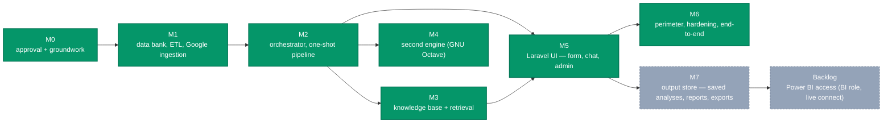

# ROADMAP.md — excise-mcp-dashboard

Phased build. Each milestone is a checklist with a stated "done when" gate.

**Position:** Phase 4 is approved. Milestone 0 — approval given, PostgreSQL
running, `excise_bank` created, the sandbox user and scratch dir in place,
MariaDB migrated, both LLM models pulled (`qwen2.5-coder:7b-instruct-q4_K_M`,
`llama3.1:8b-instruct-q4_K_M`); the Cloudflare and Google-consent decisions
are the owner's remaining M0 items. Milestone 1's database half (`db/` —
schema, `analytics.*` views, the three roles, reference seed) and ETL core
plumbing (loader, normalize, quarantine, the csv/excel readers) are done;
the NITI workbook column maps and Google ingestion are not started. Milestone
2 (the orchestrator's one-shot `/query` pipeline) is done, tested live against
real seed data. Milestone 3's retrieval plumbing is done — the
pdf-markdown-pipeline sync, the chunker, and Postgres FTS via `/kb/search`,
tested live against the real corpus (334 rows); Google Docs/Drive into `kb.*`
and wiring `search_knowledge` into a chat loop wait on the rest of Milestone 5
and Google ingestion (M1). Milestone 4 (the Octave engine) is done, tested
live against a real `octave-cli` render in the sandbox. The `db/` data bank,
`etl/` core, and `orchestrator/`'s pipeline + knowledge base + second engine
are merged into `dev`. **Milestone 5 (Laravel UI)** is underway on
`web/plan/webui.md`'s design. Phase 0 (shell, RBAC, auth), Phase 4 (admin —
users, Google connect, knowledge base, activity log), Phase 1 (the Ask
form), Phase 2 (the orchestrator `/chat` endpoint and tool loop), and Phase
3 (the Chat window) are merged into `dev` — tested green,
`pint`/PHPUnit 58 tests on `web/`, `ruff`/`mypy --strict`/`pytest` 73 tests on
`orchestrator/`. A public `/` landing page and the brand assets (state
emblem, favicons, moved from `assets/brand/` into `web/public/`) are also
built, ahead of the rest of Phase 5. The app is live end to end on this box —
Apache vhost, Cloudflare tunnel, `web/` queue worker, and the orchestrator
all running as `systemd --user` units, verified together against the real
`visualizer.exciseup.in` URL. A super-admin System health screen, AI
token-usage tracking, Ask feedback capture, and Pulse/Telescope (both
locked to Admin regardless of `APP_ENV`) are built too, ahead of schedule —
none of this was part of the original Phase 0-4 scope. Phase 5's remaining
piece, the customization panel, is also built. **Milestone 5's checklist is
now fully checked off** — money formatting, chart PNG/SVG/PDF export, the
query ledger view, and the admin ETL visibility screen are all built,
closing out the four items this file previously listed as not built. The
ETL screen needs one pending grant (`excise_ro` read on schema `etl`,
`OPERATOR_SETUP.md` §Data bank) applied to this box's already-provisioned
database before it shows real data; every other item is live. **Milestone 6
— perimeter, hardening, end-to-end — is next.**

Every `sudo` / install / external-console step is collected, copy-pasteable,
in [`OPERATOR_SETUP.md`](OPERATOR_SETUP.md), grouped by the milestone that
needs it. The checkboxes below reference those sections.

Scope note: Milestones 1, 2, 5, and 6 build the reduced design from
`EVALUATION.md` §Right-sizing — one Python engine, direct read-only `asyncpg`,
explicit tool selection, Postgres FTS before vectors, native Livewire chat.
Milestone 3 adds the knowledge base. Milestone 4 adds a second engine behind
the same interface. Milestone 7 adds the output store — saved analyses,
reports, and exports — and is post-MVP. MATLAB and Mathematica stay documented
and unbuilt.

---

## Milestone 0 — Approval and groundwork (no code)

- [x] Owner reviews all docs and replies `Approved. Proceed to Phase 4.`
- [x] Owner runs `OPERATOR_SETUP.md` §0 — start PostgreSQL, create the sandbox
      user and scratch dir, confirm `bwrap` works unprivileged
- [x] Owner runs `OPERATOR_SETUP.md` §Models — `ollama pull` for the SQL model
      and the chat model
- [x] Owner decides the Cloudflare hostname — `visualizer.exciseup.in`
- [ ] Owner decides the Google consent-screen type (Internal vs External —
      `OPERATOR_SETUP.md` §Google Cloud has the trade-off) and whether the
      Google connect feature is in scope for the first build at all

**Done when:** approval is given, PostgreSQL is running, both LLM models are
pulled, the sandbox user exists.

---

## Milestone 1 — Data bank, ETL, and Google ingestion

### Database (`db/`)
- [x] `db/schema.sql` — the PostgreSQL schema from `DATA_PIPELINE.md`
      (dimensions, fact tables, shops split, reference tables, the `etl`
      schema, the `kb` schema); `set_updated_at()` trigger on every
      `updated_at` table; fact-table and lookup indexes
- [x] `db/analytics_views.sql` — the `analytics.*` published-only views
- [x] `db/roles.sql` — `excise_owner` / `excise_etl` / `excise_ro` from
      `SECURITY.md` §1 (grants cover `analytics.*` and `kb.*`)
- [x] `db/seed_reference.sql` — `zones` (5) / `divisions` (18) / `districts`
      (75) / `financial_years` (FY2014-15..FY2025-26) / `license_categories`,
      seeded from `~/Sites/UP-excise-mailer`'s contact-list JSON;
      `ON CONFLICT DO NOTHING` throughout
- [x] `db/README.md` — script purpose, apply order, roles
- [x] Owner runs `OPERATOR_SETUP.md` §Data bank — `createdb`, apply the four
      scripts (`roles.sql`'s `-v` password-quoting bug found and fixed along
      the way, see `db/roles.sql`'s header comment). The
      `excise_mcp_kb_ro` read-only MariaDB user is Milestone 3-scoped and
      still pending
- [x] Verify: `psql -U excise_ro` can `SELECT` from `analytics.revenues` and
      `kb.documents`, and **cannot** `INSERT` anywhere or read `public.*` —
      confirmed live against `excise_bank`

### ETL core (`etl/`)
- [x] `etl/` package: `config.py` (pydantic-settings), `db.py` (writer pool on
      `excise_etl`), `run.py` (`etl sync` CLI), `loader.py` (upsert on natural
      key), `quarantine.py`, `normalize.py` (district / FY / money / volume
      rules per `DATA_PIPELINE.md` §Normalization rules)
- [x] `etl.source_registry` / `etl.ingestion_runs` / `etl.quarantine` writing
      on every run; Postgres advisory lock so timers cannot overlap
- [x] `etl/sources/excel.py`, `etl/sources/csv.py`
- [x] `etl/sources/iescms_dispatch.py` — the IESCMS shop-wise wholesale-to-
      retail dispatch report (a live-system monthly export, not the NITI
      annual reconciliation below), into the new `dispatches` /
      `dispatch_strength_lines` tables (`DATA_PIPELINE.md` §Dispatches).
      August 2026, Lucknow, both report layouts (foreign-liquor-family and
      country-liquor with its per-strength breakdown). `db/schema.sql` /
      `analytics_views.sql` / `seed_reference.sql` (FY2026-27, the seven
      retail/wholesale license codes the report uses) are written; applying
      them and running the import is pending the operator's `sudo -u
      postgres` step (`OPERATOR_SETUP.md` §Data bank)
- [ ] Excel adapter loads the NITI submission workbooks from
      `~/mentor_portal_db/UP Excise Data Collection/` and reconciles counts
      against the sibling's verified import (75 districts; 900 rows/series on
      revenues/sales_volumes/operations; ~79,685 shops / 242,520 shop-years;
      3,524 brands; 5,537 brand prices; 72 duty rates; 60 policy rows)

### Google ingestion
- [ ] Owner runs `OPERATOR_SETUP.md` §Google Cloud — create the project,
      configure the consent screen, enable Drive / Sheets / Docs APIs, create
      the OAuth client (web) and, if used, the service account
- [ ] `web/` (minimal, ahead of the full UI): `laravel/socialite` Google
      provider, `/google/connect` + `/google/callback`, `google_connections`
      table (encrypted refresh token), an internal loopback
      `GET /internal/google-token/{connection}` endpoint (bearer auth)
- [ ] `etl/google_auth.py` — resolve a source's auth mode (`service_account`
      or `oauth`), mint/refresh access tokens, typed "reconnect needed" error
- [ ] `etl/sources/gsheets.py`, `etl/sources/gdrive.py` — pull a live test
      sheet and a test Drive folder end to end in both auth modes
- [ ] `deploy/` systemd `--user` timers for the schedules in
      `DATA_PIPELINE.md` §Schedules, `Persistent=true`, `OnFailure=` notifier
      that mails the run summary via Resend

### Tests
- [ ] `etl/tests/`: each source adapter parses a fixture to the normalized
      shape (done for `csv`/`excel`, against synthetic fixtures — no real
      NITI file to fixture yet); re-running a fixture changes no counts
      (done for `csv`); a malformed row is quarantined and counted; FY and
      money/volume normalization (done); district-alias resolution against a
      live database; both Google auth modes against a mocked API; token
      refresh and revocation paths
- [x] `ruff`, `ruff format --check`, `mypy --strict` green on `etl/`

**Done when:** `etl sync --source niti_full` populates `excise_bank`, counts
match the sibling's verified import, `analytics.*` returns only published
rows, `excise_ro` is provably read-only, and a Google Sheet syncs through an
OAuth connection.

---

## Milestone 2 — Orchestrator: the one-shot analytical pipeline

- [x] `orchestrator/` scaffold per `MCP_ENGINES.md` §Module layout; venv,
      pinned `requirements.txt` + `.lock`
- [x] `config.py` Settings incl. the model registry (`OLLAMA_ALLOWED_MODELS`,
      per-role defaults); `auth.py` bearer-token dependency (constant-time)
- [x] `schemas.py`: `QueryRequest` / `QueryResponse` / `SqlPlan` / `PlotPlan` /
      `Stage` / typed errors (`QueryRequest.model` optional, registry-checked)
- [x] `sql/schema_card.py` renders `analytics.*` into a prompt schema card
- [x] `llm/client.py`: Ollama async client, `format=`-constrained structured
      output, one-retry validation loop, model resolved from the registry (a
      request override falls back to the per-role default);
      `llm/prompts.py` (system prompt, schema card slot, 6–10 few-shot NL->SQL
      examples)
- [x] `sql/guard.py`: `sqlglot` single-read-only-SELECT parser with the full
      reject list from `SECURITY.md`; `LIMIT` injection
- [x] `sql/runner.py`: `asyncpg` pool on `DATABASE_URL_READONLY`,
      `BEGIN READ ONLY` + `SET LOCAL` timeouts + `ROLLBACK`, row cap
- [x] `engines/base.py`: `IVisualizationEngine` Protocol, registry, errors
- [x] `engines/python_engine.py`: script harness (Parquet preamble), output
      collection (`plotly.json` / `png` / `svg` / `pdf`), `is_available()`
- [x] `sandbox/bwrap.py`: the `bwrap` command from `SECURITY.md` §2,
      `systemd-run` cgroup caps (`MemoryMax` + `MemorySwapMax=0` — swap alone
      lets a script page around the cap instead of getting OOM-killed, found
      live), artifact copy-out, scratch cleanup; decided `systemd-run` —
      `--uid=excise-sandbox` behind `SANDBOX_UID_SWITCH_ENABLED` (still off:
      `loginctl enable-linger excise-sandbox` is done, but `--uid=` from an
      unprivileged session needs root/polkit regardless of linger — confirmed
      live; the sudoers fallback in `SECURITY.md` §2 is the real path,
      untried). `bwrap`'s own namespace/network/filesystem confinement is the
      primary control either way and is fully active without the uid switch
- [x] `pipeline.py`: the six stages, `Stage` events, per-stage timing
- [x] `main.py`: FastAPI app, lifespan (pool, `httpx`, ollama warmup),
      `/health` (incl. the model registry with a pulled flag each), `/query`
      (chunked stage stream + final JSON), `/query/{id}/status`
- [x] `deploy/`: systemd `--user` unit `excise-orchestrator.service` on
      `127.0.0.1:8085`
- [x] Manual end-to-end from `curl`: a question -> SQL -> rows -> `chart.plotly.json`
      -> a summary — done against the live `excise_bank` and the real
      `qwen2.5-coder`/`llama3.1` models ("How many districts are in each
      zone?" -> a real `GROUP BY` over `analytics.districts`, 75 rows across 5
      zones matching `seed_reference.sql`, a real sandboxed Plotly render, a
      real narrated summary). `chart.png` (static export) is not yet part of
      this: Plotly's static export needs `kaleido>=1.0`, which drives a real
      headless Chrome instead of the old pure-binary renderer, and it fails to
      launch inside the `bwrap` sandbox even with `/dev/shm` mounted
      (`BrowserFailedError`) — `llm/prompts.py` asks the model for
      `chart.plotly.json` only until this is debugged further; see the note in
      `engines/python_engine.py`

### Tests
- [x] tool schemas round-trip; guard rejects non-SELECT / multi-statement /
      cross-schema / volatile-fn; a write attempt fails against real local
      Postgres via `excise_ro` (verified live: `CREATE TABLE`, `INSERT` into
      `kb.*`, and a `public.*` / `etl.*` read all correctly refused)
- [x] router: explicit `engine` picks the adapter; unknown/unavailable ->
      typed error; default `python`
- [x] sandbox: past-wallclock killed; socket open fails; write outside
      `/scratch` fails; past-memory killed
- [x] Ollama client: malformed structured output -> one retry -> typed error
- [x] model selection: allowed `model` used; out-of-registry `model` rejected
      pre-call; chat picker does not change the `run_sql_query` planner model
      (chat itself is Milestone 5)
- [x] `ruff` / `ruff format --check` / `mypy --strict` green

**Done when:** `POST /query` with a bearer token turns an excise question into
a validated read-only SQL run plus a sandboxed Python chart plus a summary,
every failure path typed.

---

## Milestone 3 — Knowledge base and retrieval

Scoped to the retrieval plumbing this milestone's own pipeline needs: the
pdf-markdown-pipeline sync and FTS search. Wiring `search_knowledge` into the
chat tool loop is Milestone 5+ (the loop itself isn't built yet either); Google
Docs/Drive ingestion into `kb.*` waits on Milestone 1's Google ingestion,
still not started. `kb_uploads.py` / `gdocs.py` / the `gdrive.py` `kb.*`
branch stay unbuilt until those land.

- [x] `db/` already has the `kb` schema (Milestone 1). Add
      `db/kb_indexes.sql` — the GIN FTS index, the document/chunk indexes.
      Written; applying it needs `sudo -u postgres`, so it's a pending
      `OPERATOR_SETUP.md` §Data bank step, not run by this session
      (`CLAUDE.md`'s "no passwordless sudo" constraint)
- [x] `etl/sources/pdf_pipeline.py` — read
      `pdf_markdown_pipeline_local.documents` (via `excise_mcp_kb_ro`,
      `SELECT`-only) filtered public + verified + not-deleted, join for
      `rule_set` / `doc_type` / `language` / URL slug, read each Markdown file
      from `~/Sites/pdf-markdown-pipeline/storage/app/public/<markdown_path>`.
      Verified live against the real `pdf_markdown_pipeline_local` (334
      public+verified Excise rows, all with a buildable URL and a readable
      `markdown_path`) — one alias fix needed (`div` is a MariaDB reserved
      word)
- [x] `etl/chunk.py` — heading-aware chunking with `heading_path`, ~1,200-token
      cap, ~100-token overlap, tables kept whole
- [ ] `etl/sources/kb_uploads.py` — ingest pending `kb_uploads` rows staged by
      `web/`; `etl/sources/gdocs.py` — Google Docs -> Markdown -> `kb.*`;
      `gdrive.py` gains the `.md` / Docs -> `kb.*` branch
- [x] Withdrawal handling: a doc that stops matching the filter, or a withdrawn
      upload, sets `kb.documents.withdrawn_at`; re-run changes no other rows
- [x] `orchestrator/app/kb/retrieve.py` — FTS query over `kb.chunks`
      (`websearch_to_tsquery('simple', ...)`, `withdrawn_at IS NULL`, top
      `KB_RETRIEVE_K`); a `pgvector` code path behind `KB_EMBEDDINGS_ENABLED`
      (off)
- [ ] `orchestrator/app/kb/embed.py` — local Ollama embed client, used only
      when embeddings are enabled. Not built: `KB_EMBEDDINGS_ENABLED` is off
      and stays off until Milestone 6's retrieval quality check calls for it
      (`EVALUATION.md` §Retrieval) — nothing to embed with yet
- [x] `orchestrator` `/kb/search` endpoint (retrieval only, no LLM) for tests
      and the "cite sources" panel; `/health` reports `kb_docs` and
      `embeddings`
- [x] `etl.source_registry` row: `pdf_pipeline_docs` (daily), registered live.
      `kb_uploads` / `gdocs_*` / `gdrive_kb_*` wait on the sources above

### Tests
- [x] fixture mirroring `pdf_markdown_pipeline_local.documents` + a Markdown
      file -> correct `kb.documents` + `kb.chunks` with metadata and source
      URL; re-run changes no counts; removed upstream doc -> `withdrawn_at`
      (`etl/tests/test_pdf_pipeline.py`, against the real local Postgres via
      `excise_etl`). Non-public/non-verified skipped is enforced by
      `fetch_documents`' `WHERE` clause, not fixture-tested separately — the
      live 334-row check above confirms the filter runs against the real
      schema
- [x] retrieval returns expected chunks by FTS rank; a withdrawn document is
      excluded; no match / empty corpus -> no context
      (`orchestrator/tests/test_kb_retrieve.py`, against the real local
      Postgres). `pgvector` merge/de-dupe test deferred with `embed.py`
- [x] upload validation in `web/` (extension, size, path traversal) — built as
      part of Milestone 5's Knowledge base admin screen
      (`tests/Feature/Admin/KnowledgeBaseTest.php`)
- [x] `ruff` / `ruff format --check` / `mypy --strict` green on `etl/` and
      `orchestrator/`

**Done when:** the verified pdf-markdown-pipeline corpus and admin `.md`
uploads are searchable through `/kb/search`, withdrawal is respected, and
turning on `pgvector` is a config flag plus a backfill (not a rebuild).

---

## Milestone 4 — Second engine (GNU Octave); proprietary adapters stubbed

- [x] Owner runs `OPERATOR_SETUP.md` §Octave (`sudo apt install octave`)
- [x] `engines/octave_engine.py`: generated `.m` variable hand-off (Octave has
      no `readtable`), `octave-cli --no-gui --norc` under the same sandbox,
      `print()` to `chart.{png,svg,pdf}` via gnuplot's cairo terminals,
      `supported_outputs = {"png","svg","pdf"}`, `is_available()`
- [x] `sandbox/bwrap.py` gains an Octave profile (script/data filenames, the
      `octave-cli` command line, a `LANG` for Ghostscript's iconv step, and a
      conditional `/etc/fonts` bind for gnuplot's text rendering)
- [x] Router prompt gains one capability line for `octave` — the chat
      `make_chart` tool has nothing to target yet, since the chat tool loop
      itself is still Milestone 5+ (Milestone 3 above has the same deferral
      for `search_knowledge`)
- [x] Tests: an `.m` script renders a PNG in the sandbox (live, against a real
      `octave-cli`); unavailable Octave is skipped cleanly; pipeline falls
      back to a static chart when a no-Plotly-JSON engine is chosen
- [x] `engines/matlab_engine.py` and `engines/wolfram_engine.py` as documented
      stubs raising `EngineUnavailable("not configured")`, behind
      `ENABLE_MATLAB` / `ENABLE_WOLFRAM` (default off), integration notes from
      `MCP_ENGINES.md` in the docstrings. No dependency added.

**Done when:** the model can choose `python` or `octave` from the one-shot
path, both run in the sandbox, proprietary adapters are
inert stubs.

---

## Milestone 5 — Laravel UI: analytical form, chat window, admin

Full design in `web/plan/webui.md` — reuse map, RBAC and data model, the Ask
and Chat flows end to end, the orchestrator `/chat` design, the model picker,
and a security checklist. This checklist tracks the same scope; the plan has
the detail and the reasoning behind each decision below.

- [x] `web/` scaffold: Laravel 13 + Livewire 4 + Fortify, sibling dependency
      set + `laravel/socialite`; `php artisan db:provision` ->
      `excise_mcp_dashboard_local` (MariaDB, scoped user)
- [x] Port auth from `~/Sites/upexcise-stats-dashboard` (OTP login, magic-link
      onboarding + reset, `tests/Feature/Auth/*`)
- [x] Move `assets/brand/*` (state emblem, favicons, app icons) into
      `web/public/`, wired into `<x-head>`; port the identity strip and the
      skip link into a new public landing page (`web/plan/webui.md` §3 — a
      placeholder public route was added this milestone, reversing the
      original "no public route" call). Not done: the theme + high-contrast
      toggle (that's the Phase 5 customization panel below) and regenerating
      the icons/OG card with the sibling's `scripts/make-brand-assets.php` —
      the existing sibling-generated assets were copied as-is
- [x] Design system: copy the token block and `@apply` classes from the
      sibling's `head.blade.php`, the Tabler-icon admin shell
      (`components/{layout,sidebar}.blade.php`), and `public/vendor/tabler-icons/`;
      follow `docs/design-guidelines.md` (`govviolet` / `govsaffron`, Inter,
      GIGW accessibility baseline). The admin shell uses `govviolet` as its
      accent, same as the one public landing page (`web/plan/webui.md` §3);
      Chart.js colours per §Charts wait on the first screen that renders a
      Chart.js chart
- [x] Customization panel: a FAB + Display panel (theme, font family via
      on-demand Google Fonts, text size, line spacing, content width, density,
      accent, high contrast, reduce-motion), `data-*` attributes + CSS vars,
      `localStorage` + a mirrored cookie, `users.ui_prefs` JSON via
      `PATCH /account/ui-prefs`, Reset. Theme keeps its own `color_scheme` key,
      separate from the `ui_prefs` JSON, so the sidebar's light/dark toggle and
      the panel's three-way control share one piece of state. Accent recolors
      every existing `govviolet-*` utility class app-wide with no change to
      the ~20 files using them: the Tailwind config routes the `govviolet`
      palette through `--accent-*` CSS custom properties — `rgb(var(--accent-600))`,
      the same trick a full Tailwind build uses for opacity-modifier support —
      and an accent choice swaps which ramp those ten variables hold:
      govviolet (default) and govsaffron, the department's own two-tone
      palette
- [x] Port middleware: `SecurityHeaders` (CSP extended for the FastAPI origin,
      Plotly/Chart.js, `marked` + highlighter, `cleave.js`, `dexie`),
      `LogMutation`, `HasPrivilege` / `IsAdmin`. Every Livewire write method
      re-checks its privilege — `livewire/update` skips route middleware
      (`SECURITY.md` §3)
- [x] RBAC: `role` (`Admin`/`Analyst`) + `privileges` JSON + `designation_id` +
      free-text `post`, plus a `designations` preset table seeded with the
      excise-specific rank names `excise-budget-tracker`/`UP-excise-mailer`
      already seed — the pattern four sibling Laravel apps converged on
      independently (`web/plan/webui.md` §6); `AppServiceProvider` rate
      limiters incl. `ask` and `chat`; `Carbon::macro('ist')` and the `Login` /
      `Logout` -> `activity_logs` listeners ported from the sibling
- [x] Formatting: store UTC, render IST via `->ist()`. `₹` + `en-IN` grouping
      with a rupees / thousands / lakh / crore switcher
      (`App\Support\Money`, `<x-money>`) and the ported `<x-currency-input>`
      Cleave.js component are built; neither screen currently on `web/`
      renders a money figure or takes a money input, so this is ready
      infrastructure with no live caller yet, the same position
      `->ist()`/`Carbon::macro` was in before Phase 4's admin screens used it
- [x] `/admin/activity-logs` (Admin only) ported; the audit table in
      `SECURITY.md` §5 is the coverage checklist
- [x] Migrations: `conversations` (ULID), `messages` (incl. `model`,
      `prompt_tokens`, `completion_tokens`), `message_tool_calls`, `queries`
      (prompt, sql, engine, `model`, `tables_used`, row_count, timings JSON,
      status, request_id, `prompt_tokens`, `completion_tokens`),
      `chart_artifacts` (`spec` JSON + disk file paths), and `query_feedback`
      (thumbs + note, one row per person per query) are all built.
      `kb_uploads`, `google_connections`, and `users.ui_prefs` (JSON) are
      built (Phase 4)
- [x] Orchestrator `orchestrator/app/chat/` (`tools.py`, `loop.py`,
      `prompts.py`; `ChatRequest` + tool schemas in the existing root
      `schemas.py`) and one new route, `POST /chat` — the bounded tool loop
      over the existing `sql/`, `kb/`, `engines/` primitives, no parallel
      implementation (`MCP_ENGINES.md` §Chat and retrieval,
      `web/plan/webui.md` §9). Streams the same newline-delimited JSON
      `/query` already uses, not `text/event-stream`
- [x] `RunExciseQuery` job (one-shot `/query`); queue worker systemd `--user`
      unit with `--timeout` above the orchestrator timeout
- [x] Livewire `Ask` component: split-view (chat left, canvas right, one
      column under `lg`); submit -> job -> a plain route the browser polls via
      `fetch()` for DB-status stage changes
      (`Querying database -> Running analysis -> Rendering chart -> Complete`)
- [x] Livewire `Chat` component: conversation list rail, active thread, a
      `fetch()` + `ReadableStream` reader (not `EventSource`, which is
      GET-only and would put the message in a query string) appending
      assistant tokens; tool-call cards (SQL, cited knowledge snippets,
      chart); history persists and resumes; markdown/code render
      client-side, sanitised; model picker (`config/models.php` registry,
      offered entries filtered by orchestrator `/health`, sent as `model`,
      server-validated). Cited knowledge snippets don't carry a
      `docsrepo.exciseup.in` link yet — `search_knowledge`'s tool result is
      a plain text preview, not a structured per-chunk `source_url` field
- [x] Chart canvas: interactive `chart.plotly.json` and a data table
      (`rows_preview`) are built for Ask and Chat's `make_chart` card;
      generated SQL (collapsed, copyable) is built for Ask. CSV / XLSX (rows,
      the sibling `ExportService`, `openspout`) and PNG / SVG / PDF export of
      the chart itself are both built — the chart export reuses
      `engines/static_render.py`'s own persistent-browser renderer through a
      new `POST /chart/render`, rather than a second render path, since it
      only ever rasterizes a figure a completed query or chat turn already
      produced
- [x] Query ledger view: every past `/query` with prompt, SQL, timing, engine,
      model, status; Admin sees all, Analyst sees own (`/ledger`, previously a
      placeholder route). Thumbs + note itself is built, captured directly on
      Ask's own result screen (`giveFeedback()`) rather than waiting on this
      list view
- [x] Admin: user CRUD (built); "Connected sources" (Google connect /
      disconnect, show "reconnect needed" — built; the Drive folder / Sheets /
      Docs `source_registry` picker waits on Milestone 1's Google ingestion);
      "Knowledge base" (upload `.md`, browse the ingested corpus via the new
      orchestrator `GET /kb/documents` — paginated, no ranking, alongside the
      existing ranked `/kb/search` — withdraw an upload — built); a read-only
      view of `etl.ingestion_runs` / `etl.quarantine` is built
      (`/admin/etl`, privilege `etl.view`, a new `GET /etl/runs` and
      `GET /etl/quarantine`) but not yet live — it needs `excise_ro` granted
      read on schema `etl`, which `db/roles.sql` now includes but this box's
      already-provisioned database hasn't received yet
      (`OPERATOR_SETUP.md` §Data bank has the pending grant)
- [x] System health (Admin -> System health, privilege `system.monitor`,
      not part of the original Phase 4 admin set): orchestrator reachability,
      queue depth, server vitals, recent error counts, and AI usage by model
      (query/message counts, summed prompt/completion tokens now that the
      orchestrator reports them). Laravel Pulse and Telescope both installed
      alongside it, both locked to Admin regardless of `APP_ENV` (`SECURITY.md`
      §3 has the reasoning) — `telescope:prune` is scheduled but needs a
      `schedule:run` cron entry that doesn't exist on this box yet
      (`OPERATOR_SETUP.md` §Monitoring)
- [x] Data dictionary (Admin -> Data dictionary, privilege `schema.manage`,
      also not part of the original Phase 4 admin set): every `analytics.*`
      table and column, from a new orchestrator `GET /schema/tables`, with an
      admin-editable note per table and per column and a five-row sample per
      table (`GET /schema/tables/{name}/sample`). A note is stored in `web/`'s
      own new `schema_notes` table and read back into the SQL-planning
      prompt by the orchestrator's own `GET /api/schema-notes` call into
      `web/` — the first HTTP call in this app running that direction
      (`DATA_PIPELINE.md` §Row visibility for the AI path, `SECURITY.md` §3).
- [x] `deploy/`: Apache vhost on `127.0.0.1:8084`, `DocumentRoot web/public`;
      owner runs `OPERATOR_SETUP.md` §Apache (append `ReadWritePaths`, incl.
      the `kb-uploads` disk path) — done ahead of schedule via
      `deploy/root-setup.sh`. The queue worker, the orchestrator, and the
      Cloudflare tunnel are all installed as `systemd --user` units and
      verified running together against `visualizer.exciseup.in`
      (`OPERATOR_SETUP.md`'s per-milestone sections had the unit files
      written earlier but not installed until now)

### Tests
- [x] Auth suite (ported): login, wrong password, wrong/expired OTP, the auth
      gate redirecting an unauthenticated request, onboarding link, password
      reset
- [x] `ask` flow: submit -> a pending `queries` row + dispatched job; a mocked
      orchestrator success persists the result + a chart artifact; a mocked
      error marks the row failed with its stage; the stream endpoint is
      owner-only
- [x] chat flow: a mocked orchestrator stream persists assistant tokens and a
      tool call with its chart; an unknown model key is refused; sending to
      another user's conversation is forbidden; reopening a conversation
      resumes its history. The `chat` rate limit itself has no dedicated test
      yet (neither does `ask`'s). These all drive `ChatController::send()`
      directly — none exercise the browser-side bridge from the Livewire
      `send()` call to that route, which is exactly where a real bug shipped
      undetected (`CLAUDE.md`'s Status paragraph has the detail); no browser
      JS test tooling is in place to close that gap yet
- [x] knowledge upload: valid `.md` accepted + `kb_uploads` row; non-`.md` /
      oversize rejected; path traversal blocked
- [x] Google OAuth: connect redirect scopes; callback stores encrypted token +
      row; disconnect deletes it; a token never appears in a log or response
- [x] `SecurityHeaders` present; `activity_logs` on non-GET; the stage-polling
      endpoint returns the sequence
- [x] System health: a non-privileged user is forbidden; an admin (or an
      analyst granted `system.monitor`) sees it, with token usage correctly
      summed per model; `ask` feedback persists thumbs + an optional note.
      Pulse/Telescope's admin-only guard is asserted on their `config()`
      middleware arrays, not over HTTP — both are disabled in the test
      environment (`phpunit.xml`, the standard Laravel setup), so their
      routes don't exist to hit there; verified live against real accounts
      instead (`SECURITY.md` §3)
- [x] customization panel: `PATCH /account/ui-prefs` persists a valid pref set
      to `users.ui_prefs` and rejects an invalid one before it's saved
      (`tests/Feature/UiPreferencesTest.php`); `->ist()` itself is covered by
      `tests/Feature/Admin/ActivityLogTest.php`. Reset and the client-side
      apply/reload behaviour are pure Alpine/localStorage with no server round
      trip to assert against and no browser JS test tooling in place to cover
      them either (the same gap `ChatTest`/`AskTest` already have for their
      own browser-side bridges) — verified by hand instead: a headless-Chrome
      pass against a rendered Ask page confirmed the accent swap, high
      contrast, and every other control apply live
- [x] `Money::format()` on all four units, including negative amounts
      (`tests/Unit/MoneyTest.php`) — the Blade components built on top of it
      (`<x-money>`, `<x-currency-input>`) have no current page to render them
      on, so they're covered at the formatter level only
- [x] chart export: the owner downloads a rendered file; another user's chart
      is forbidden; an unknown format is rejected
      (`tests/Feature/ChartExportTest.php`, against a mocked orchestrator).
      `etl_status.py`'s `list_ingestion_runs()` / `list_quarantine()` are
      tested the same way `kb/retrieve.py`'s `list_documents()` already is —
      against the real local Postgres — and currently fail with a permission
      error until the pending `etl` schema grant above lands
      (`orchestrator/tests/test_etl_status.py`)
- [x] query ledger: an Analyst sees only their own queries, an Admin sees
      every query, search filters by prompt, an unauthenticated request
      redirects to `/login` (`tests/Feature/QueryLedgerTest.php`)
- [x] ETL visibility: a non-privileged user is forbidden; an Admin (or a
      granted Analyst) sees the ingestion runs a mocked orchestrator returns;
      an unreachable orchestrator shows the fallback banner; viewing a run's
      quarantine reasons toggles them in
      (`tests/Feature/Admin/EtlRunsIndexTest.php`)
- [x] `vendor/bin/pint --dirty` clean

**Done when:** a signed-in analyst can use the one-shot form and the chat
window; the chat calls SQL and knowledge tools and renders charts; admins can
connect Google and upload `.md` files; every query and message is in the
ledger / history and exportable.

---

## Milestone 6 — Perimeter, hardening, end-to-end

- [x] Owner runs `OPERATOR_SETUP.md` §Tunnel — create the tunnel, route DNS
      for the chosen `*.exciseup.in` subdomain, write the config, enable the
      systemd `--user` unit (done ahead of schedule, along with the
      Milestone 5 Apache vhost — `visualizer.exciseup.in` resolves through
      the tunnel to the live skeleton; `/health` returns 200, `/` and
      `/login` wait on Milestone 5's actual routes/views). Registering the
      Google `redirect_uri` against this hostname is still open, pending
      §Google Cloud
- [ ] Confirm every route except `/health` redirects an unauthenticated
      request to `/login`, and the tunnel is the only inbound path (no open
      firewall port, Apache bound to `127.0.0.1`)
- [ ] Sandbox hardening pass: re-verify no network, read-only FS, scratch-only
      writes, all rlimits / cgroup caps; add the scratch sweeper timer;
      finalize `systemd-run` vs scoped sudoers
- [ ] `excise_ro` audit: connect as it and attempt writes, cross-schema reads
      (`public.*`, `etl.*`), volatile functions, `COPY`, long scans, and
      writes to `kb.*` — all must fail or time out
- [ ] Secrets audit: `.env` perms `600`; nothing sensitive committed;
      `.gitignore` covers `**/.env` (keep `*.env.example`), `*.pem`,
      `*credentials*.json`, `*service-account*.json`, `**/.venv/`,
      `web/storage/`; service-account JSON outside the repo; Google refresh
      tokens only in the encrypted DB column
- [ ] Retrieval quality check: run the representative question set against FTS;
      if sections are being missed, install `pgvector`
      (`OPERATOR_SETUP.md` §pgvector), pull the embed model, backfill, flip
      `KB_EMBEDDINGS_ENABLED`, re-measure
- [ ] Model bake-off (optional): pull `gemma2:9b` (and/or `gemma3:12b` if RAM
      allows), add them to `OLLAMA_ALLOWED_MODELS` / `config/models.php`, run
      the representative question set across the shortlist, score SQL /
      retrieval / chart correctness and latency, fix the defaults from the
      result (`EVALUATION.md` §2 Published benchmarks)
- [ ] Security headers / CSP review against the live site (no silently blocked
      CDN); `X-Robots-Tag: noindex` site-wide
- [ ] Load reality check: several `/query` and `/chat` requests queued —
      confirm one-at-a-time execution, model swap behaviour, memory ceiling
      under a plot + Postgres + inference at once; confirm behaviour under the
      3.0 GHz thermal cap
- [ ] Backup: `pg_dump excise_bank` on a timer; `web/` DB in the existing
      MariaDB backup routine
- [ ] End-to-end test script: 20–30 representative questions across the
      one-shot form and the chat — revenue trends, district comparisons,
      dispatch volumes, enforcement counts, duty rates, shop quotas, and
      policy/acts lookups ("what does the 2016 policy say about MGQ", "which
      rule governs bar licence fees", a hybrid actual-vs-policy question).
      Record SQL correctness, retrieval correctness, chart correctness,
      latency; file the failures
- [ ] `DEPLOY.md` written from the actual steps taken (sibling `DEPLOY.md`
      shape)
- [ ] Update `CLAUDE.md` "Build status" and this file

**Done when:** the site is reachable only through the Cloudflare Tunnel and
every route is gated by the app's email-OTP login, every enforcement layer is
verified by trying to break it, the representative question set (numbers + law
+ hybrid) passes, and the deploy runbook is written.

---

## Milestone 7 — Output store: saved analyses, reports, exports

Post-MVP. `DATA_PIPELINE.md` §Output store has the design.

- [ ] Migrations: `saved_analyses` (ULID; `user_id`, `query_id`, `title`,
      `notes`, `recipe` JSON, `visibility`, `auto_refresh`, `schedule`,
      `pinned_at`), `analysis_runs` (`saved_analysis_id`, `query_id`, `ran_at`,
      `trigger`, `headline`), `reports` (ULID), `report_blocks`
      (`report_id`, `position`, `type`, `saved_analysis_id`, `run_ref`, `body`),
      `report_exports` (`report_id`, `format`, `file_path`, `generated_at`,
      `etl_epoch`)
- [ ] `queries.tables_used` — the SQL guard records the `analytics.*` views a
      statement references, so an ETL completion can fan out to the saved
      analyses that depend on them
- [ ] Artifact disk `web/storage/app/artifacts/<query-ulid>/` on
      `ReadWritePaths`; a systemd `--user` timer sweeps unsaved runs older than
      `ARTIFACT_TTL_DAYS` (default 30), skipping any run a `saved_analyses` row
      pins
- [ ] Livewire: a "Save" action on a result; a "Saved analyses" screen (list,
      refresh, `Sparkline` of `headline` across `analysis_runs`, open a run);
      pin latest vs a fixed run
- [ ] `RefreshAnalysis` job — re-runs a saved analysis's `recipe` through
      `/query`, writes an `analysis_runs` row + artifacts. Triggers: a Refresh
      button, a per-row cron (systemd `--user` timer), and an ETL-completion
      listener for `auto_refresh` rows
- [ ] Livewire `Report` builder: ordered blocks (analysis / heading / text /
      image), reorder, per-block `run_ref` (`latest` / pinned), visibility,
      a shared read-only link on a ULID
- [ ] Exports: chart (PNG/SVG/PDF/`plotly.json`); result (CSV/XLSX via the
      sibling `ExportService`, `openspout`); report (print-view Blade -> `laravel-dompdf`
      PDF, DejaVu Sans; XLSX workbook, one sheet per analysis block; ZIP
      bundle), each stamped with `etl_epoch`. `report_exports` caches the last
      per `(report_id, format)`
- [ ] Result cache keyed on normalized SQL + `etl_epoch` — a repeat question
      on unchanged data skips the model and the DB
- [ ] Offline read cache: a Dexie store keyed on `etl_epoch` (ported from the
      sibling shops-table pattern), a JSON slice endpoint for conversations /
      recent messages / an opened report, a "last synced" marker, and an
      outbox that sends a queued question on reconnect
- [ ] Tests: save creates the row set; refresh appends an `analysis_runs` row
      and new artifacts; the sweeper spares a pinned run; an ETL completion
      queues only the `auto_refresh` analyses whose `tables_used` intersect;
      report PDF/XLSX/ZIP render with the right blocks and vintage; a shared
      report link is read-only and respects `visibility`; the offline cache
      serves a cached report when the network is down and refuses to answer a
      new question offline

**Done when:** an analyst can save a result, refresh it as new data lands and
see the trend, assemble saved analyses into a report, and export the report as
PDF / XLSX / ZIP with the data vintage on it.

---

## Backlog (not scheduled)

- `pgvector` semantic retrieval — pulled in by Milestone 6's quality check if
  FTS recall is weak; otherwise stays off
- MATLAB engine — needs a MATLAB install + a licence that permits multi-user
  deployment + the Go toolchain, and a named toolbox requirement
- Mathematica engine — needs Wolfram Engine/licence and a symbolic /
  high-precision requirement
- OpenWebUI in Docker as an alternate chat frontend against an
  OpenAI-compatible shim on the orchestrator — only if its model management /
  prompt library is wanted (`EVALUATION.md` §2c)
- `prism-php/prism` — only if LLM orchestration ever moves into `web/` and the
  Python orchestrator is retired
- Multi-step "research" mode — a sequential `plan -> run each sub-task with the
  existing tools -> synthesise` loop inside the orchestrator, one Ollama
  client, a step cap. Only if a real question set needs decompose-run-
  synthesise that the bounded tool loop cannot express. Multi-agent frameworks
  (CrewAI, AutoGen, Semantic Kernel) stay declined; LangGraph is the fallback
  only if a true graph state machine is needed. `EVALUATION.md` §Right-sizing
  item 13
- Per-analyst memory — a `user_memory` table in `web/`'s MariaDB (short
  human-curated facts and defaults: a term glossary, a home district, a
  default FY window), edited on a screen and prepended to that analyst's chat
  system prompt. The model reads it, never writes it. Agent-memory frameworks
  (Letta/MemGPT, Mem0, Zep) stay declined. `EVALUATION.md` §Right-sizing
  item 14, `MCP_ENGINES.md` §Memory
- `crystaldba/postgres-mcp` mounted as a real MCP server — only if an external
  MCP client (Claude Desktop, an IDE) becomes a second consumer of the bank
- BI client access to `excise_bank` (Power BI Desktop, DBeaver, or any SQL
  client several officers already use) — a new `excise_bi_ro` role, a copy of
  `excise_ro`'s `SELECT`-only grants on `analytics.*` + `kb.*` under its own
  name (`DATA_PIPELINE.md` §BI access), reached over Tailscale following
  `infra-notes/postgres-tailscale-remote-access.md`, **named read-only role
  only**. Bypasses the orchestrator entirely — no guard, no sandbox, no LLM,
  because it's a human running their own query. `ARCHITECTURE.md` Diagram 5,
  `EVALUATION.md` §Right-sizing item 15. CSV/XLSX export (Milestone 7) already
  covers "get the data into Power BI" with no new role at all — this item is
  for a *live* connection. A `.pbix` template or a custom Power BI connector
  is a further-out toggle under the same item, built only if a named analyst
  asks for a specific reusable report — the live-connection role already lets
  anyone build their own in Power BI Desktop without one. Power BI *Service*
  (cloud publish/scheduled refresh) is excluded, not deferred — it would send
  data off the box, against `CLAUDE.md`'s no-egress hard constraint
- `drive.file` scope instead of `drive.readonly` if the broad-read grant
  becomes a concern
- PPTX export for reports — needs a slide library; the Milestone 7 PDF and
  print view cover "make a presentation" until editable slides are asked for
- Publish into the public stats dashboard — a reviewed hand-off from this tool
  to `upexcise-stats-dashboard`: an approved saved analysis, chart, or derived
  series becomes a published spotlight or dataset there. Needs an export
  contract and an admin review step; not started until this tool is in daily
  use (Milestone 7's `saved_analyses` + `report_exports` are the source side)
- Bhang as a real license category — the legacy Mentor portal DB
  (`~/mentor_portal_db`, a restored dump of the department's own predecessor
  system) shows 2,024 real shops under `Bhang`/`Bhang Shop`, and
  `upexcise-stats-dashboard`'s own `docs/data-model.md` independently flags
  the same gap. Neither this project's `license_categories` table nor its
  live IESCMS import carries it — the wholesale-to-retail dispatch reports
  this app ingests are liquor-only. Needs a source of shop-level Bhang data
  before there's anything to ingest; not started
