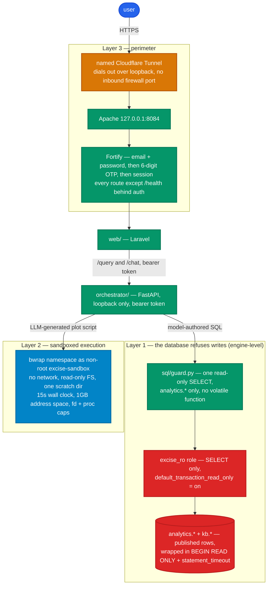

# SECURITY.md — database, sandbox, perimeter

Three enforcement layers, each independent of the others:

1. PostgreSQL refuses any write or DDL on the AI path (engine-level, not
   string filtering).
2. Every LLM-generated script runs in a `bwrap` namespace as a non-root user
   with no network, a read-only root filesystem, one writable scratch dir, and
   hard time and memory caps.
3. The web app is reachable only through a named Cloudflare Tunnel; the app's
   own Fortify email-OTP login is the access gate, the same as the sibling
   apps.



## 1. PostgreSQL read-only role

The data bank is `excise_bank` on the local cluster (`18/main`, port 5432,
`127.0.0.1`). Three roles:

| Role | Rights | Used by |
|---|---|---|
| `excise_owner` | owns the schema; `CREATE`/`ALTER` | migrations only, run by the operator |
| `excise_etl` | `INSERT`/`UPDATE`/`DELETE` on data tables + `etl.*`; no DDL | `etl/` cron jobs |
| `excise_ro` | `SELECT` on `analytics.*` only; `default_transaction_read_only = on` | the orchestrator (the AI path) |

### Provisioning script (`db/roles.sql`)

Run once by the operator as a superuser (`psql -U postgres -d excise_bank -f
db/roles.sql`). `db:provision` is MariaDB-only and is not used here.

```sql
-- Owner (schema DDL only; not a login used by any service at runtime)
CREATE ROLE excise_owner LOGIN PASSWORD :'owner_pw';
ALTER DATABASE excise_bank OWNER TO excise_owner;

-- ETL writer: data tables, kb.*, and etl bookkeeping
CREATE ROLE excise_etl LOGIN PASSWORD :'etl_pw';
GRANT CONNECT ON DATABASE excise_bank TO excise_etl;
GRANT USAGE ON SCHEMA public, kb, etl TO excise_etl;
GRANT SELECT, INSERT, UPDATE, DELETE ON ALL TABLES IN SCHEMA public, kb, etl TO excise_etl;
GRANT USAGE, SELECT ON ALL SEQUENCES IN SCHEMA public, kb, etl TO excise_etl;
ALTER DEFAULT PRIVILEGES FOR ROLE excise_owner IN SCHEMA public, kb, etl
    GRANT SELECT, INSERT, UPDATE, DELETE ON TABLES TO excise_etl;
-- no CREATE: excise_etl cannot add or drop tables

-- Read-only AI role: analytics views + the knowledge base, nothing else
CREATE ROLE excise_ro LOGIN PASSWORD :'ro_pw';
GRANT CONNECT ON DATABASE excise_bank TO excise_ro;
GRANT USAGE ON SCHEMA analytics, kb TO excise_ro;
GRANT SELECT ON ALL TABLES IN SCHEMA analytics, kb TO excise_ro;
ALTER DEFAULT PRIVILEGES FOR ROLE excise_owner IN SCHEMA analytics, kb
    GRANT SELECT ON TABLES TO excise_ro;

-- excise_ro must not see base data or write anywhere
REVOKE ALL ON SCHEMA public, etl FROM excise_ro;
REVOKE CREATE ON SCHEMA public, kb, analytics FROM PUBLIC;   -- no ad-hoc object creation by anyone
REVOKE ALL ON DATABASE excise_bank FROM PUBLIC;

-- Force read-only at the session level, on top of the per-transaction READ ONLY
ALTER ROLE excise_ro SET default_transaction_read_only = on;
ALTER ROLE excise_ro SET statement_timeout = '10s';
ALTER ROLE excise_ro SET idle_in_transaction_session_timeout = '15s';
ALTER ROLE excise_ro SET lock_timeout = '2s';
ALTER ROLE excise_ro SET search_path = analytics, kb;
```

`kb.*` is `SELECT`-only to `excise_ro` exactly like `analytics.*`. Retrieval
(FTS or `pgvector`) is a read; the model cannot write to the knowledge base.
Ingestion writes as `excise_etl` only. The retrieval query always adds
`WHERE d.withdrawn_at IS NULL`.

### Why each layer

- `GRANT SELECT` only on `analytics.*` — even a bug in the SQL guard cannot
  reach a statement the role has no privilege for. `INSERT`/`UPDATE`/`DELETE`/
  `TRUNCATE`/`COPY ... TO`/`CREATE`/`ALTER`/`DROP` all fail with a permission
  error before any row changes.
- `default_transaction_read_only = on` on the role — any write is refused even
  on a table where `SELECT` implies nothing, and even inside a function.
- The orchestrator additionally wraps every query in `BEGIN READ ONLY; SET
  LOCAL statement_timeout = '10s'; ...; ROLLBACK` (`MCP_ENGINES.md`
  §run_sql) — a third redundant guard and a hard cap on runaway scans.
- `analytics.*` are views that already filter `deleted_at IS NULL AND
  published_at IS NOT NULL` and never expose the base tables — the LLM cannot
  query unpublished or soft-deleted rows because it is not granted them and
  does not know they exist (`DATA_PIPELINE.md` §Row visibility).
- `search_path = analytics` and `REVOKE ... FROM PUBLIC` mean an unqualified
  name resolves only inside `analytics`; `public` and `etl` are invisible.

### SQL guard in the orchestrator (`sql/guard.py`)

Defense in depth, not the primary control. Parse with `sqlglot`; reject unless:

- exactly one statement (no `;`-separated batch, no trailing `;` with a second
  statement);
- the root is `SELECT` or `WITH ... SELECT`;
- no node of type INSERT/UPDATE/DELETE/MERGE/CREATE/ALTER/DROP/TRUNCATE/
  GRANT/REVOKE/COPY/CALL/DO/SET/VACUUM/ANALYZE;
- every table reference is in schema `analytics` (or unqualified, which
  `search_path` pins to `analytics`);
- no call to a volatile / side-effecting function
  (`pg_read_file`, `pg_sleep`, `lo_*`, `dblink*`, `pg_stat_file`, `nextval`,
  `setval`, anything in `pg_catalog` write helpers);
- a `LIMIT` is present — inject `LIMIT :row_limit` if the LLM omitted it.

On acceptance the guard also returns the set of `analytics.*` views the
statement reads; the pipeline records it on `queries.tables_used` so an ETL
completion can refresh the saved analyses that depend on those views
(`DATA_PIPELINE.md` §Output store).

A rejection returns the reason to the planner for exactly one re-plan, then a
typed `SQL rejected` error to the user. This applies to model-authored SQL from
both `/query` and the chat's `run_sql_query` tool. `search_knowledge` does not
run model-authored SQL at all — it is a fixed parametrised query
(`websearch_to_tsquery` / a vector search) with the user text bound as a
parameter, so there is no SQL-injection surface there.

### Knowledge base — read paths

The knowledge base pulls from another app on the same box. Both reads are
read-only and least-privilege:

- **`pdf_markdown_pipeline_local` (MariaDB)** — a dedicated user
  `excise_mcp_kb_ro` with `SELECT` on that database only, no other schema, no
  write. Created by the operator (`OPERATOR_SETUP.md` §Knowledge base). The
  sync reads `documents` joined to `sections`/`rule_sets`/`departments`,
  filtered to `visibility='public' AND status='verified' AND deleted_at IS
  NULL`. A non-public or non-verified document is never read.
- **Markdown files** — `~/Sites/pdf-markdown-pipeline/storage/app/public/`,
  group-read for the ETL user. The sync only opens paths taken from a matched
  `documents.markdown_path`; it never lists the tree or follows a path with
  `..` in it.
- **Admin `.md` uploads** — validated in `web/` before they are staged:
  extension is `.md`, size `<= 2 MB`, content decodes as UTF-8, the filename
  is replaced with a generated ULID (the original is kept only as a display
  label), no path separators reach disk. Stored on a dedicated `kb-uploads`
  disk that is on the Apache `ReadWritePaths` list. The ETL reads that disk;
  `web/` never writes `kb.*`.
- **Withdrawn content** — a document that loses public/verified status
  upstream, or an upload an admin withdraws, gets `kb.documents.withdrawn_at`
  set. Retrieval filters it out; the row and its chunks stay for audit and
  are purged on a slow schedule, not immediately.

### Network

`postgresql.conf` keeps `listen_addresses = 'localhost'` for this project. If
direct BI-client access to `excise_bank` is ever wanted — DBeaver, Power BI
Desktop, or any SQL client, over Tailscale — follow
`~/Sites/infra-notes/postgres-tailscale-remote-access.md` exactly — bind the
Tailscale IP, scope the `ufw` rule to `tailscale0`, add a `pg_hba.conf` line
for a **named read-only role only**, never `all`/`admin` over the tailnet.
`DATA_PIPELINE.md` §BI access has the role grant (`excise_bi_ro`, a copy of
`excise_ro`'s grants under its own name — never the same role the orchestrator
uses). This path bypasses the orchestrator entirely: no SQL guard, no sandbox,
no request-id logging, because it's a human running their own query, not the
AI. Once it exists, add its connections to the audit checklist below. Power BI
*Service* (the cloud product) is not this — publishing or scheduling a refresh
there sends data off the box, which the no-egress hard constraint in
`CLAUDE.md` rules out.

## 2. Code-execution sandbox

The primitive on this box is **bubblewrap (`bwrap` 0.11.1)**, already
installed. `firejail` is not installed and is not needed. Containers
(Docker/Podman) are also absent and not required.

### Execution user

A dedicated login-less user, created once by the operator (give the command,
do not work around the lack of sudo):

```bash
sudo useradd --system --no-create-home --shell /usr/sbin/nologin excise-sandbox
sudo install -d -o excise-sandbox -g excise-sandbox -m 0700 /var/tmp/excise-charts
```

The orchestrator runs as its own service user (`excise-orch`) and must be able
to `setuid` to `excise-sandbox` for the child. Simplest without granting the
orchestrator broad privilege: a tiny setuid-root helper is avoided — instead
run the sandbox child via `systemd-run --uid=excise-sandbox --pipe
--collect --property=...` (user manager) or give `excise-orch` a single
`sudo` rule scoped to exactly `/usr/bin/bwrap` for `excise-sandbox`
(`/etc/sudoers.d/excise-sandbox`, added with `visudo`, drafted below for the
operator). Decide at Milestone 5; `systemd-run` is preferred because it needs
no sudoers entry.

### `bwrap` invocation (`sandbox/bwrap.py`)

Per render, a fresh scratch dir `/var/tmp/excise-charts/<run-ulid>/` is created
(owned `excise-sandbox`, `0700`), the Parquet result and the script written
into it, then:

```
timeout --signal=KILL 15 \
bwrap \
  --unshare-all \                # new user/pid/net/ipc/uts/cgroup/mount ns
  --die-with-parent \
  --new-session \
  --clearenv \
  --setenv PATH /usr/bin:/bin \
  --setenv HOME /scratch \
  --setenv MPLBACKEND Agg \
  --setenv MPLCONFIGDIR /scratch/.mpl \
  --setenv TMPDIR /scratch/tmp \
  --ro-bind /usr /usr \
  --ro-bind /bin /bin \
  --ro-bind /lib /lib \
  --ro-bind /lib64 /lib64 \
  --ro-bind /etc/alternatives /etc/alternatives \
  --ro-bind /opt/excise-orch/venv /opt/excise-orch/venv \   # the engine venv, read-only
  --proc /proc \
  --dev /dev \
  --tmpfs /tmp \
  --bind /var/tmp/excise-charts/<run-ulid> /scratch \       # the ONLY writable path
  --chdir /scratch \
  --cap-drop ALL \
  --                                        \
  /opt/excise-orch/venv/bin/python /scratch/chart.py
```

- `--unshare-all` includes `--unshare-net` — **no network**. No loopback, no
  DNS, no sockets. A script that tries to `urlopen` or connect gets an
  immediate error.
- Root filesystem is read-only bind mounts of `/usr` `/bin` `/lib*` only.
  `/scratch` is the sole writable path; a write anywhere else fails with
  `EROFS`.
- `--clearenv` + explicit `--setenv` — no host environment, no secrets, no
  `DATABASE_URL`, no bearer token reachable from inside.
- `--cap-drop ALL`, `--unshare-user` (via `--unshare-all`) — the process is
  unprivileged and cannot regain privilege.
- `--die-with-parent` — if the orchestrator worker dies, the sandbox child
  dies with it.

The command above is the Python engine's; the Octave engine's tail is
`octave-cli --no-gui --norc --eval "source('/scratch/chart.m')"` instead, over
a generated `data.m` rather than the Parquet file, with two additions found
only by testing a real render: `--setenv LANG C.utf8` (Ghostscript's iconv
step, reached via Octave's gnuplot print path, fails outright in the C/POSIX
locale `--clearenv` otherwise leaves), and a conditional read-only
`--ro-bind /etc/fonts /etc/fonts` (gnuplot's cairo print terminals need it for
text rendering). Neither widens the writable surface or touches the network;
`sandbox/bwrap.py`'s `_build_command` has the exact per-engine invocation.

### Resource limits

Applied to the child before `exec` (via `resource.setrlimit` in a
`preexec_fn`, or `systemd-run --property=`):

| Limit | Value | Guards against |
|---|---|---|
| `timeout --signal=KILL 15` (wall clock) | 15 s | infinite loops, `while True` |
| `RLIMIT_CPU` | 12 s soft / 15 s hard | CPU-bound spin |
| `RLIMIT_AS` (address space) | 1024 MB | memory exhaustion |
| `RLIMIT_FSIZE` | 64 MB | filling the disk with one huge file |
| `RLIMIT_NOFILE` | 64 | fd exhaustion |
| `RLIMIT_NPROC` | 16 | fork bombs (also capped by the pid namespace) |
| `MemoryMax=` (if `systemd-run`) | 1200 M | OOM-kill the whole unit, not the host |

`systemd-run --scope --property=MemoryMax=1200M
--property=TasksMax=16 --property=CPUQuota=100%` is the cleaner way to apply
the cgroup limits and is preferred over `preexec_fn` rlimits where available.

### What the script can and cannot do

Can: read `/scratch/data.parquet`, use `pandas`/`numpy`/`scipy`/`matplotlib`/
`seaborn`/`plotly`/`kaleido`, write `chart.{png,svg,pdf,plotly.json}` into
`/scratch`, print to stdout (last 4 KB is captured).

Cannot: open a socket, resolve a hostname, read anything under `/home`,
`/etc` (beyond `/etc/alternatives`), `/root`, `/var` (beyond its own scratch),
write outside `/scratch`, spawn more than 16 procs, run longer than 15 s, use
more than ~1 GB, `import` a package not in the pinned venv, escalate
privilege, or see the orchestrator's environment.

### After the render

The orchestrator copies the declared outputs out of `/scratch` to the Laravel
`local` disk (the `chart_artifacts` path), then removes the scratch dir. A
sweeper (systemd timer) deletes any `/var/tmp/excise-charts/*` older than 1 h
in case a crash left one behind.

### `/etc/sudoers.d/excise-sandbox` (draft, operator applies with `visudo`)

Only needed if the `systemd-run` route is not used:

```
excise-orch ALL=(excise-sandbox) NOPASSWD: /usr/bin/bwrap *
```

Scoped to one command, one target user. Add with `sudo visudo -f
/etc/sudoers.d/excise-sandbox` — never `tee` a sudoers file
(`~/Sites/infra-notes/cpu-thermal-and-apache-procfs.md` records why).

## 3. Perimeter — Cloudflare Tunnel and app auth

Follows `~/Sites/infra-notes/laravel-apps-deploy.md`, the same as the four
sibling apps: a named Cloudflare Tunnel to a private Apache port, and the
app's own Fortify email-OTP login as the access gate. No Cloudflare Access /
Zero Trust layer.

### Tunnel

The account's `~/.cloudflared/cert.pem` covers the `exciseup.in` zone only.
Hostname: **`visualizer.exciseup.in`**.

```bash
cloudflared tunnel create excise-mcp-dashboard
# note the UUID it prints; a <uuid>.json credentials file lands in ~/.cloudflared/
cloudflared tunnel route dns --overwrite-dns <uuid> visualizer.exciseup.in
```

Use `--overwrite-dns` and route by UUID, not by name — the route-by-name
gotcha in `laravel-apps-deploy.md` pointed a CNAME at the wrong tunnel once.

`~/.cloudflared/excise-mcp-config.yml`:

```yaml
tunnel: <uuid>
credentials-file: /home/subhan/.cloudflared/<uuid>.json

ingress:
  - hostname: visualizer.exciseup.in
    service: http://127.0.0.1:8084
  - service: http_status:404
```

systemd `--user` unit `~/.config/systemd/user/excise-mcp-dashboard-tunnel.service`
running `cloudflared tunnel --config
~/.cloudflared/excise-mcp-config.yml run`, `WantedBy=default.target`, enabled
via the existing `loginctl enable-linger subhan`.

Apache vhost on `127.0.0.1:8084` (bind loopback explicitly, do not rely on
`ufw` alone — `laravel-apps-deploy.md` §"make the bind match the intent"),
`DocumentRoot .../web/public`, and append
`/home/subhan/Sites/excise-mcp-dashboard/web/storage` and
`.../web/bootstrap/cache` to the shared
`/etc/systemd/system/apache2.service.d/override.conf` `ReadWritePaths=` line —
**edit in place, never overwrite** (that file has been clobbered before). Then
`sudo systemctl daemon-reload && sudo systemctl restart apache2`. Give the
operator these commands; Claude has no sudo.

### App auth

The OTP-login + magic-link stack from `~/Sites/upexcise-stats-dashboard` is the
access gate: email + password, then an emailed 6-digit OTP, then a session.
Every route except `/health` is behind `auth` middleware; an unauthenticated
request redirects to `/login`. Magic-link onboarding (signed, single-use, 72 h)
and password reset (Laravel's broker, single-use hashed token, 60 min) copied
from the sibling. Rate limiters `login` / `two-factor` / `password-reset`
ported (`AppServiceProvider`).

Roles: `Admin` (manage users, see all ledgers, manage the ETL source registry)
and `Analyst` (ask questions, see own ledger, export). RBAC copied and trimmed
from the sibling.

The tunnel is the only inbound path — `cloudflared` dials out over loopback, no
firewall port is opened, and Apache binds `127.0.0.1:8084`. The orchestrator's
`/health` is loopback-only and never passes through the tunnel.

### Headers, logging, rate limits

- Port `SecurityHeaders` middleware: CSP allowing Tailwind Play CDN, jsDelivr
  (Chart.js / Plotly, the chat's `marked` + highlighter), Google Fonts, and
  `connect-src 'self'` for the SSE endpoints; HSTS; `X-Frame-Options: DENY`;
  `X-Content-Type-Options: nosniff`; `Referrer-Policy: same-origin`;
  `X-Robots-Tag: noindex` on the whole site (this is not a public dashboard).
- Port `LogMutation` — an `activity_logs` row for every non-GET authenticated
  request, including every `ask`, every chat message, every knowledge upload,
  and every Google connect/disconnect.
- Rate limiters in `AppServiceProvider`: `login`, `two-factor`,
  `password-reset` from the sibling; `ask` and `chat` keyed by user id, start
  10/min.
- Livewire write authorization: route middleware gates a component's mount, but
  a `wire:click` / `wire:submit` reaching `livewire/update` does not re-run
  route middleware. Every write method on an admin component (knowledge upload,
  Google connect/disconnect, user CRUD, source-registry edits) re-checks the
  privilege itself with `abort_unless(Auth::user()?->hasPrivilege(...), 403)`,
  the same pattern as `~/Sites/upexcise-stats-dashboard`'s `PublishToggles` and
  `Milestones` components.
- The orchestrator refuses any `/query` or `/chat` call whose bearer token
  does not match `ORCH_BEARER_TOKEN` (constant-time compare), logs the
  request-id, and never logs the token or the DB password.
- Chat rendering: assistant Markdown is rendered client-side with output
  sanitised (no raw HTML passthrough); a fenced code block is display-only,
  never executed in the browser. Retrieved knowledge snippets are shown as
  quoted text with the source link, not rendered as live Markdown from an
  untrusted document.
- Model picker: the `/chat` and `/query` `model` field is a key from
  `config/models.php` / `OLLAMA_ALLOWED_MODELS`, not a free-form Ollama tag.
  The orchestrator rejects any value outside that set before calling Ollama,
  so the picker cannot be used to pull or run an arbitrary model.

## 4. Google OAuth

`web/` connects a user's Google account so the ETL can read that person's
Drive, Sheets, and Docs. This is additive — the service-account path stays for
server-owned content.

### Consent screen and scopes

- Scopes, all read-only and the minimum needed:
  `.../auth/drive.readonly`, `.../auth/spreadsheets.readonly`,
  `.../auth/documents.readonly`.
- `drive.readonly` is a **restricted** scope. In a Google Cloud project with
  the consent screen set to **Internal** (the department's Google Workspace),
  restricted scopes work for users in that Workspace with no Google
  verification. If the consent screen is **External**, `drive.readonly`
  triggers Google's app-verification and a CASA security assessment before
  more than 100 users can connect. Prefer **Internal** — `OPERATOR_SETUP.md`
  §Google Cloud has the setup and this decision point. If Internal is not
  possible, either accept the External test-user cap (100 users, no
  verification) or narrow to `drive.file` (only files the user explicitly
  picks) to avoid the restricted-scope process.
- Request `access_type=offline` and `prompt=consent` so Google returns a
  refresh token on first connect.

### Token handling

- `laravel/socialite` (Google provider) runs the flow. The callback stores one
  `google_connections` row per user: `user_id`, `google_sub` (the stable
  account id), `email`, `scopes`, `refresh_token` (**`Crypt`-encrypted**,
  Laravel `APP_KEY`), `access_token` + `expires_at` (short-lived, may be left
  null and re-minted on demand), `created_at`, `last_used_at`,
  `revoked_at`.
- The refresh token is written once, read only by the token-refresh code, and
  never returned in any HTTP response or Livewire payload. Log lines about a
  connection use `google_connections.id` and the masked email, never a token.
- The ETL gets a fresh access token by reading the encrypted refresh token
  over loopback: either `web/` exposes an internal `GET
  /internal/google-token/{connection}` (bearer-auth, `127.0.0.1` only) that
  returns a short-lived access token, or the ETL holds `client_id` /
  `client_secret` in `etl/.env` and refreshes directly with `google-auth`
  against the stored refresh token. Pick one at Milestone 1; the internal
  endpoint keeps the client secret in one place (`web/`).
- **Disconnect**: the user (or an admin) hits disconnect → `web/` calls
  Google's token-revoke endpoint, then sets `revoked_at` and clears the
  encrypted token. Any `source_registry` row bound to that connection is
  disabled and flagged on the "Connected sources" screen.
- **Scope of trust**: a connected token can read everything in that user's
  Drive within the granted scopes. Only connect accounts that are supposed to
  feed the data bank, register specific folders / sheets / docs rather than
  "all of Drive", and review connections periodically. The `drive.file`
  fallback above removes the broad-read concern entirely if it becomes one.

### The OAuth routes

The Socialite redirect and callback routes are behind the app login like every
other route — a stranger cannot reach `/google/connect`. The Google
`redirect_uri` is `https://visualizer.exciseup.in/google/callback`, registered
in the Cloud project; it only resolves through the tunnel.

### Secrets

| Secret | Location | Perms |
|---|---|---|
| `web/.env` `APP_KEY`, MariaDB creds, Resend key, `ORCH_BEARER_TOKEN`, `GOOGLE_CLIENT_ID` / `GOOGLE_CLIENT_SECRET` | `web/.env` | `664`, not committed (Apache/`www-data` reads it via the `subhan` group — `600` blocks it) |
| `orchestrator/.env` `ORCH_BEARER_TOKEN`, `DATABASE_URL_READONLY` | `orchestrator/.env` | `600`, not committed |
| `etl/.env` `DATABASE_URL_ETL`, `GOOGLE_APPLICATION_CREDENTIALS` path, KB MariaDB creds, (optionally `GOOGLE_CLIENT_ID`/`SECRET` if the ETL refreshes tokens directly) | `etl/.env` | `600`, not committed |
| Postgres role passwords | set once via `db/roles.sql` with `psql -v`, then only in `orchestrator/.env` / `etl/.env` | — |
| Google service-account JSON | a path outside the repo, referenced by `GOOGLE_APPLICATION_CREDENTIALS` | `600`, owned by the ETL user |
| Google OAuth **refresh tokens** (per user) | `google_connections.refresh_token`, `Crypt`-encrypted with `APP_KEY`, in `web/`'s MariaDB | DB row, never in a file, never logged |
| KB MariaDB read-only user (`excise_mcp_kb_ro`) password | `etl/.env` | `600` |
| Tunnel credentials, `cert.pem` | `~/.cloudflared/` | as-is, gitignored by not being in the repo |

`.gitignore` covers `**/.env`, `**/*.env` (keeping `*.env.example`), `*.pem`,
`*credentials*.json`, `*service-account*.json`, `web/storage/`, `**/.venv/`,
`**/__pycache__/`; `/var/tmp` and the KB Markdown tree are outside the repo.

## 5. Audit trail

Every state change and every AI action is recorded. One `request_id` per query
threads `web/` -> orchestrator -> `structlog` journal lines -> the ledger row,
so a `queries` row links to its logs.

| What | Where | Written by |
|---|---|---|
| Auth events — login, logout, failed OTP, password reset, onboarding | `activity_logs` | `Login` / `Logout` listeners + the auth controllers (ported from `upexcise-stats-dashboard`) |
| Every non-GET authenticated request | `activity_logs` (`user_id`, route, method, IP, `request_id`) | `LogMutation` middleware |
| Every AI query — question, generated SQL, `engine`, `model`, `tables_used`, row count, timings, status, `request_id` | `queries` (one-shot) / `messages` + `message_tool_calls` (chat) | `RunExciseQuery` / the chat relay |
| Saved-analysis refreshes | `analysis_runs` (`trigger`, `ran_at`, `headline`) | `RefreshAnalysis` |
| Exports — chart, result, report | `activity_logs` (scope, format, `report_id`) | the export controllers |
| Google connect / disconnect / token refresh failure | `activity_logs` + `google_connections` timestamps; the token itself is never logged | the Socialite callback + the ETL auth code |
| Knowledge upload / withdraw | `activity_logs` + `kb_uploads.status` | the "Knowledge base" screen |
| ETL runs and quarantined rows | `etl.ingestion_runs` / `etl.quarantine` (Postgres) | `etl/` |
| Orchestrator request/response, stage transitions, errors | `structlog` JSON to the systemd journal, `request_id` on every line | the orchestrator |
| BI-client connections (`excise_bi_ro`, future — §1 Network) | PostgreSQL's own `log_connections`/`log_disconnections` — no `queries` row, since this path never touches the orchestrator | PostgreSQL, once the role exists |

- **Never logged**: bearer tokens, DB passwords, Google OAuth tokens, full
  result row sets (a preview only), document text.
- **Access**: `activity_logs` is Admin-only at `/admin/activity-logs` (ported).
  An Analyst sees their own `queries` / `analysis_runs` in the ledger.
- **Retention**: `activity_logs` and `queries` are kept indefinitely (small
  rows); artifact files follow `ARTIFACT_TTL_DAYS` unless a run is saved
  (`DATA_PIPELINE.md` §Output store); the journal rotates on the host's
  `journald` policy.

## Incident-response quick reference

- **LLM produced a destructive statement**: it cannot execute — `excise_ro`
  has no write privilege and the transaction is `READ ONLY`. The guard logs
  it; review the prompt that produced it.
- **A script tried to exfiltrate data**: no network in the sandbox — the
  connection fails. `stdout_tail` and the violation log show the attempt.
- **Runaway query**: `statement_timeout = 10s` cancels it; the pool connection
  is returned; the user sees `query timeout`.
- **Sandbox won't die**: `timeout --signal=KILL` and `--die-with-parent`; the
  sweeper timer cleans scratch. If a child survives (should not), the
  `excise-sandbox` user has no login and owns nothing but scratch.
- **Tunnel down**: `systemctl --user status excise-mcp-dashboard-tunnel`;
  restart it; the app is simply unreachable meanwhile — no data exposure.
- **Suspected bearer-token leak**: rotate `ORCH_BEARER_TOKEN` in both `.env`
  files, restart both services.
- **Suspected Google token compromise**: disconnect the affected
  `google_connections` row (revokes at Google, clears the encrypted token),
  disable its `source_registry` sources, rotate `GOOGLE_CLIENT_SECRET` in the
  Cloud console and `web/.env` if the client secret itself may be exposed.
- **A withdrawn document still shows in chat citations**: check the retrieval
  query applies `withdrawn_at IS NULL`; run `etl sync --source pdf_pipeline_docs`
  to re-sync withdrawal state.
- **Model wrote to `kb.*` or `analytics.*`**: not possible — `excise_ro` has
  `SELECT` only and the session is `READ ONLY`. Treat any such report as a
  role-misconfiguration bug and re-run `db/roles.sql` verification.
