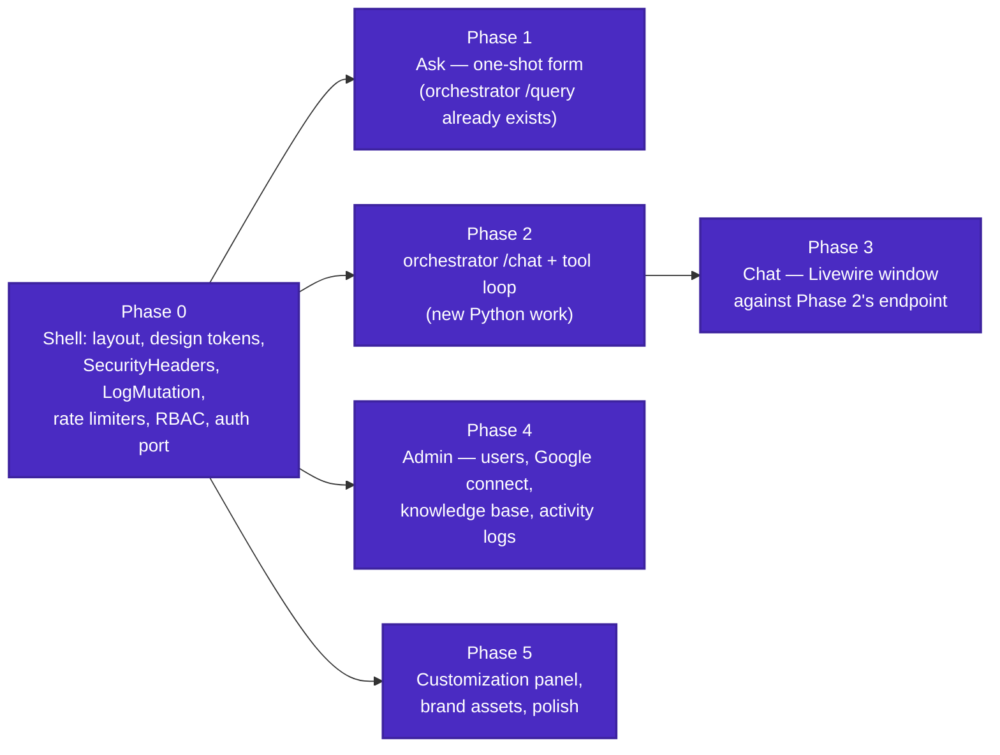
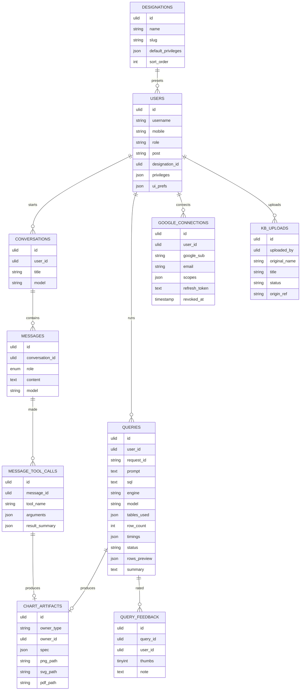
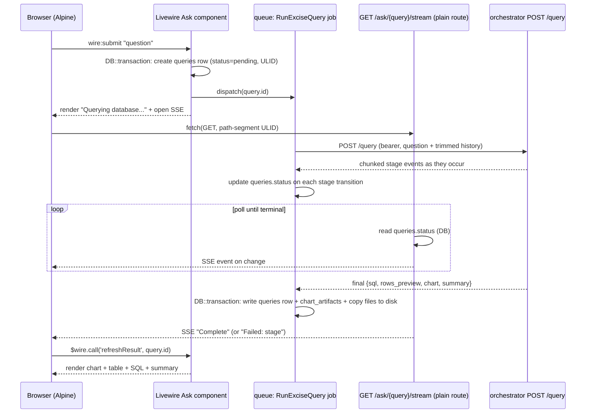
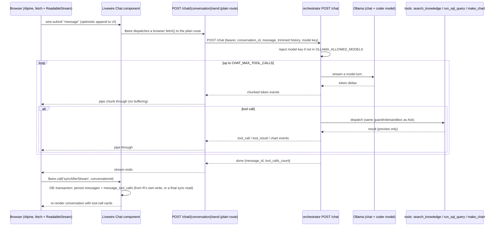
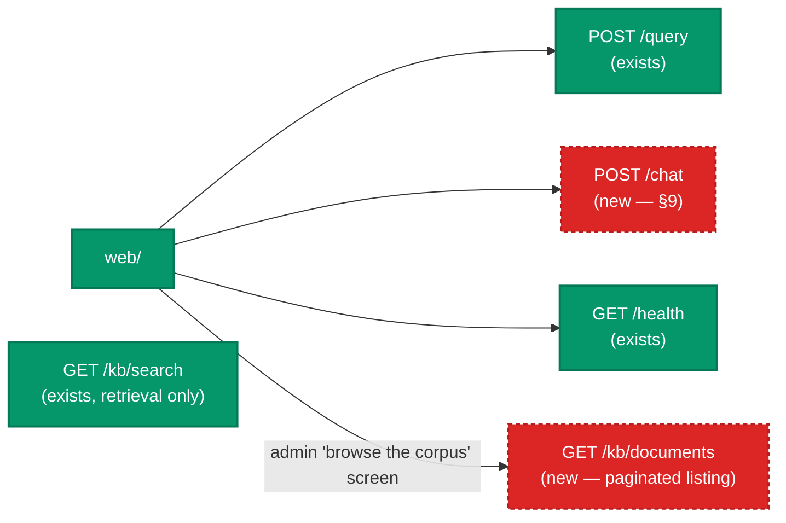
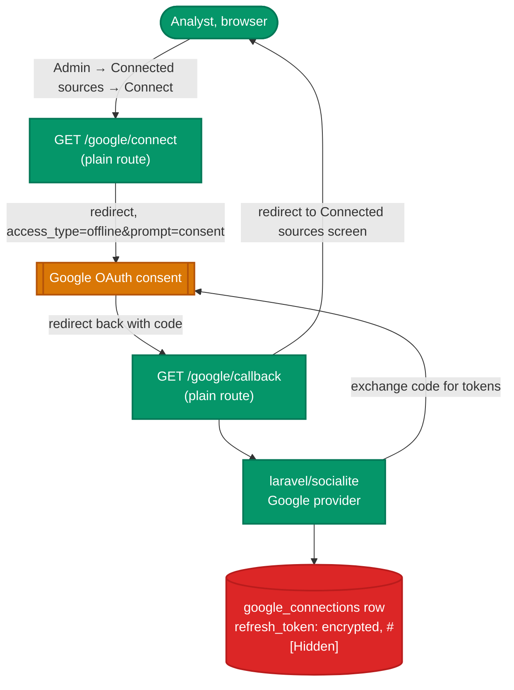

# Milestone 5 build plan — web/ (Laravel UI)

Draft for review. Nothing in this plan has been built. `web/` is still the bare
Laravel skeleton (`User` model, framework migrations only, no routes past the
stub, no controllers past the base class) — every item below is greenfield.
Sources are the project's own docs (`ROADMAP.md`, `ARCHITECTURE.md`,
`DATA_PIPELINE.md`, `MCP_ENGINES.md`, `SECURITY.md`, `EVALUATION.md`) plus a
direct read of the named files in `~/Sites/upexcise-stats-dashboard`,
`~/Sites/UP-excise-mailer`, `~/Sites/excise-budget-tracker`, `~/Sites/pla`, and
`~/Sites/pdf-markdown-pipeline`. Open questions are called out where they come
up and collected at the end, each with a proposed answer this plan already
builds to.

---

## 1. Scope and sequencing

`ROADMAP.md` files Milestone 5 under "Laravel UI," but the chat window has
nothing to call yet: `orchestrator/app/` has no `chat/` package, no `/chat`
route, no `chat/tools.py`. `MCP_ENGINES.md` §Chat and retrieval documents the
design; `ROADMAP.md` Milestones 2–4 each note the chat tool loop as deferred
to "Milestone 5+." **Building the orchestrator's `/chat` endpoint and tool
loop is part of this milestone** — see §9.

Proposed build order (each phase gate-able on its own):



Phase 0 blocks everything else (no page renders without a layout). Phase 1 and
Phase 2 can run in parallel — one is Laravel against an existing endpoint, the
other is Python with no Laravel dependency. Phase 4's Google connect screen
can be built before M1's Google ingestion consumers exist (it only needs to
write `google_connections` rows); see the open question in §12.

---

## 2. Reuse map — copy, then adapt

Per your instruction, these are copied first and edited in place. "Adapt"
means: keep the structure, swap project-specific strings (app name, table
names, route names).

| Destination in `web/` | Copy from | Change on the way in |
|---|---|---|
| `resources/views/components/layout.blade.php` | `upexcise-stats-dashboard` same path | Nav items → Ask / Chat / Ledger / Admin |
| `resources/views/components/sidebar.blade.php` | same | Nav gates → `hasPrivilege('kb.manage')`, `isAdmin()` per §6 |
| `resources/views/components/head.blade.php` | same | No `connect-src` entry for the orchestrator origin needed — `web/` calls it server-side, the browser never does. CSP only needs jsDelivr (Plotly, Chart.js, Cleave, `marked`+highlighter) and Google Fonts |
| Tailwind config block + `@apply` classes | `head.blade.php` same repo | Verbatim — `govviolet`/`govsaffron` ramp, `.stat-card`/`.badge`/`.field-*` |
| `app/Http/Middleware/SecurityHeaders.php` | same | CSP `script-src`/`style-src` gains nothing new (no new CDN host); `img-src` drops the CARTO tile host (no map here); keep `X-Robots-Tag: noindex` **site-wide**, not scoped to an `admin` prefix — everything in this app is internal |
| `app/Http/Middleware/LogMutation.php` + `ActivityLog` model | same | `SKIP_ROUTES` gains `livewire.update` already; no other change |
| `app/Providers/AppServiceProvider.php` rate limiters | same, **plus** `UP-excise-mailer`'s `mutations` limiter + `Livewire::setUpdateRoute(...->middleware([...,'throttle:mutations']))` | Add `ask` and `chat` limiters (10/min, per user id) alongside the ported `login`/`two-factor`/`password-reset`/`mutations` |
| `app/Http/Controllers/Auth/{LoginController,OnboardingController,ForgotPasswordController}.php` | `upexcise-stats-dashboard` same | Branding strings only |
| `app/Providers/FortifyServiceProvider.php` | same | Keep the `register()`-not-`boot()` placement for `Fortify::ignoreRoutes()` — the sibling's own regression note explains why `boot()` is too late |
| `app/Models/User.php`, `app/Models/Designation.php` | same | Trim `ROLES` to `['Admin', 'Analyst']`; trim `PRIVILEGES` to what §6 lists |
| `app/Livewire/Admin/*` `abort_unless(...)` pattern | `PublishToggles.php` / `Milestones.php` same repo | Privilege strings only — every write method re-checks, `livewire/update` skips route middleware |
| `app/Services/ExportService.php` | same | `FORMATS` drops `'sql'` (no SQL export need here); CSV/XLSX/PDF kept |
| `app/Support/Sparkline.php` | same | Verbatim |
| `resources/views/components/currency-input.blade.php` | `excise-budget-tracker` same | Not needed for the Phase 0–4 scope in this pass — no money **input** exists in M5 (only money **display**); park it for Milestone 7's report metadata fields (open question §12) |
| `scripts/make-brand-assets.php` | `upexcise-stats-dashboard` same | Text strings ("Department of Excise" already correct per `assets/brand/README.md`) |
| `.env.example` production-flag comments (`APP_DEBUG`, `SESSION_ENCRYPT`, `SESSION_SECURE_COOKIE`) | `excise-budget-tracker` `.env.example` | Verbatim inline `# PRODUCTION: ...` comment convention — already partly present in `web/.env.example`, extend to session flags |
| `config/models.php` | new, shaped on `pdf-markdown-pipeline`'s `config/ocr.php` | `default` key + `models` map, each entry `{label, role, ollama_tag}` — see §10 |

Not ported, by design:
- `resources/views/components/public-layout.blade.php` and the whole UX4G/GIGW
  chrome (identity strip, A-/A/A+ toggle, footer policy links, Material
  Symbols) — this app defines no public route yet (§4). If one is ever added,
  it uses that track; the authed dashboard/chat/admin use the plain indigo
  admin shell only, per your direction.
- The Dexie/IndexedDB offline cache (`shops-table.blade.php` pattern) — that's
  `ROADMAP.md` Milestone 7 scope, not this one.
- `laravel/laravel-db-provisioner` is already a required dev dependency here
  (matches every sibling at this stage). `excise-budget-tracker`'s own launch
  hardening removed it before going internet-facing — that's a Milestone 6
  action item, not this one; noting it so it isn't forgotten.

---

## 3. Design system — the admin track only

`upexcise-stats-dashboard/docs/design-guidelines.md` documents two shells: a
public UX4G/GIGW track (`public-layout.blade.php`, Material Symbols,
indexable) and an admin track (`layout.blade.php`, Tabler Icons, `noindex`).

Per your direction: **this app has no public route**, so only the admin track
applies — to the dashboard, the Ask form, the Chat window, and every admin
screen alike. `govviolet` (`#4a2bc2`)/`govsaffron` stay as the brand and
accent colors (they're the department's palette regardless of audience), but
none of the GIGW-specific chrome (identity strip, accessibility text-size
toggle bar, skip-link styled for a public visitor, footer policy links) is
built. `X-Robots-Tag: noindex` applies to every route, not just an `/admin`
prefix.

If a public route is ever added later (the backlog item about publishing to
`upexcise-stats-dashboard` is the only candidate currently on record), it
adopts the public track at that time — that's a separate, future decision.

Chart color conventions (from the same doc, unaffected by the above): single
Chart.js series `#4a2bc2` line + `rgba(74,43,194,0.08)` fill; multi-series
`#4a2bc2, #c47d00, #0f766e, #b91c1c, #1d4ed8, #7c3aed`; `maintainAspectRatio:
false` in a fixed-height wrapper; bottom legend; `y.beginAtZero`. These apply
to the ledger's Chart.js/Sparkline uses only — the Ask/Chat chart canvas
itself renders Plotly's own JSON spec, which carries its own colors from the
orchestrator (§8).

---

## 4. Routing conventions

Per your direction: no query-string parameters as a request-carrying
mechanism. What that means concretely here:

- **Every Livewire write is already a POST** — `wire:click`/`wire:submit`
  transport through `livewire/update`, which this plan throttles with
  `mutations` (§2). Nothing to change for those.
- **Filters, sorts, and search boxes** (the query ledger's date-range/status/
  engine filter, the admin user list search) are Livewire public properties
  bound with `wire:model`, kept off the query string (`#[Url]` is
  deliberately **not** used) — a filter change is a POST re-render, not a GET
  with `?status=failed`.
- **Bookmarkable resources use a path segment, not a query string** — a
  specific conversation is `/chat/{conversation:ulid}`, a specific report
  (Milestone 7) is `/reports/{report:ulid}`. This is a URL parameter but not a
  query-string parameter — it's `CLAUDE.md`'s own "clean path segments over
  query strings, except where a value must be bookmarkable" rule, and it's
  what makes a conversation link shareable at all.
- **Pagination is the one accepted query-string case**, per your explicit
  exception — the query ledger and the admin user list use Laravel's default
  `?page=N` paginator behavior, unchanged.
- **Every HTTP verb Laravel supports is used where it's the honest one**, not
  just GET/POST: admin CRUD routes (the handful that are plain controllers,
  not Livewire — see §5) use `PATCH` for update and `DELETE` for destroy, not
  a POST with a hidden `_method` workaround left implicit; a Livewire
  component's own `wire:click="destroy"` doesn't create a route at all, so
  this only applies to the plain-controller endpoints in §5.
- **File downloads and the Google OAuth redirect/callback stay GET**, because
  that's what a browser navigation and an external OAuth redirect both are —
  see §5 for why they can't be Livewire.

---

## 5. What stays a plain controller

`CLAUDE.md` already carves out: the health check, the Fortify OTP auth flow,
file/report downloads, the Google OAuth redirect/callback. Per your "end to
end Livewire" direction, this plan keeps that carve-out **only where a plain
route is structurally required**, and no wider:

| Route | Why it can't be Livewire |
|---|---|
| `GET /health` | Unauthenticated, polled by infrastructure, not a page |
| `POST /login`, OTP verify/resend, onboarding, password reset | Fortify's own request lifecycle; the sibling's controllers already handle this without Livewire, and rate limiting/session handling is simpler as plain form posts |
| `GET /google/connect`, `GET /google/callback` | An OAuth redirect is a full browser navigation to Google and back — Livewire can't intercept it |
| `POST /chat/{conversation}/send` | Must return a genuinely streamed HTTP body (`text/event-stream` or chunked), which a Livewire action cannot do — Livewire responses are JSON over `livewire/update`. See §9 |
| `GET /ask/{query}/stream` | Same reason, for the Ask stage-progress relay (§8) |
| `GET /export/{artifact}/{format}`, `GET /reports/{report}/download/{format}` | Byte-stream file responses (`Storage::download`), not a page render |
| `GET /internal/google-token/{connection}` | Loopback-only, bearer-authed, called by `etl/`, never by a browser |

Every admin CRUD screen (users, Designations if kept, connected sources,
knowledge base, activity-log viewer) is a full-page Livewire component, per
your direction — `pdf-markdown-pipeline`'s plain-controller admin pattern was
read for its validation/transaction/authorization conventions only (§7), not
copied as a structural template.

---

## 6. RBAC — the full fleet pattern, confirmed and ported

Resolved (open question 3): full `role` + `privileges` + `designation_id` +
`post`, matching the pattern four government apps in `~/Sites` converged on
independently — `excise-budget-tracker`, `UP-excise-mailer`,
`upexcise-stats-dashboard`, and `pdf-markdown-pipeline` (the pattern's
origin) all carry the same shape, each explicitly built by porting the
previous one. (`pla` and `Amber-Publishers` were checked too — both are
personal/business-client projects with a small user base, and neither has
this pattern: `pla` has `privileges` only with no `role`/`Designation`/`post`,
`Amber-Publishers` has no RBAC at all. Their absence of the pattern isn't
counter-evidence — a client site with a handful of users doesn't need it, the
same way this reasoning would apply if this app were client work rather than
a departmental tool.)

**`users` table** gains, beyond the framework default:

| Column | Type | Matches |
|---|---|---|
| `username` | string, unique | all four government apps |
| `mobile` | string(10), nullable | all four |
| `role` | string, default `'Analyst'` | all four (each keeps its own value set — see below) |
| `post` | string(100), nullable | free-text specific posting/charge, e.g. "Deputy Excise Commissioner (Prevention & Enforcement)" — kept distinct from `designation_id`'s standardized rank, per the explicit comment convention in `UP-excise-mailer`/`upexcise-stats-dashboard` |
| `designation_id` | nullable FK → `designations`, `constrained()->nullOnDelete()` | all four |
| `privileges` | json, nullable | all four |

`excise-budget-tracker` tried `post`-only with no `designation_id`, then
reversed that (added `designation_id`, dropped `post` shortly after) — the
other two later apps keep both, and this plan keeps both: `designation_id`
drives the privilege preset, `post` is a free-text display field with no
behavior attached to it, so there's no risk of the same churn.

**`role` values**: `CLAUDE.md`/`SECURITY.md` already say to trim to
`Admin`/`Analyst`, and this plan keeps that — this app's actual privilege
surface (four checks, listed below) doesn't need `pdf-markdown-pipeline`'s
four-tier `system_admin`/`admin`/`operator`/`viewer` split with its
department/section/division org-scoping. That richer split exists there
because privileges are scoped to a specific department/section a document
belongs to; nothing in this app is scoped below the whole app. Two roles is
the right-sized reading of the same pattern, not a departure from it.

**`designations` table** (new), matching all four apps' shape exactly:

```
id, name, slug (unique), default_privileges (json, nullable),
sort_order (int, default 0), timestamps, softDeletes
```

`Designation::default_privileges` is a **preset copied onto the user's
`privileges` at creation time**, not a live-applied grant — every sibling
implements it this way (`UserForm`/`UserManagementController`'s
`designationDefaults()` reads the preset only when the create form's
designation picker changes). An admin editing a user's `privileges`
afterward doesn't stay linked to their designation; the designation is a
starting point, not an ongoing constraint. `User::hasPrivilege()` ports
directly:

```php
public function hasPrivilege(string $privilege): bool
{
    return $this->isAdmin()
        || in_array('*', $this->privileges ?? [], true)
        || in_array($privilege, $this->privileges ?? [], true);
}
```

**Privileges this milestone actually checks** (the `User::PRIVILEGES`
whitelist, validated on every admin write per `SECURITY.md` §3): `kb.manage`
(knowledge upload/withdraw), `google.manage` (connect/disconnect, register
sources), `users.manage`, `activity-logs.view`. `Admin` has everything
(`isAdmin()` short-circuits `hasPrivilege()`, matching every sibling);
`Analyst` has none of the above but can use Ask and Chat and see their own
ledger — a designation preset only ever grants a subset of these four, never
Ask/Chat access, since that isn't privilege-gated in this app.

**Seed data**: the two other UP Excise apps already seed the department's
real designation ladder (`excise-budget-tracker`'s `DesignationSeeder` has 22
rows, `UP-excise-mailer`'s has 9, both include the excise-specific tier —
Excise Commissioner, Additional Excise Commissioner, Deputy Excise
Commissioner, District Excise Officer, Assistant Excise Commissioner, System
Engineer). This app's `DesignationSeeder` reuses that same excise-specific
subset rather than inventing new titles, mapped onto this app's four
privileges instead of the sibling's own:

```
Excise Commissioner            → ['*']
Additional Excise Commissioner → ['*']
System Engineer                → ['*']
Deputy Excise Commissioner     → [kb.manage]
District Excise Officer        → [kb.manage]
Assistant Excise Commissioner  → []
Officer                        → []
```
No seeded `users` rows carrying real names — every sibling seeder seeds
`designations` only; actual accounts are created through the admin invite
flow (`SECURITY.md`'s onboarding link), never fixtures.

---

## 7. Data model

Every table below carries `timestamps()` and `softDeletes()`, uses `HasUlids`
route-model binding where the row is ever referenced by URL, and every write
path goes through `DB::transaction()` with a `try/catch` that logs and
re-throws (or flashes + redirects for a Livewire action) — following
`pdf-markdown-pipeline`'s `Admin/DesignationController@store` shape and
`pac-recovery-portal`'s "an action touching more than one table is one
atomic write" rule.

**Note on ULIDs**: neither `upexcise-stats-dashboard`, `excise-budget-tracker`,
nor `pla` actually uses `HasUlids` or a ULID route key anywhere — confirmed by
direct search. This is a pattern this app introduces fresh, not one it ports.
Laravel 11+ ships `HasUlids` natively, so no new dependency, but flagging it
since "port near-verbatim" doesn't apply to this specific piece.



`chart_artifacts` uses a polymorphic `owner_type`/`owner_id` (a `queries` row
or a `message_tool_calls` row can each produce one) rather than two separate
artifact tables — one export/render code path either way.

`google_connections.refresh_token` is `text`, cast `'refresh_token' =>
'encrypted'`, `#[Hidden(['refresh_token'])]` — the exact shape confirmed live
in `UP-excise-mailer/app/Models/MailAccount.php` for its `app_password`
column, which is the same "per-row credential, `encrypted` cast, `Hidden`
attribute" problem.

`users.ui_prefs` is a JSON column for the customization panel (Phase 5),
mirroring the cookie-based preferences so they follow the login.

---

## 8. The Ask flow — one-shot query builder



`/query` is a one-shot bounded call, already run through Laravel's queue per
`ARCHITECTURE.md` ("Livewire dispatches a job... the web worker is not
blocked"), and its stage set is small and coarse (4 states). A job plus a
DB-status polling relay, at ~500ms intervals, tracks that comfortably without
a held-open connection or Redis broadcasting — Chat needs a different
mechanism (§9), because its token-by-token stream doesn't fit this same
polling granularity. `wire:poll` is the documented fallback if the tunnel
handles the fetch-based SSE badly.

Component tree:

```
resources/views/livewire/ask.blade.php
├── x-layout                              (Phase 0 shell)
│   ├── composer (question textarea, engine + model advanced controls)
│   ├── stage indicator (4-state progress, current stage highlighted)
│   └── canvas (right pane, ≥lg; stacks under it)
│       ├── plotly chart (chart.plotly.json, interactive)
│       ├── data table (rows_preview, paginated — ?page= exception)
│       ├── SQL card (collapsed, copy button)
│       └── export menu (PNG/SVG/PDF/plotly.json/CSV/XLSX)
```

---

## 9. The Chat flow — orchestrator design, then the Laravel side

Building `orchestrator/app/chat/` is in scope for this milestone (§1),
confirmed. It doesn't exist yet, but `config.py` already carries
`chat_max_tool_calls`/`chat_context_turns`, and `auth.py`'s docstring already
reads "shared by `/query` and `/chat`" — the surrounding code was written
anticipating this endpoint. This section is the end-to-end design for it,
written against the real signatures in `orchestrator/app/{main,pipeline,
schemas,config,auth}.py` and `{llm,sql,kb,engines}/*.py`, so building it is
wiring these pieces together, not inventing a new pattern.

**Wire format correction.** `MCP_ENGINES.md` and `CLAUDE.md` describe the
stream as "SSE." The actual `/query` implementation (`main.py`'s
`_stream_query`) doesn't use `text/event-stream` — it yields newline-delimited
JSON objects (`media_type="application/x-ndjson"`), one per line: `{"stage":
...}`, `{"error": ...}`, `{"result": ...}`. `/chat` follows that same existing
convention rather than introducing a second wire format: each line is one of
`{"token": ...}`, `{"tool_call": ...}`, `{"tool_result": ...}`, `{"chart":
...}`, `{"done": ...}`, `{"error": ...}`. On the Laravel side this changes
nothing about the design already agreed (§4, §9 below) — it's still a `POST`,
still read incrementally via `fetch()` + `ReadableStream`, still never
`EventSource` — it just means the browser-side reader splits on `\n` and
`JSON.parse`s each line, the same as it would for `/query`'s job relay,
instead of parsing `data: ...` SSE frames.

### `orchestrator/app/chat/` — file by file

```
orchestrator/app/chat/
├── __init__.py
├── prompts.py    # CHAT_SYSTEM_PROMPT + the three tool JSON schemas for Ollama's `tools=`
├── tools.py      # search_knowledge / run_sql_query / make_chart — dispatch table
└── loop.py       # run_chat(): the bounded tool loop, yields wire events
```

`ChatRequest`, `ChatTurn`, and the tool-call/result wire models live in the
root `schemas.py` alongside `QueryRequest`/`QueryResponse` — `MCP_ENGINES.md`'s
module layout already documents them there, so `chat/` holds behavior only,
no new schema file.

`tools.py` calls into existing modules only: `kb/retrieve.py`'s `retrieve()`,
`sql/guard.py`'s `guard_sql()` + `sql/runner.py`'s `run_sql()`,
`llm/prompts.py`'s `build_sql_prompt()` (a `run_sql_query` call with a
`question` instead of raw `sql` plans through the same `plan_sql` prompt
`/query` uses), `engines/base.py`'s `get()`/`available()` + the same
`RenderRequest`/`RenderResult` shape `pipeline.py` already uses for
`make_chart`. No parallel implementation of any of these — the same guard,
the same read-only role, the same sandbox.

The new models to add to the root `schemas.py`:

```python
class ChatTurn(BaseModel):
    role: Literal["user", "assistant", "tool"]
    content: str

class ChatRequest(BaseModel):
    conversation_id: str             # ULID from Laravel
    message: str
    history: list[ChatTurn] = Field(default_factory=list)   # capped by Laravel at CHAT_CONTEXT_TURNS
    model: str | None = None         # registry key; None -> settings.ollama_chat_model

class ToolCall(BaseModel):
    name: Literal["search_knowledge", "run_sql_query", "make_chart"]
    arguments: dict[str, object]

class ToolResult(BaseModel):
    ok: bool
    summary: str                     # never the full row set — a preview only
    chart: ChartArtifact | None = None
```

Chat-specific typed errors, added to the root `schemas.py`'s existing
`OrchestratorError` family (same `{error, request_id, stage}` shape the web
app already renders):

```python
class ChatToolLoopExceededError(OrchestratorError):
    def __init__(self) -> None:
        super().__init__("too many tool calls", stage="tool_loop", http_status=400)

class ChatToolArgumentError(OrchestratorError):
    def __init__(self, tool: str, detail: str) -> None:
        super().__init__(f"{tool}: {detail}", stage="tool_call", http_status=400)
```

`prompts.py` — the system prompt names the three tools and when each applies
(§Routing below); the tool JSON schemas passed as Ollama's `tools=` are each
tool's Pydantic argument model exported via `model_json_schema()`, matching
how `SqlPlan`/`PlotPlan` already export schemas for `format=` in
`llm/client.py`.

**`OllamaClient` needs one new method.** The existing client only calls
`/api/generate` with `stream: false` (`generate_structured`/`generate_text`).
Chat needs `/api/chat` with `stream: true` and `tools=[...]`, so `llm/client.py`
gains:

```python
async def chat_stream(
    self, *, model: str, messages: list[dict[str, object]], tools: list[dict[str, object]]
) -> AsyncIterator[ChatChunk]:
    """POSTs /api/chat with stream=True; yields one ChatChunk per ndjson line
    Ollama emits (content delta, or tool_calls on the turn's final chunk)."""
```

`ChatChunk` is a small internal dataclass (`content: str`, `tool_calls:
list[ToolCall]`), not a wire model — it's consumed only by `loop.py`.

`tools.py`'s `make_chart` needs the DataFrame from the conversation's last
`run_sql_query` (`data_ref` in `MCP_ENGINES.md`'s table). That's a fourth
entry in the existing in-process working-set store (`MCP_ENGINES.md`
§Memory's `dict[conversation_id, deque[Turn]]`) — extended to also hold
`dict[conversation_id, pd.DataFrame]` for the most recent result, evicted
with the same conversation, written to a scratch parquet file the same way
`pipeline.py`'s `_write_parquet` already does for `/query`. No new store, one
more key in the one that exists.

### `loop.py` — `run_chat()`

```python
async def run_chat(
    request: ChatRequest,
    *,
    pool: asyncpg.Pool,
    ollama: OllamaClient,
    schema_card: str,
) -> AsyncIterator[ChatEvent]:
    model = _select_model(request.model, settings.ollama_chat_model)  # same helper pipeline.py uses
    messages = build_chat_messages(request.message, request.history)
    tool_calls_made = 0
    for _ in range(settings.chat_max_tool_calls + 1):
        assistant_text = ""
        pending_calls: list[ToolCall] = []
        async for chunk in ollama.chat_stream(model=model, messages=messages, tools=CHAT_TOOL_SCHEMAS):
            if chunk.content:
                assistant_text += chunk.content
                yield TokenEvent(delta=chunk.content)
            pending_calls.extend(chunk.tool_calls)
        messages.append({"role": "assistant", "content": assistant_text})
        if not pending_calls:
            yield DoneEvent(tool_calls_count=tool_calls_made)
            return
        for call in pending_calls:
            yield ToolCallEvent(name=call.name, arguments=call.arguments)
            result = await dispatch(call, pool=pool, ollama=ollama, schema_card=schema_card,
                                     conversation_id=request.conversation_id)
            tool_calls_made += 1
            yield ToolResultEvent(name=call.name, ok=result.ok, summary=result.summary)
            if result.chart is not None:
                yield ChartEvent(chart=result.chart)
            messages.append({"role": "tool", "content": result.summary})
    yield ErrorEvent(stage="tool_loop", message="too many tool calls")
```

`main.py` gains one route, matching `_stream_query`'s existing
task-plus-queue pattern exactly (a background task runs `run_chat` and pushes
events onto an `asyncio.Queue`; the generator drains it; a client disconnect
makes `StreamingResponse` stop iterating, which the existing `finally:
task.cancel()` already turns into an Ollama-call cancellation — no new
cancellation mechanism needed):

```python
@app.post("/chat", dependencies=[Depends(require_bearer_token)])
async def chat(request: ChatRequest) -> StreamingResponse:
    if request.model is not None and request.model not in settings.allowed_models:
        raise HTTPException(status_code=400, detail=f"model not in registry: {request.model}")
    return StreamingResponse(_stream_chat(_ctx(), request), media_type="application/x-ndjson")
```

### Routing (knowledge / data / hybrid / general)

No separate classifier, per `MCP_ENGINES.md` — the system prompt names the
three tools and the model decides. Four worked examples already in that doc
(a law question → `search_knowledge` only; a numbers question →
`run_sql_query` (+ `make_chart`); a question needing both → both tools then a
combined answer; a definitional question → no tool). Same "explicit selection
over a heuristic" choice as the engine router.

### Tests this adds (`orchestrator/`, beyond what `CLAUDE.md` already lists)

- `chat/tools.py`: each of the three tools round-trips its Pydantic argument
  schema; `run_sql_query` with a malformed `question` produces the same
  `SqlRejectedError` path `/query` already has a test for, not a new one.
- `chat/loop.py`: a turn with no tool call ends at `done` after one model
  call; a turn with one tool call appends the result and continues; a turn
  that keeps calling tools past `chat_max_tool_calls` ends at
  `ChatToolLoopExceededError`.
- `OllamaClient.chat_stream`: a fixture Ollama response (content-only chunks,
  then a tool-call chunk) is parsed into the right `ChatChunk` sequence.

---

## 9.1 The Chat flow — the Laravel side

On the Laravel side, a token arrives every few hundred milliseconds, so the
DB-polling relay Ask uses (§8) is too coarse here — a round-trip through a
queued job and a status column can't keep up. The browser's native
`EventSource` API is unsuitable too: it only issues `GET` requests, so a chat
message would have to travel as a query string to open one, directly against
your no-query-string instruction. The transport that fits your "AJAX
styling, POST, visible in the Network tab" instruction is a `fetch()` `POST`
whose response body is read incrementally via `response.body.getReader()` —
no native `EventSource` involved.



`R` (the plain route) is the one place doing real streaming I/O — it opens
`Http::withOptions(['stream' => true])` against the orchestrator and pipes
each chunk into a Laravel `response()->stream()` generator, persisting
`messages`/`message_tool_calls` rows incrementally as events arrive. A
mid-stream disconnect leaves a partial, resumable transcript rather than
losing the turn.
Rate-limited by the `chat` limiter (§2), CSRF-protected like any other POST
from an authenticated session, auth-gated like every other route.

Component tree:

```
resources/views/livewire/chat.blade.php
├── x-layout
│   ├── conversation rail (left) — list, new-conversation button
│   ├── active thread (center)
│   │   ├── message bubbles (markdown + fenced code, client-rendered via `marked`+highlighter, sanitized)
│   │   ├── tool-call cards, inline:
│   │   │   ├── search_knowledge → cited chunk + heading_path + docsrepo.exciseup.in link
│   │   │   ├── run_sql_query → the SQL (collapsed, copyable) + row count
│   │   │   └── make_chart → the same Plotly canvas as Ask, inline
│   │   └── composer + model picker (config/models.php entries filtered by orchestrator /health)
```

---

## 10. Model picker — the registry pattern

**Which model plays which role, confirmed against `EVALUATION.md` §2's actual
benchmarks** (open question 2): the conversational chat role and the
SQL/plot execution role are already assigned to different models there, on
published scores, not a guess made for this plan.

| | `llama3.1:8b-instruct` (chat role) | `qwen2.5-coder:7b-instruct` (SQL/plot role) |
|---|---|---|
| HumanEval (Python codegen) | 72.6 | 88.4 |
| MBPP (Python codegen) | 69.6 | 83.5 |
| LiveCodeBench (recent, uncontaminated code) | 8.3 | — (Qwen2.5-7B-Inst: 28.7; coder variant leads further) |
| IFEval (instruction-following) | **75.9 — best of the four models evaluated** | not the differentiator for this role |
| Resident RAM, Q4_K_M @ 8k context | ~6–7 GB | ~6–7 GB |

The two models are close in footprint — "efficient" here isn't one model
being dramatically smaller, it's `OLLAMA_MAX_LOADED_MODELS=1` keeping only
one resident at a time regardless of which role is active, so the chat
window never carries a second model's RAM cost just for being open. The
split is by task fit: Llama 3.1 has the strongest instruction-following of
the four models `EVALUATION.md` benchmarked, which is what a conversational
turn needs; Qwen 2.5 Coder leads every code-generation benchmark, which is
what `run_sql_query` planning and `make_chart` scripting need. `MCP_ENGINES.md`
§Model roles and `config.py`'s `ollama_chat_model`/`ollama_sql_model`
defaults already encode this split — this plan's `config/models.php` mirrors
it rather than picking a different assignment. A conversation's model picker
changes only the chat role for that conversation; `run_sql_query` planning
inside a chat turn always uses the SQL-role model, matching `MCP_ENGINES.md`
§Model roles.

`config/models.php`, shaped directly on `pdf-markdown-pipeline`'s
`config/ocr.php` (`default` key + a map keyed by short slug, each entry
`{label, ...}`):

```php
return [
    'default' => 'llama3.1',
    'models' => [
        'qwen2.5-coder' => ['label' => 'Qwen 2.5 Coder (SQL/plot planner)', 'role' => 'sql',   'ollama_tag' => 'qwen2.5-coder:7b-instruct-q4_K_M'],
        'llama3.1'      => ['label' => 'Llama 3.1 (chat)',                  'role' => 'chat',  'ollama_tag' => 'llama3.1:8b-instruct-q4_K_M'],
    ],
];
```

Validated the same way `pdf-markdown-pipeline`'s OCR-engine key is: once at
the dropdown-submission boundary (the Livewire component only offers keys the
orchestrator's `/health` reports as pulled) and again by the orchestrator
itself against `OLLAMA_ALLOWED_MODELS` before any Ollama call — two
independent checks, matching that repo's "checked at dispatch and again at
use" convention. The chat picker changes the conversational model only;
`run_sql_query` planning always uses the `sql`-role model regardless of the
picker, per `MCP_ENGINES.md`.

---

## 11. Data visualization — three renderers, each for a different job

| Renderer | Where | Why |
|---|---|---|
| **Plotly.js** (jsDelivr) | Ask canvas; Chat's `make_chart` tool-result card | The orchestrator returns `chart.plotly.json` — this is the only interactive chart in the app, and it's already the artifact shape, no server-side re-render needed |
| **Chart.js** | Nowhere in this milestone's own screens, kept on the CSP for §3's documented conventions | No Chart.js chart exists in the Ask/Chat/Admin scope — flagging so it isn't built speculatively; the sibling's Chart.js use is all *public*-dashboard territory, which this app doesn't have (§3) |
| **`Sparkline::svg()`** (server-side, no JS) | Query ledger row list — a tiny trend indicator per row, if the ledger ever needs one | Cheapest option; only add if the ledger design actually calls for a per-row trend, which today's `queries` table (single runs, no `analysis_runs` history yet — that's Milestone 7) doesn't really support. Likely **not used until Milestone 7** |

Export paths, all reusing the ported `ExportService`: chart as PNG/SVG/PDF
(the orchestrator's own rendered files, just served) or `plotly.json`
(re-embeddable); result as CSV/XLSX (re-run the stored SQL through the
orchestrator's `/query`-equivalent read path, stream through `openspout`).

---

## 12. Orchestrator integration surface — what web/ actually calls



`web/` never reaches Postgres, Ollama, or a Python process directly — every
data/AI operation is one of these HTTP calls to `127.0.0.1:8085` with the
shared bearer token. `GET /health` also drives the model-picker's "only show
pulled models" filter.

**`GET /kb/documents`** (resolved, open question 4): a new orchestrator route,
paginated, no ranking — `SELECT id, title, doc_type, source_url, uploaded_at,
withdrawn_at FROM kb.documents ORDER BY uploaded_at DESC LIMIT $1 OFFSET $2`,
same read-only role and pool `kb/retrieve.py` already uses. `/kb/search`
stays a separate ranked-FTS route; the admin screen's search box calls it
directly with the typed query, and the same screen's unfiltered "browse"
view calls `/kb/documents` — one route per actual query shape, not one route
doing both jobs with an optional parameter.

**Laravel Scout**: considered and not used here. Scout indexes local Eloquent
models in `web/`'s own MariaDB; `kb.documents` lives in Postgres behind the
orchestrator; a Scout index over it would mean duplicating that table's
metadata into MariaDB just to search it, when Postgres FTS already does the
real search at the source. For what Scout *could* index locally — the admin
user list, the conversation list — a `wire:model`-bound `WHERE ... LIKE`
already covers a few hundred rows at Laravel-app scale, and adding Scout's
database driver wouldn't outperform it; the meilisearch/algolia drivers would
add a service or an outbound dependency for no measurable gain here. Not
built this pass; worth revisiting only if `users` or `conversations` grow
large enough that `LIKE` measurably slows down, which nothing in this
milestone's data volumes suggests.

---

## 13. Admin screens

All Livewire, all gated by route middleware **and** a per-write
`abort_unless(...)` re-check (§2, §6):

- **Users** — CRUD, `Admin` only.
- **Connected sources** (Google) — connect/disconnect via Socialite
  (`GET /google/connect` → `GET /google/callback`, both plain routes, §5),
  list registered Drive folders/Sheets/Docs, show "reconnect needed" when
  `google_connections.revoked_at` is set or a refresh fails.
- **Knowledge base** — upload `.md` (Livewire `WithFileUploads`, no query
  string involved regardless), following `pdf-markdown-pipeline`'s validation
  shape adapted for a text format: extension `md` via Laravel's `extensions:`
  rule, `max:2048` (KB), a `Str::slug()`-derived stored filename (never the
  client's original name — same "don't trust the client filename for the
  storage path" rule that repo's `StoreDocumentRequest` follows), plus a
  `mb_check_encoding($contents, 'UTF-8')` check that repo doesn't need (its
  uploads are all binary/office formats). Browse the ingested corpus via the
  new `GET /kb/documents` (§12), search it via the existing `GET /kb/search`,
  withdraw an upload.
- **Activity logs** — read-only, `Admin` only, ported `LogMutation` +
  `ActivityLog::record()` feed it.



---

## 14. Security checklist applied in this milestone

Pulled from the fleet's `SECURITY.md` files (`EVALUATION.md` §Security
patterns already names these four; this plan applies the baseline it draws,
item by item, rather than re-deriving it):

- [ ] `SESSION_ENCRYPT=true`, `SESSION_SECURE_COOKIE=true` (HTTPS),
      `SESSION_SAME_SITE=strict`, `http_only`, 7-day sliding lifetime
      (`SESSION_LIFETIME=10080`, `SESSION_EXPIRE_ON_CLOSE=false`) — the
      `pla` rolling-session pattern, `!Auth::viaRemember()` OTP-skip included
- [ ] `SecurityHeaders` on every response: CSP naming exactly jsDelivr +
      Google Fonts (no wildcard), HSTS over HTTPS, `X-Frame-Options`,
      `X-Content-Type-Options: nosniff`, `Referrer-Policy`,
      `Permissions-Policy`, `X-Robots-Tag: noindex` site-wide
- [ ] `login` (5/min per email+IP, 10/min per IP), `two-factor` (5/min),
      `password-reset` (5/min), `mutations` (60/min, wraps
      `livewire/update` itself), `ask` and `chat` (10/min per user) — all
      checked before any DB query
- [ ] `APP_DEBUG=false` with `APP_ENV=production`; `web/.env` at `664`
      (Apache/`www-data` via the `subhan` group), `orchestrator/.env` and
      `etl/.env` at `600`
- [ ] Every admin write re-checks privilege inside the method
      (`abort_unless`), not only at route-middleware/mount time
- [ ] `ActivityLog::record()` never throws (wrapped in `try/catch`, logs a
      warning on failure) — a logging failure must not break the request
      it's logging
- [ ] Google refresh tokens: `encrypted` cast + `#[Hidden]`, never in a log
      line or an HTTP response body; disconnect calls Google's revoke
      endpoint then clears the column
- [ ] `.md` upload: extension, size, UTF-8 decodability, sanitized/slugged
      stored filename (never the client's original), no path separators
- [ ] Assistant Markdown rendered client-side with sanitized output; a
      fenced code block is display-only; retrieved knowledge snippets render
      as quoted text with a link, not as live Markdown from an untrusted
      document

---

## 15. Decisions

All seven items that were open questions in the previous pass are now
decided. Numbered for reference against earlier discussion of the same
points.

1. **Orchestrator `/chat` + tool loop is in scope for this milestone**,
   designed end to end before any of it is built (§9's file-by-file design,
   real signatures against the existing `orchestrator/app/` modules) — build
   follows the design, as Phase 2 in parallel with Ask.
2. **Chat model role, confirmed against `EVALUATION.md` §2's published
   benchmarks** (§10): `llama3.1:8b-instruct` for the conversational role
   (best instruction-following of the four models evaluated, IFEval 75.9),
   `qwen2.5-coder:7b-instruct` for the SQL/plot execution role (leads every
   code-generation benchmark checked). Comparable footprint (~6–7 GB each);
   `OLLAMA_MAX_LOADED_MODELS=1` keeps only one resident regardless of role.
3. **RBAC**: full `role` + `privileges` + `designation_id` + `post` +
   a `designations` preset table (§6), matching the pattern independently
   converged on by `excise-budget-tracker`, `UP-excise-mailer`, and
   `upexcise-stats-dashboard`, all descended from `pdf-markdown-pipeline`'s
   original. Two roles (`Admin`/`Analyst`), four privileges, and a
   `DesignationSeeder` reusing the excise-specific rank names the other two
   UP Excise apps already seed.
4. **Admin "browse the ingested corpus" screen**: a new orchestrator
   `GET /kb/documents` (§12), paginated, no ranking, same read-only role as
   every other Postgres access. Laravel Scout considered and not used —
   `kb.documents` lives in Postgres behind the orchestrator, and Scout
   indexes local MariaDB models; the local lists this app has (`users`,
   `conversations`) are small enough that a `wire:model`-bound `LIKE` search
   already covers them.
5. **Google connect UI ships in Phase 4** ahead of Milestone 1's ETL
   consumers — it only writes `google_connections` rows, which is harmless
   before a consumer reads them.
6. **Cleave.js `currency-input`** parked for Milestone 7 — no money input
   exists in this milestone's screens.
7. `Carbon::macro('ist')` is written fresh here — `CLAUDE.md`/`EVALUATION.md`'s
   citation of it already existing in `upexcise-stats-dashboard` doesn't hold
   up against a direct search of that repo, but the macro itself is a few
   lines with no real cost either way.
